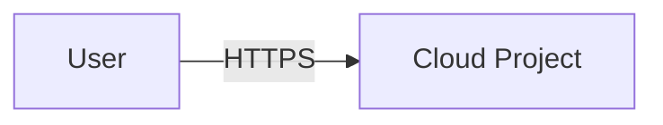
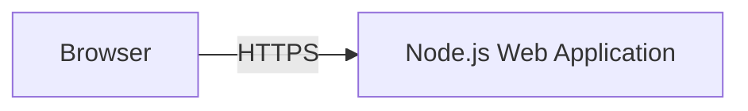
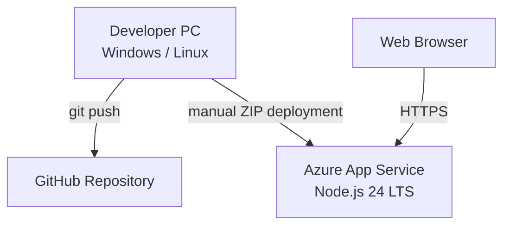
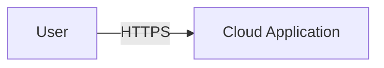
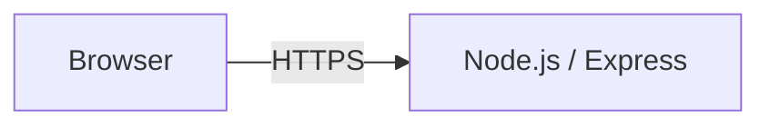
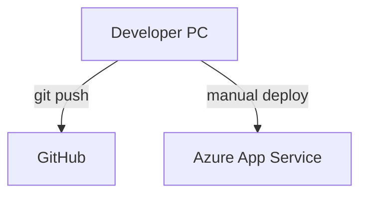
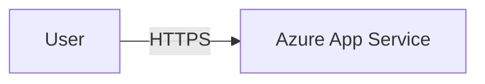
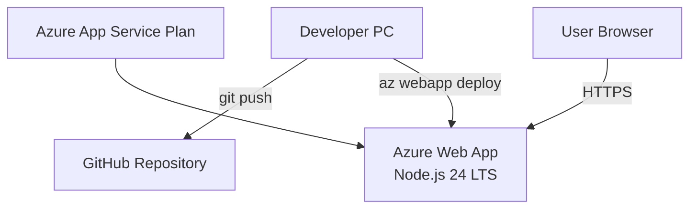

# MODUL CLOUD COMPUTING — PERTEMUAN 3

## Project Inception: Architecture, Repository, dan First Deployment

**Mata Kuliah:** Cloud Computing  
**Kode Mata Kuliah:** PTI 2802  
**Program Studi:** S1 Pendidikan Teknologi Informasi  
**Fakultas:** Fakultas Ilmu Terapan dan Sains  
**Perguruan Tinggi:** Institut Pendidikan Indonesia  
**Periode:** Semester Ganjil 2026/2027  
**Pertemuan:** 3 dari 16  
**Penyusun:** **Muhaemin Sidiq, S.Pd., M.Pd.**  
**Versi Modul:** 1.0 — 18 September 2026  

> **Tema utama:** mengubah sebuah ide menjadi proyek cloud yang dapat ditelusuri, dijelaskan, dikembangkan, dan dideploy.

---

# 1. Posisi Pertemuan dalam Mata Kuliah

Pertemuan 3 menandai dimulainya **proyek semester individual**. Hasil pertemuan ini menjadi baseline yang dikembangkan terus sampai UAS.

```text
P1  Cloud Computing Foundations
 |
P2  Cloud Account + CLI + IAM + Compute + Network
 |
P3  PROJECT INCEPTION
 |   ├── Problem statement
 |   ├── Users
 |   ├── Requirements
 |   ├── Architecture v0.1
 |   ├── GitHub repository
 |   ├── ADR-0001
 |   ├── Backlog
 |   └── First deployment
 |
P4  Compute, Networking, DNS, Secure Endpoint
 |
P5  Storage & Managed Data
 |
P6  Containerization
 |
P7  Infrastructure as Code
 |
P8  UTS / Mid-project checkpoint
 |
P9–P15  CI/CD, Security, Reliability, Observability,
        FinOps, Kubernetes, Production Readiness
 |
P16 Final Demo + Technical Defense + Repository Audit
```

Pertemuan 3 menggunakan **Node.js 24 LTS + Express + Azure App Service** sebagai reference implementation agar jalur praktikum sama pada Windows dan Linux. Stack tersebut bukan kewajiban proyek akhir; mahasiswa boleh menggunakan stack lain jika alasan, trade-off, dan deployment path dicatat dalam ADR dan tetap memenuhi CPMK.

---

# 2. Capaian Pembelajaran Pertemuan

Setelah menyelesaikan modul, mahasiswa mampu:

1. merumuskan masalah nyata yang layak diselesaikan melalui aplikasi/layanan cloud;
2. mengidentifikasi target user dan stakeholder;
3. membedakan functional requirements dan non-functional requirements;
4. menentukan scope awal proyek;
5. membuat Minimum Viable Cloud Project (MVCP) awal;
6. membuat arsitektur sistem versi 0.1;
7. menjelaskan hubungan client, aplikasi, cloud platform, dan data;
8. menggunakan Git sebagai version control;
9. menggunakan GitHub sebagai remote repository;
10. menerapkan repository hygiene;
11. membuat README profesional;
12. membuat backlog awal menggunakan GitHub Issues;
13. menulis Architectural Decision Record (ADR);
14. membangun baseline application;
15. menjalankan aplikasi lokal pada Windows maupun Linux;
16. membuat resource Azure untuk deployment;
17. mendeploy baseline application ke Azure App Service;
18. memverifikasi deployment melalui HTTPS;
19. memperbarui dokumentasi dengan URL dan evidence deployment;
20. membuat tag/release `m03`;
21. menjelaskan keputusan teknis yang dibuat;
22. menjaga credential dan secret tetap aman;
23. mengelola resource serta biaya cloud secara bertanggung jawab.

---

# 3. Deliverable Wajib Milestone M03

Repository minimal:

```text
cloud-project/
├── .github/
│   └── ISSUE_TEMPLATE/
├── docs/
│   ├── architecture.md
│   ├── requirements.md
│   ├── evidence/
│   │   └── m03/
│   └── adr/
│       └── 0001-initial-platform-and-stack.md
├── public/
│   └── index.html
├── .env.example
├── .gitignore
├── package.json
├── package-lock.json
├── server.js
└── README.md
```

Evidence minimum:

- [ ] problem statement;
- [ ] target user;
- [ ] functional requirements;
- [ ] non-functional requirements;
- [ ] in-scope dan out-of-scope;
- [ ] architecture v0.1;
- [ ] satu ADR;
- [ ] GitHub repository;
- [ ] minimal lima backlog item;
- [ ] aplikasi dapat berjalan lokal;
- [ ] aplikasi dapat diakses dari cloud;
- [ ] URL deployment tercatat;
- [ ] tidak ada secret di repository;
- [ ] commit history menunjukkan proses;
- [ ] evidence deployment tersedia;
- [ ] tag/release `m03`.

---

# 4. Project Inception sebagai Proses Engineering

Kesalahan umum proyek mahasiswa:

```text
langsung coding
→ kebutuhan belum jelas
→ arsitektur berubah tanpa alasan tercatat
→ dependency tidak terkontrol
→ deployment ditunda sampai akhir
→ error sulit dilacak
→ repository tidak merepresentasikan proses
```

Pola yang digunakan pada mata kuliah:

```text
MASALAH
→ REQUIREMENT
→ KEPUTUSAN
→ ARSITEKTUR
→ IMPLEMENTASI
→ DEPLOYMENT
→ EVIDENCE
→ ITERASI
```

Cloud engineering tidak hanya menilai apakah aplikasi hidup. Proyek harus dapat dijelaskan, direproduksi, dioperasikan, ditelusuri riwayatnya, dan dikembangkan secara bertahap. Azure Well-Architected Framework menggunakan lima perspektif utama: **Reliability, Security, Cost Optimization, Operational Excellence, dan Performance Efficiency** [1].

---

# 5. Workload dan Lima Perspektif Arsitektur

Workload adalah kumpulan komponen, resource, data, proses, dan aktivitas operasional yang bersama-sama menghasilkan nilai.

Contoh:

```text
Sistem Kuis
├── Frontend
├── Backend/API
├── Database
├── Identity
├── Network
├── Storage
├── Deployment
├── Monitoring
└── Operational procedure
```

Pada M03 workload belum lengkap. Targetnya:

```text
Workload v0.1
=
masalah jelas
+ user jelas
+ baseline app
+ arsitektur awal
+ repository
+ cloud endpoint
```

### 5.1 Reliability

Pertanyaan: *Apa yang terjadi bila aplikasi gagal?*

M03 cukup mencatat bahwa deployment masih sederhana, belum redundan, dan downtime masih diterima untuk tahap development.

### 5.2 Security

Pertanyaan: *Siapa boleh mengakses sistem dan bagaimana secret dilindungi?*

M03 minimal: HTTPS endpoint, tidak ada credential di source, akun GitHub/Azure diautentikasi dengan benar.

### 5.3 Cost Optimization

Pertanyaan: *Resource apa yang menimbulkan biaya?*

Gunakan free tier bila tersedia, hindari resource tidak perlu, inventaris resource, dan cleanup ketika tidak dibutuhkan.

### 5.4 Operational Excellence

Pertanyaan: *Bisakah pihak lain memahami, menjalankan, dan mengembangkan sistem?*

Artefak: README, commit history, issue backlog, ADR, struktur repo, deployment instructions.

### 5.5 Performance Efficiency

Pada M03 tidak diperlukan premature optimization. Catat NFR dasar dan ukur bila ada target performa.

---

# 6. Dari Masalah ke Project Statement

Gunakan pola:

```text
[Pengguna] mengalami [masalah]
dalam konteks [situasi].
Sistem akan membantu dengan [kapabilitas utama]
sehingga [hasil yang diharapkan].
```

Contoh:

```text
Guru membutuhkan cara sederhana untuk mengelola bank soal
serta melihat hasil latihan siswa secara terpusat.

Sistem akan menyediakan pembuatan latihan, pengumpulan jawaban,
dan ringkasan hasil sehingga guru dapat melakukan evaluasi lebih cepat.
```

Project statement bukan daftar teknologi.

Kurang tepat:

```text
Saya akan membuat Node.js + MongoDB + Azure.
```

Lebih tepat:

```text
Saya akan membuat layanan pencatatan peminjaman laboratorium
agar pengguna dapat memeriksa ketersediaan dan administrator dapat
melacak peminjaman secara terpusat.
```

---

# 7. User, Stakeholder, dan User Need

**User** menggunakan sistem secara langsung. **Stakeholder** memiliki kepentingan terhadap sistem tetapi tidak selalu menjadi pengguna langsung.

Format user need:

```text
Sebagai <role>,
saya ingin <kapabilitas>,
sehingga <nilai/manfaat>.
```

Contoh:

```text
Sebagai guru,
saya ingin melihat hasil latihan siswa,
sehingga saya dapat mengidentifikasi materi yang perlu diremediasi.
```

---

# 8. Functional dan Non-Functional Requirements

Functional requirement menjawab **apa yang harus dilakukan sistem**.

```text
FR-01 Sistem memungkinkan pengguna melihat daftar tugas.
FR-02 Sistem memungkinkan pengguna membuat data tugas.
FR-03 Sistem menyediakan endpoint health check.
FR-04 Sistem menampilkan halaman status.
```

Non-functional requirement menjawab **seberapa baik sistem harus beroperasi**.

```text
NFR-01 Endpoint publik menggunakan HTTPS.
NFR-02 Secret tidak boleh disimpan dalam Git repository.
NFR-03 Deployment harus dapat direproduksi.
NFR-04 Halaman utama merespons < 2 detik pada beban normal laboratorium.
NFR-05 Repository mempunyai dokumentasi setup.
```

Kategori NFR:

- security;
- reliability;
- performance;
- usability;
- maintainability;
- observability;
- portability;
- cost;
- privacy.

---

# 9. Scope dan MVCP

Contoh:

```text
IN SCOPE
- autentikasi dasar
- CRUD data inti
- deployment cloud
- database
- CI/CD
- logging

OUT OF SCOPE
- mobile native
- machine learning
- multi-region active-active
- payment gateway
```

MVCP final mata kuliah akan berkembang menjadi:

```text
APPLICATION
+ CLOUD DEPLOYMENT
+ PERSISTENCE
+ NETWORKING
+ SECURITY
+ AUTOMATION
+ OBSERVABILITY
+ RECOVERY
+ DOCUMENTATION
+ COST AWARENESS
```

Pada M03 cukup:

```text
APPLICATION
+ REPOSITORY
+ ARCHITECTURE v0.1
+ FIRST DEPLOYMENT
```

---

# 10. Architecture v0.1

Arsitektur awal adalah **hipotesis teknis**, bukan kontrak permanen. Cukup detail untuk memandu implementasi, tetapi cukup fleksibel untuk berubah berdasarkan evidence.

## 10.1 Context View



## 10.2 Application View



## 10.3 Deployment View v0.1



Pada Pertemuan 9, hubungan GitHub → build/test → deployment akan diotomasi.

---

# 11. Architectural Decision Record (ADR)

ADR menyimpan **satu keputusan arsitektural** bersama konteks, alternatif, alasan, konsekuensi, dan pemicu review. Komunitas ADR mendefinisikan ADR sebagai rekaman keputusan arsitektural dan rationale-nya [2].

Contoh keputusan:

- mengapa Node.js;
- mengapa Azure App Service;
- mengapa monolith pada baseline;
- mengapa repository public/private;
- mengapa memilih satu data service tertentu pada M05.

Template:

```markdown
# ADR-0001: Initial Platform and Application Stack

## Status
Accepted

## Context
Jelaskan kebutuhan dan constraint.

## Decision
Jelaskan keputusan.

## Considered Alternatives
1. Alternatif A
2. Alternatif B
3. Alternatif C

## Rationale
Jelaskan alasan.

## Consequences

### Positive
- ...

### Negative
- ...

### Risks
- ...

## Review Trigger
Keputusan ditinjau ulang jika:
- ...
```

---

# 12. Git dan GitHub

Git adalah distributed version control system yang menangani repository lokal [3]. GitHub menyediakan hosting repository serta fitur kolaborasi seperti Issues, Pull Requests, Releases, dan Actions.

Model mental:

```text
WORKING DIRECTORY
      │ git add
      ▼
STAGING AREA
      │ git commit
      ▼
LOCAL REPOSITORY
      │ git push
      ▼
REMOTE REPOSITORY
    GitHub
```

Commit baik:

```text
feat: add health endpoint
docs: add initial architecture
chore: initialize project
fix: validate missing input
```

Commit buruk:

```text
update
fix
final
final2
final-bener
```

Jumlah commit bukan ukuran kualitas; yang dinilai adalah meaningful history, traceability, correctness, dan documentation.

---

# 13. README dan GitHub Issues

GitHub menjelaskan bahwa README biasanya menjadi salah satu artefak pertama yang dilihat pengunjung repository dan sebaiknya menjelaskan fungsi proyek, manfaat, cara memulai, dan cara memperoleh bantuan [4].

README minimal:

```markdown
# Project Name

## Problem
## Users
## Features
## Architecture
## Technology Stack
## Repository Structure
## Local Development
## Environment Variables
## Deployment
## Cloud Resources
## Security
## Current Limitations
## Roadmap
## Evidence
## Author
```

GitHub Issues dapat digunakan untuk merencanakan dan melacak task, feature, bug, atau idea [5]. M03 minimal memiliki lima issue untuk milestone berikutnya.

---

# 14. Repository Hygiene

Repository harus bebas dari:

```text
✗ .env aktual
✗ password
✗ API key
✗ token
✗ private key
✗ node_modules
✗ deploy.zip
✗ file temporary yang tidak diperlukan
```

`.gitignore` untuk proyek Node:

```gitignore
node_modules/
.env
.env.*
!.env.example
*.log
.DS_Store
Thumbs.db
deploy.zip
.azure/
```

`.env.example`:

```dotenv
PORT=3000
APP_ENV=development
EXAMPLE_SETTING=replace-me
```

---

# 15. Naming Convention dan Tagging

Microsoft Cloud Adoption Framework merekomendasikan naming convention yang konsisten dan mengingatkan bahwa banyak nama resource tidak dapat diubah setelah creation [6].

Contoh:

```text
Repository:         cc-<nim>-<short-project-name>
Resource Group:     rg-cc-<nim>-dev
App Service Plan:   plan-cc-<nim>-dev
Web App:            app-cc-<nim>-<unique>
```

Tag minimum:

```text
Course=PTI2802
Meeting=03
Environment=dev
Owner=<NIM>
Project=<short-name>
```

Azure tags adalah metadata key-value untuk mengorganisasi resource [7].

---

# 16. Reference Stack Praktikum

```text
Client
  |
  | HTTPS
  v
Azure App Service
  |
  +-- Node.js 24 LTS
  |
  +-- Express application
```

P3 belum menggunakan database. Persistence dimulai pada Pertemuan 5.

Menggunakan App Service memberi pengalaman **PaaS**, melengkapi P2 yang lebih berorientasi VM/IaaS.

---

# 17. Prasyarat Software

- Git;
- GitHub CLI (`gh`);
- Node.js 24 LTS;
- npm;
- Azure CLI (`az`);
- browser;
- text editor/VS Code opsional.

Verifikasi Windows maupun Linux:

```bash
git --version
gh --version
node --version
npm --version
az version
```

Node.js 24 adalah LTS saat modul disusun [8], dan Azure App Service merekomendasikan Node 24 LTS [9].

---

# 18. Instalasi Git — Windows

PowerShell:

```powershell
winget install --id Git.Git -e
```

Tutup seluruh Windows Terminal, buka kembali, lalu:

```powershell
git --version
```

# 19. Instalasi Git — Ubuntu/Debian Linux

```bash
sudo apt update
sudo apt install -y git
git --version
```

Konfigurasi identitas Git:

```bash
git config --global user.name "Nama Anda"
git config --global user.email "email-yang-sesuai@example.com"
git config --global --list
```

---

# 20. Instalasi GitHub CLI — Windows

GitHub mendokumentasikan WinGet sebagai metode instalasi resmi [10].

```powershell
winget install --id GitHub.cli --source winget
```

Buka terminal baru:

```powershell
gh --version
```

# 21. Instalasi GitHub CLI — Ubuntu/Debian

Gunakan repository resmi GitHub CLI [11]:

```bash
(type -p wget >/dev/null || (sudo apt update && sudo apt install wget -y)) \
&& sudo mkdir -p -m 755 /etc/apt/keyrings \
&& wget -nv -O /tmp/githubcli-archive-keyring.gpg \
  https://cli.github.com/packages/githubcli-archive-keyring.gpg \
&& cat /tmp/githubcli-archive-keyring.gpg \
  | sudo tee /etc/apt/keyrings/githubcli-archive-keyring.gpg > /dev/null \
&& sudo chmod go+r /etc/apt/keyrings/githubcli-archive-keyring.gpg \
&& sudo mkdir -p -m 755 /etc/apt/sources.list.d \
&& echo "deb [arch=$(dpkg --print-architecture) signed-by=/etc/apt/keyrings/githubcli-archive-keyring.gpg] https://cli.github.com/packages stable main" \
  | sudo tee /etc/apt/sources.list.d/github-cli.list > /dev/null \
&& sudo apt update \
&& sudo apt install gh -y
```

Verifikasi:

```bash
gh --version
```

---

# 22. Login GitHub CLI

```bash
gh auth login
```

Pilihan yang disarankan:

```text
GitHub.com
HTTPS
Authenticate Git with GitHub credentials → Yes
Login with a web browser
```

GitHub CLI dapat menyimpan credential Git ketika HTTPS dipilih dan pengguna menyetujui integrasi credential [12].

Verifikasi:

```bash
gh auth status
```

---

# 23. Node.js

## Windows

```powershell
winget search nodejs
winget install OpenJS.NodeJS.LTS
```

Buka terminal baru:

```powershell
node --version
npm --version
```

## Linux

Gunakan Node.js LTS dari metode resmi yang disetujui pada lingkungan laboratorium. Jika sudah tersedia:

```bash
node --version
npm --version
```

Target kelas:

```text
Node.js 24 LTS
```

---

# 24. Azure CLI

Verifikasi:

```bash
az version
```

Login:

```bash
az login
```

Fallback:

```bash
az login --use-device-code
```

Verifikasi subscription:

```bash
az account show --output table
az account list --output table
```

Jika perlu:

```bash
az account set --subscription "<SUBSCRIPTION>"
```

---

# 25. PRAKTIKUM A — Project Inception

## Windows PowerShell

```powershell
New-Item -ItemType Directory -Path "$HOME\cloud-projects" -Force
Set-Location "$HOME\cloud-projects"
```

## Linux

```bash
mkdir -p ~/cloud-projects
cd ~/cloud-projects
```

Tentukan repository:

```text
cc-<NIM>-<project>
```

Contoh:

```text
cc-23012345-quiz-cloud
```

Windows:

```powershell
$PROJECT = "cc-<NIM>-<project>"
New-Item -ItemType Directory -Path $PROJECT
Set-Location $PROJECT
```

Linux:

```bash
PROJECT="cc-<NIM>-<project>"
mkdir "$PROJECT"
cd "$PROJECT"
```

---

# 26. Buat Struktur Proyek

Windows:

```powershell
New-Item -ItemType Directory -Force -Path docs
New-Item -ItemType Directory -Force -Path docs\adr
New-Item -ItemType Directory -Force -Path docs\evidence\m03
New-Item -ItemType Directory -Force -Path public
New-Item -ItemType Directory -Force -Path .github\ISSUE_TEMPLATE
```

Linux:

```bash
mkdir -p docs/adr docs/evidence/m03 public .github/ISSUE_TEMPLATE
```

---

# 27. Buat `docs/requirements.md`

```markdown
# Requirements

## 1. Problem Statement
...

## 2. Target Users
- ...

## 3. User Needs
- Sebagai ..., saya ingin ..., sehingga ...

## 4. Functional Requirements
- FR-01 ...
- FR-02 ...
- FR-03 ...

## 5. Non-Functional Requirements
- NFR-01 ...
- NFR-02 ...
- NFR-03 ...

## 6. In Scope
- ...

## 7. Out of Scope
- ...

## 8. Assumptions
- ...

## 9. Constraints
- ...

## 10. Acceptance Criteria for M03
- [ ] baseline application runs locally
- [ ] repository available on GitHub
- [ ] architecture v0.1 documented
- [ ] first cloud deployment accessible
```

Reference baseline:

```text
FR-01 Sistem menampilkan nama proyek.
FR-02 Sistem menampilkan status aplikasi.
FR-03 Sistem menyediakan GET /health.
FR-04 Sistem menyediakan GET /api/info.

NFR-01 Endpoint publik menggunakan HTTPS.
NFR-02 Secret tidak disimpan di Git.
NFR-03 Aplikasi dapat dijalankan Windows/Linux.
NFR-04 Aplikasi dapat dideploy ulang dari source.
NFR-05 Setup terdokumentasi.
```

---

# 28. Buat `docs/architecture.md`

Contoh:

````markdown
# Architecture v0.1

## Overview
Jelaskan sistem.

## Context


## Application View


## Deployment View


## Cloud Resources
| Resource | Purpose |
|---|---|
| Resource Group | Lifecycle boundary |
| App Service Plan | Compute capacity |
| Web App | Application runtime |

## Data
Belum ada persistent database pada M03.

## Security
- HTTPS endpoint
- no secret in repository
- authenticated GitHub/Azure access

## Risks
- single deployment
- no persistent database
- manual deployment
- limited observability

## Planned Evolution
- M04 networking/secure endpoint
- M05 persistence
- M06 container
- M07 IaC
- M09 CI/CD
````

Diagram berbasis teks mudah ditinjau melalui Git dan harus tetap disertai deskripsi tekstual.

---

# 29. Buat ADR-0001

`docs/adr/0001-initial-platform-and-stack.md`:

```markdown
# ADR-0001: Initial Platform and Application Stack

## Status
Accepted

## Context
Proyek memerlukan baseline aplikasi web yang dapat dijalankan di Windows/Linux, mudah dideploy, dan memungkinkan pengembangan bertahap.

## Decision
Menggunakan:
- Node.js 24 LTS
- Express
- Azure App Service Linux
- GitHub repository

## Considered Alternatives
1. Python Flask + App Service
2. PHP + App Service
3. Linux VM + NGINX
4. Static web hosting

## Rationale
Node.js bersifat lintas platform dan App Service mengurangi administrasi OS pada tahap inception.

## Consequences

### Positive
- deployment awal sederhana
- source portable
- iterasi cepat

### Negative
- sebagian detail OS/network diabstraksikan
- reference deployment bergantung pada Azure

### Risks
- free tier/quota dapat berbeda antar-subscription

## Review Trigger
Tinjau kembali ketika kebutuhan data, container, networking, atau NFR berubah.
```

---

# 30. PRAKTIKUM B — Baseline Application

Inisialisasi:

```bash
npm init -y
npm install express
```

Buat `server.js`:

```javascript
"use strict";

const express = require("express");
const path = require("path");

const app = express();
const PORT = process.env.PORT || 3000;
const APP_ENV = process.env.APP_ENV || "development";

app.disable("x-powered-by");
app.use(express.static(path.join(__dirname, "public")));

app.get("/health", (req, res) => {
  res.status(200).json({
    status: "ok",
    environment: APP_ENV,
    timestamp: new Date().toISOString()
  });
});

app.get("/api/info", (req, res) => {
  res.json({
    course: "Cloud Computing",
    code: "PTI 2802",
    meeting: 3,
    milestone: "M03"
  });
});

app.use((req, res) => {
  res.status(404).json({ error: "not_found", path: req.path });
});

app.listen(PORT, () => {
  console.log(`Cloud project listening on port ${PORT}`);
});
```

`process.env.PORT` meningkatkan portabilitas karena platform cloud dapat menentukan port runtime.

---

# 31. Buat `public/index.html`

```html
<!doctype html>
<html lang="id">
<head>
  <meta charset="utf-8">
  <meta name="viewport" content="width=device-width, initial-scale=1">
  <meta name="description" content="Cloud Computing PTI 2802 Project">
  <title>Cloud Project — PTI 2802</title>
  <style>
    :root { font-family: system-ui, sans-serif; color-scheme: light dark; }
    body {
      margin: 0;
      min-height: 100vh;
      display: grid;
      place-items: center;
      background: radial-gradient(circle at top, #174a79, #081827 65%);
      color: #f8fafc;
    }
    main {
      width: min(760px, calc(100% - 2rem));
      padding: 2rem;
      border: 1px solid rgba(255,255,255,.14);
      border-radius: 1.5rem;
      background: rgba(255,255,255,.08);
      backdrop-filter: blur(12px);
    }
    .badge {
      display: inline-block;
      padding: .4rem .7rem;
      border-radius: 999px;
      background: rgba(255,255,255,.12);
    }
    h1 { font-size: clamp(2rem, 6vw, 4rem); margin-bottom: .4rem; }
    a { color: #7dd3fc; }
    code { background: rgba(0,0,0,.3); padding: .15rem .35rem; border-radius: .4rem; }
  </style>
</head>
<body>
  <main>
    <span class="badge">PTI 2802 · M03</span>
    <h1>First Cloud Deployment</h1>
    <p>Baseline application berhasil berjalan.</p>
    <p>Health: <a href="/health"><code>/health</code></a></p>
    <p>API info: <a href="/api/info"><code>/api/info</code></a></p>
  </main>
</body>
</html>
```

---

# 32. Perbarui `package.json`

Pastikan bagian utama mencakup:

```json
{
  "name": "cc-project",
  "version": "0.1.0",
  "private": true,
  "description": "Cloud Computing PTI 2802 semester project",
  "main": "server.js",
  "scripts": {
    "start": "node server.js",
    "dev": "node server.js"
  },
  "engines": {
    "node": ">=24 <25"
  }
}
```

Jangan menghapus dependency `express` yang ditambahkan npm.

Validasi:

```bash
npm install
npm start
```

Buka:

```text
http://localhost:3000
http://localhost:3000/health
```

Windows:

```powershell
curl.exe http://localhost:3000/health
```

Linux:

```bash
curl http://localhost:3000/health
```

Stop aplikasi dengan `Ctrl+C`.

---

# 33. Buat `.gitignore` dan `.env.example`

`.gitignore`:

```gitignore
node_modules/
.env
.env.*
!.env.example
*.log
deploy.zip
.azure/
.DS_Store
Thumbs.db
```

`.env.example`:

```dotenv
PORT=3000
APP_ENV=development
```

---

# 34. PRAKTIKUM C — README

Gunakan template:

````markdown
# <Project Name>

Cloud Computing — PTI 2802  
Semester Ganjil 2026/2027

## Author
- Nama:
- NIM:
- Kelas:

## Problem
...

## Target Users
...

## Core Features
- ...

## Architecture


Detailed architecture: [docs/architecture.md](docs/architecture.md)

## Technology Stack
- Node.js 24 LTS
- Express
- Azure App Service
- GitHub

## Local Development
```bash
npm install
npm start
```

Open `http://localhost:3000`.

## Health Check
`GET /health`

## Environment Variables
See `.env.example`.

## Cloud Deployment
Provider: Microsoft Azure  
Environment: Development  
URL: `<DEPLOYMENT_URL>`

## Security
- secrets are not committed
- HTTPS endpoint
- least-privilege principle

## Current Limitations
- no persistent database
- manual deployment
- no CI/CD
- limited observability

## Roadmap
- M04 Networking
- M05 Data
- M06 Container
- M07 IaC
- M09 CI/CD

## Architecture Decisions
See [`docs/adr/`](docs/adr/).
````

---

# 35. PRAKTIKUM D — Git Repository

```bash
git init
git branch -M main
git status --short
```

Pastikan tidak terlihat `.env`, `node_modules`, private key, token, atau `deploy.zip`.

```bash
git add .
git status
git commit -m "chore: bootstrap cloud semester project"
git log --oneline --decorate
```

---

# 36. PRAKTIKUM E — GitHub Repository

```bash
gh repo create <REPOSITORY_NAME> \
  --public \
  --source=. \
  --remote=origin \
  --push
```

Atau private:

```bash
gh repo create <REPOSITORY_NAME> \
  --private \
  --source=. \
  --remote=origin \
  --push
```

GitHub mendukung pembuatan repository melalui web UI maupun GitHub CLI [13].

Verifikasi:

```bash
git remote -v
git status
gh repo view --web
```

---

# 37. PRAKTIKUM F — GitHub Issues sebagai Backlog

Contoh:

```bash
gh issue create \
  --title "M04: configure secure public endpoint" \
  --body "Improve networking, endpoint configuration, and access controls."
```

```bash
gh issue create \
  --title "M05: add persistent data storage" \
  --body "Introduce persistent data and document data lifecycle."
```

```bash
gh issue create \
  --title "M06: containerize application" \
  --body "Create a reproducible container image."
```

```bash
gh issue create \
  --title "M07: define infrastructure as code" \
  --body "Provision appropriate cloud resources with IaC."
```

```bash
gh issue create \
  --title "M09: implement CI/CD" \
  --body "Automate build, test, and deployment from GitHub."
```

Lihat:

```bash
gh issue list
```

Acceptance criteria issue sebaiknya berupa checklist yang dapat diuji.

---

# 38. PRAKTIKUM G — First Deployment ke Azure

Login:

```bash
az login
az account show --output table
```

Daftar region:

```bash
az account list-locations \
  --query "[].{Name:name,DisplayName:displayName}" \
  --output table
```

Pilih `<REGION>` sesuai availability, latency, biaya, dan kebijakan kelas.

---

# 39. Variabel Azure — Windows PowerShell

```powershell
$RG       = "rg-cc-<NIM>-dev"
$PLAN     = "plan-cc-<NIM>-dev"
$APP      = "app-cc-<NIM>-<UNIQUE>"
$LOCATION = "<REGION>"
```

Contoh:

```powershell
$RG       = "rg-cc-23012345-dev"
$PLAN     = "plan-cc-23012345-dev"
$APP      = "app-cc-23012345-quiz-a7f2"
$LOCATION = "southeastasia"
```

# 40. Variabel Azure — Linux Bash

```bash
RG="rg-cc-<NIM>-dev"
PLAN="plan-cc-<NIM>-dev"
APP="app-cc-<NIM>-<UNIQUE>"
LOCATION="<REGION>"
```

---

# 41. Periksa Runtime Aktif

```bash
az webapp list-runtimes \
  --os linux \
  --runtime node \
  --output table
```

Pada saat modul disusun, Azure mendokumentasikan `NODE:24-lts` untuk runtime Node modern [14]. Jika output berubah, gunakan runtime LTS aktif dari CLI.

---

# 42. Buat Resource Group

Windows:

```powershell
az group create `
  --name $RG `
  --location $LOCATION `
  --tags Course=PTI2802 Meeting=03 Environment=dev Owner=<NIM>
```

Linux:

```bash
az group create \
  --name "$RG" \
  --location "$LOCATION" \
  --tags Course=PTI2802 Meeting=03 Environment=dev Owner=<NIM>
```

---

# 43. Buat App Service Plan

Gunakan F1 hanya bila tersedia pada subscription.

Windows:

```powershell
az appservice plan create `
  --name $PLAN `
  --resource-group $RG `
  --location $LOCATION `
  --sku F1 `
  --is-linux
```

Linux:

```bash
az appservice plan create \
  --name "$PLAN" \
  --resource-group "$RG" \
  --location "$LOCATION" \
  --sku F1 \
  --is-linux
```

> Jika F1 tidak tersedia karena limit, quota, atau kebijakan subscription, jangan memilih tier berbayar tanpa persetujuan dosen.

---

# 44. Buat Web App

Windows:

```powershell
az webapp create `
  --resource-group $RG `
  --plan $PLAN `
  --name $APP `
  --runtime "NODE:24-lts"
```

Linux:

```bash
az webapp create \
  --resource-group "$RG" \
  --plan "$PLAN" \
  --name "$APP" \
  --runtime "NODE:24-lts"
```

Jika runtime tidak valid, jalankan ulang `az webapp list-runtimes` dan gunakan value yang didukung.

---

# 45. Verifikasi App dan Paksa HTTPS

```bash
az webapp show \
  --resource-group <RESOURCE_GROUP> \
  --name <APP_NAME> \
  --query "{name:name,state:state,host:defaultHostName,httpsOnly:httpsOnly}" \
  --output table
```

Windows:

```powershell
az webapp update `
  --resource-group $RG `
  --name $APP `
  --https-only true
```

Linux:

```bash
az webapp update \
  --resource-group "$RG" \
  --name "$APP" \
  --https-only true
```

---

# 46. Aktifkan Build Automation untuk ZIP Deployment

Dokumentasi Azure CLI menjelaskan bahwa ZIP deployment tidak otomatis menjalankan build dependency kecuali build automation diaktifkan [15].

Windows:

```powershell
az webapp config appsettings set `
  --resource-group $RG `
  --name $APP `
  --settings SCM_DO_BUILD_DURING_DEPLOYMENT=true APP_ENV=development
```

Linux:

```bash
az webapp config appsettings set \
  --resource-group "$RG" \
  --name "$APP" \
  --settings SCM_DO_BUILD_DURING_DEPLOYMENT=true APP_ENV=development
```

---

# 47. Catatan Penting: `az webapp up`

Dokumentasi Azure CLI terbaru menandai `az webapp up` sebagai **deprecated** dan menyarankan penggunaan `webapp create` serta `webapp deploy` untuk workflow baru [16]. Karena itu modul menggunakan alur eksplisit:

```text
group create
→ plan create
→ webapp create
→ webapp deploy
```

Alur ini juga lebih baik secara pedagogis karena mahasiswa melihat dependency resource satu per satu.

---

# 48. PRAKTIKUM H — Membuat Deployment ZIP

Jangan masukkan `node_modules`, `.git`, atau `deploy.zip`.

## Windows PowerShell

```powershell
Remove-Item .\deploy.zip -ErrorAction SilentlyContinue

Compress-Archive `
  -Path .\server.js, .\package.json, .\package-lock.json, .\public `
  -DestinationPath .\deploy.zip

Get-Item .\deploy.zip
```

## Linux

```bash
sudo apt update
sudo apt install -y zip
rm -f deploy.zip
zip -r deploy.zip server.js package.json package-lock.json public
ls -lh deploy.zip
```

Microsoft mengingatkan bahwa ZIP deployment harus berisi isi root proyek, bukan satu folder induk tambahan [17].

Benar:

```text
deploy.zip
├── server.js
├── package.json
├── package-lock.json
└── public/
```

Salah:

```text
deploy.zip
└── cc-project/
    ├── server.js
    └── package.json
```

---

# 49. Deploy ke Azure

Windows:

```powershell
az webapp deploy `
  --resource-group $RG `
  --name $APP `
  --src-path .\deploy.zip `
  --type zip
```

Linux:

```bash
az webapp deploy \
  --resource-group "$RG" \
  --name "$APP" \
  --src-path ./deploy.zip \
  --type zip
```

---

# 50. Ambil URL dan Verifikasi

Windows:

```powershell
$HOSTNAME = az webapp show `
  --resource-group $RG `
  --name $APP `
  --query defaultHostName `
  --output tsv

$URL = "https://$HOSTNAME"
$URL

curl.exe "$URL"
curl.exe "$URL/health"
curl.exe -I "$URL"
```

Linux:

```bash
HOSTNAME=$(az webapp show \
  --resource-group "$RG" \
  --name "$APP" \
  --query defaultHostName \
  --output tsv)

URL="https://$HOSTNAME"
echo "$URL"

curl "$URL"
curl "$URL/health"
curl -I "$URL"
```

Buka di browser:

```text
https://<APP_NAME>.azurewebsites.net/
https://<APP_NAME>.azurewebsites.net/health
```

---

# 51. Logging dan Troubleshooting Deployment

Aktifkan application logging bila diperlukan:

```bash
az webapp log config \
  --resource-group <RESOURCE_GROUP> \
  --name <APP_NAME> \
  --application-logging filesystem \
  --level information
```

Stream:

```bash
az webapp log tail \
  --resource-group <RESOURCE_GROUP> \
  --name <APP_NAME>
```

Stop dengan `Ctrl+C`.

Periksa runtime:

```bash
az webapp config show \
  --resource-group <RESOURCE_GROUP> \
  --name <APP_NAME> \
  --query linuxFxVersion \
  --output tsv
```

Periksa app settings:

```bash
az webapp config appsettings list \
  --resource-group <RESOURCE_GROUP> \
  --name <APP_NAME> \
  --output table
```

Jangan menyimpan output yang mengandung secret ke repository.

---

# 52. Troubleshooting Matrix

## `az webapp create` gagal

Periksa:

```text
subscription
permission
resource group
App Service plan
nama global web app
runtime
region
quota/provider policy
```

## Nama app digunakan

Gunakan suffix unik:

```text
app-cc-23012345-quiz-a7f2
```

## Runtime invalid

```bash
az webapp list-runtimes --os linux --runtime node --output table
```

## `Cannot find module 'express'`

Periksa `package.json`, build automation, struktur ZIP, dan lakukan deploy ulang.

## App lokal hidup, cloud gagal

Urutan diagnosis:

```text
packaging
→ dependencies
→ startup command
→ runtime
→ environment variable
→ cloud log
→ deployment status
```

Jangan langsung mengganti teknologi tanpa evidence.

---

# 53. Update README dan Architecture

README:

```markdown
## Cloud Deployment

Provider: Microsoft Azure  
Environment: Development  
URL: https://<APP_NAME>.azurewebsites.net  
Health: https://<APP_NAME>.azurewebsites.net/health
```

Deployment view aktual:



Commit:

```bash
git add README.md docs/
git commit -m "docs: record M03 architecture and first deployment"
git push
```

---

# 54. Evidence M03

Inventaris resource:

```bash
az resource list \
  --resource-group <RESOURCE_GROUP> \
  --query "[].{Name:name,Type:type,Location:location}" \
  --output table
```

Windows simpan evidence:

```powershell
az resource list `
  --resource-group $RG `
  --query "[].{Name:name,Type:type,Location:location}" `
  --output table |
  Out-File -Encoding utf8 docs\evidence\m03\azure-resources.txt

curl.exe "$URL/health" |
  Out-File -Encoding utf8 docs\evidence\m03\health.txt
```

Linux:

```bash
az resource list \
  --resource-group "$RG" \
  --query "[].{Name:name,Type:type,Location:location}" \
  --output table \
  > docs/evidence/m03/azure-resources.txt

curl "$URL/health" > docs/evidence/m03/health.txt
```

Evidence yang boleh disimpan: HTTP response, resource inventory, architecture, redacted CLI output, screenshot tanpa credential.

Jangan menyimpan token, password, private key, connection string, atau session cookie.

---

# 55. Audit Secret

Linux:

```bash
grep -RniE "password|api[_-]?key|secret|token|private[_-]?key" \
  --exclude-dir=.git \
  --exclude-dir=node_modules \
  .
```

PowerShell:

```powershell
Get-ChildItem -Recurse -File |
  Where-Object {
    $_.FullName -notmatch "\\node_modules\\" -and
    $_.FullName -notmatch "\\.git\\"
  } |
  Select-String -Pattern "password|api[_-]?key|secret|token|private[_-]?key"
```

Hasil harus ditafsirkan; kata `secret` dalam dokumentasi tidak selalu berarti credential aktual.

Jika secret sudah terlanjur di-commit:

1. revoke/rotate segera;
2. hentikan penggunaannya;
3. bersihkan history dengan prosedur yang sesuai;
4. audit lokasi lain;
5. dokumentasikan insiden;
6. buat credential baru.

Menghapus file dan commit ulang **tidak cukup**, karena secret dapat tetap berada dalam history.

---

# 56. Git History dan Milestone Tag

Periksa:

```bash
git status
git log --oneline --decorate --graph --all
```

Setelah semua code, docs, dan evidence final:

```bash
git add .
git commit -m "docs: finalize M03 evidence and documentation"
git push
```

Pastikan working tree bersih:

```bash
git status
```

Buat tag:

```bash
git tag -a m03 -m "Milestone M03: project inception and first deployment"
git push origin m03
```

Release:

```bash
gh release create m03 \
  --title "M03 — Project Inception & First Deployment" \
  --notes "Initial architecture, repository baseline, backlog, ADR-0001, and first cloud deployment."
```

---

# 57. Resource Lifecycle dan Cost Guardrail

Karena proyek berlanjut ke P4, resource dapat dipertahankan hanya bila sesuai kebijakan dosen dan biaya aman.

Checklist sebelum meninggalkan praktikum:

```text
□ tahu pricing tier
□ tahu resource group
□ tahu jumlah resource
□ tahu pemilik resource
□ tahu apakah resource harus tetap hidup
□ tahu cara menghapusnya
```

Cleanup jika tidak dipakai:

```bash
az group delete --name <RESOURCE_GROUP> --yes
```

Simpan evidence sebelum delete dan beri status deployment pada README jika endpoint tidak lagi aktif.

---

# 58. Manual Deployment vs CI/CD

P3:

```text
developer
→ create ZIP
→ deploy
```

P9:

```text
git push
→ GitHub Actions
→ test
→ build
→ deploy
```

Mahasiswa perlu memahami proses manual sebelum mengotomasinya.

---

# 59. Technical Defense M03

Mahasiswa harus mampu menjawab:

1. masalah apa yang diselesaikan?
2. siapa user?
3. apa FR dan NFR utama?
4. mengapa stack ini?
5. mengapa App Service?
6. apa perbedaan local run dan cloud deployment?
7. apa fungsi App Service Plan?
8. mengapa endpoint menggunakan HTTPS?
9. mengapa belum ada database?
10. apa risiko desain v0.1?
11. bagaimana deploy ulang?
12. apa yang terjadi bila resource group dihapus?
13. bagaimana memastikan `.env` tidak di-track?
14. issue apa yang dikerjakan pada M04?
15. tunjukkan ADR dan commit history.

---

# 60. Repository Audit

Dosen dapat meminta mahasiswa menjalankan:

```bash
git log --oneline --decorate --graph --all
git status
git remote -v
git tag -n
gh issue list
```

Repository harus menjadi **single source of truth** proyek semester.

---

# 61. Quality Gate M03

## Functionality

- [ ] `/` bekerja;
- [ ] `/health` bekerja;
- [ ] `/api/info` bekerja.

## Repository

- [ ] README lengkap;
- [ ] requirements tersedia;
- [ ] architecture tersedia;
- [ ] ADR tersedia;
- [ ] Issues tersedia.

## Cloud

- [ ] HTTPS URL dapat dibuka;
- [ ] resource inventory diketahui;
- [ ] pricing tier diketahui.

## Security

- [ ] secret audit dilakukan;
- [ ] `.env` tidak di-track;
- [ ] tidak ada token/private key/password.

## Traceability

- [ ] commit history masuk akal;
- [ ] evidence tersedia;
- [ ] tag/release `m03` tersedia.

---

# 62. Rubrik Praktikum Pertemuan 3

| Dimensi | Bobot |
|---|---:|
| Problem statement dan requirements | 15% |
| Architecture v0.1 | 15% |
| Repository structure dan hygiene | 15% |
| Git history dan GitHub usage | 10% |
| ADR dan technical reasoning | 10% |
| Baseline application | 10% |
| First cloud deployment | 15% |
| Security dan cost awareness | 5% |
| Evidence dan technical explanation | 5% |
| **Total** | **100%** |

### Sangat Baik

Problem spesifik, requirement dapat diuji, architecture konsisten, ADR menjelaskan trade-off, repo rapi, deployment bekerja, troubleshooting sistematis, tidak ada credential exposure, dan keputusan dapat dipertahankan.

### Baik

Sebagian besar artefak lengkap dan deployment bekerja; terdapat minor gap pada dokumentasi atau reasoning.

### Cukup

Aplikasi berjalan tetapi requirement/architecture dangkal, history kurang terstruktur, atau explanation belum kuat.

### Perlu Remediasi

Repository tidak merepresentasikan proses, deployment tidak dapat diverifikasi, terdapat secret exposure, atau mahasiswa tidak memahami arsitektur dan command yang digunakan.

---

# 63. Soal Analisis

1. Mengapa problem statement sebaiknya tidak dimulai dari nama teknologi?
2. Apa perbedaan functional requirement dan non-functional requirement?
3. Mengapa architecture v0.1 boleh berubah?
4. Mengapa ADR lebih berguna daripada hanya menulis “kami memilih Node.js”?
5. Mengapa App Service dapat dikategorikan sebagai PaaS?
6. Apa perbedaan App Service Plan dan Web App?
7. Mengapa `node_modules` tidak perlu masuk repository?
8. Mengapa `.env.example` boleh disimpan tetapi `.env` tidak?
9. Mengapa `process.env.PORT` lebih portable daripada hard-coded port?
10. Apa tujuan `/health` endpoint?
11. Apa risiko manual deployment?
12. Mengapa `az webapp up` tidak dipakai sebagai jalur utama pada modul ini?
13. Apa manfaat meaningful commit?
14. Mengapa deployment URL harus dicatat?
15. Apa tindakan pertama bila secret terlanjur di-commit?

---

# 64. Challenge — Architecture Review

Identifikasi pada proyek masing-masing:

```text
1. user
2. system boundary
3. application component
4. data
5. external dependency
6. trust boundary
7. cloud resource
8. failure point
9. cost source
10. future scaling concern
```

---

# 65. Challenge — Requirement Quality

Requirement buruk:

```text
Sistem harus cepat.
```

Perbaikan:

```text
Pada environment development, halaman utama harus menghasilkan HTTP response
kurang dari 2 detik pada pengujian manual normal dari jaringan kampus.
```

Requirement harus dapat diuji.

---

# 66. Challenge — App Service vs VM

| Kriteria | App Service | VM |
|---|---|---|
| OS management | provider | consumer |
| runtime control | sedang | tinggi |
| deployment simplicity | tinggi | lebih kompleks |
| network control | abstraksi lebih tinggi | tinggi |
| patch responsibility | lebih kecil | lebih besar |
| cocok untuk M03 | sangat sesuai | sesuai bila tujuan IaaS |

Tidak ada pilihan universal “terbaik”; keputusan harus mengikuti requirement dan trade-off.

---

# 67. Troubleshooting Git

## `git: command not found`

Install Git dan buka terminal baru.

## `Author identity unknown`

```bash
git config --global user.name "Nama"
git config --global user.email "email@example.com"
```

## `remote origin already exists`

```bash
git remote -v
git remote set-url origin <URL>
```

## Push authentication gagal

```bash
gh auth status
gh auth login
```

GitHub telah menghapus password authentication untuk operasi Git HTTPS; gunakan GitHub CLI, credential helper, personal access token, atau SSH [18].

---

# 68. Troubleshooting Node

`node`/`npm` tidak ditemukan: periksa instalasi dan PATH, lalu buka terminal baru.

Jika Express tidak ditemukan:

```bash
npm install
```

Jika port 3000 dipakai:

Windows:

```powershell
Get-NetTCPConnection -LocalPort 3000 -ErrorAction SilentlyContinue
$env:PORT=3001
npm start
```

Linux:

```bash
ss -ltnp | grep ':3000'
PORT=3001 npm start
```

---

# 69. Troubleshooting Azure Authentication dan Permission

```bash
az account show
```

Jika perlu:

```bash
az logout
az login
```

Jika muncul `AuthorizationFailed`, periksa subscription, scope, role assignment, dan policy. Jangan meminta role `Owner` sebagai solusi pertama; gunakan least privilege.

---

# 70. Fallback Deployment

Jika App Service tidak tersedia karena quota atau kebijakan kelas, dosen dapat mengizinkan:

- Azure Static Web Apps untuk frontend-only;
- Linux VM dari P2;
- GitHub Pages untuk static baseline;
- provider lain yang ekuivalen;
- server institusi.

Evidence tetap harus menunjukkan:

```text
source
→ repository
→ deployment
→ endpoint
```

---

# 71. Evidence-Based Troubleshooting Template

```markdown
## Incident

### Symptom
Apa yang terlihat?

### Evidence
Log / error / HTTP status / command output.

### Hypothesis
Apa dugaan penyebab?

### Test
Apa yang diuji?

### Result
Apa hasilnya?

### Fix
Apa perubahan yang dilakukan?

### Verification
Bagaimana memastikan masalah selesai?

### Learning
Apa yang dipelajari?
```

---

# 72. Repository Maturity Roadmap

```text
M03
Source + Docs + Manual Deploy
        │
M06
Container Build
        │
M07
Infrastructure as Code
        │
M09
CI/CD
        │
M10
Security Hardening
        │
M12
Observability + Recovery
        │
M15
Production Readiness
        │
M16
v1.0.0
```

---

# 73. Persiapan Pertemuan 4

M03 harus menghasilkan:

```text
working app
+ cloud URL
+ repository
+ architecture
+ ADR
+ backlog
```

P4 akan memperdalam compute, networking, DNS, secure endpoint, TLS, dan network exposure.

Checklist:

- [ ] repository dapat di-clone;
- [ ] `npm install` berhasil;
- [ ] `npm start` berhasil;
- [ ] cloud URL valid;
- [ ] `/health` valid;
- [ ] resource group diketahui;
- [ ] architecture v0.1 tersedia;
- [ ] ADR-0001 tersedia;
- [ ] Issues tersedia;
- [ ] tag `m03` tersedia.

---

# 74. Catatan Dosen — Contoh Alokasi 180 Menit

| Menit | Aktivitas |
|---:|---|
| 0–15 | Review P2 + tujuan M03 |
| 15–35 | Problem, user, requirements |
| 35–55 | Architecture v0.1 + ADR |
| 55–75 | Git/GitHub setup |
| 75–105 | Baseline Node/Express |
| 105–125 | Repository + README + Issues |
| 125–155 | Azure App Service deployment |
| 155–170 | Troubleshooting + evidence |
| 170–180 | Commit/tag/release + reflection |

Instalasi software sebaiknya dijadikan pre-lab.

---

# 75. Pre-Lab Mahasiswa

Sebelum kelas:

```bash
git --version
gh --version
node --version
npm --version
az version
```

Mahasiswa harus sudah mempunyai:

- akun GitHub;
- akun/subscription Azure;
- satu ide proyek;
- hasil praktikum P2.

---

# 76. Post-Lab

1. rapikan README;
2. selesaikan requirements;
3. review architecture;
4. review ADR;
5. review Issues;
6. audit secret;
7. pastikan resource cloud sesuai kebijakan biaya;
8. finalisasi tag/release `m03`;
9. persiapkan P4.

---

# 77. Ringkasan Konsep

```text
PROJECT INCEPTION
=
problem
+ users
+ requirements
+ scope
+ architecture
+ decisions
+ repository
+ backlog
+ baseline
+ deployment
+ evidence
```

Model mental utama:

```text
REQUIREMENT
    │
    ▼
DECISION
    │
    ▼
ARCHITECTURE
    │
    ▼
SOURCE CODE
    │
    ▼
VERSION CONTROL
    │
    ▼
DEPLOYMENT
    │
    ▼
RUNNING WORKLOAD
    │
    ▼
OBSERVATION
    │
    ▼
NEXT ITERATION
```

---

# 78. Referensi

[1] Microsoft, “What is the Azure Well-Architected Framework?,” *Microsoft Learn*, 2026. [Online]. Available: https://learn.microsoft.com/azure/well-architected/what-is-well-architected-framework. [Accessed: Sep. 18, 2026].

[2] Architectural Decision Records, “Architectural Decision Records (ADRs),” 2026. [Online]. Available: https://adr.github.io/. [Accessed: Sep. 18, 2026].

[3] GitHub, “Set up Git,” *GitHub Docs*, 2026. [Online]. Available: https://docs.github.com/en/get-started/git-basics/set-up-git. [Accessed: Sep. 18, 2026].

[4] GitHub, “About the repository README file,” *GitHub Docs*, 2026. [Online]. Available: https://docs.github.com/en/repositories/managing-your-repositorys-settings-and-features/customizing-your-repository/about-readmes. [Accessed: Sep. 18, 2026].

[5] GitHub, “About issues,” *GitHub Docs*, 2026. [Online]. Available: https://docs.github.com/en/issues/tracking-your-work-with-issues/learning-about-issues/about-issues. [Accessed: Sep. 18, 2026].

[6] Microsoft, “Define your naming convention,” *Cloud Adoption Framework*, 2026. [Online]. Available: https://learn.microsoft.com/azure/cloud-adoption-framework/ready/azure-best-practices/resource-naming. [Accessed: Sep. 18, 2026].

[7] Microsoft, “Use tags to organize your Azure resources and management hierarchy,” *Microsoft Learn*, 2026. [Online]. Available: https://learn.microsoft.com/azure/azure-resource-manager/management/tag-resources. [Accessed: Sep. 18, 2026].

[8] OpenJS Foundation, “Download Node.js,” *Node.js*, Sep. 2026. [Online]. Available: https://nodejs.org/en/download. [Accessed: Sep. 18, 2026].

[9] Microsoft, “Quickstart: Create a Node.js Web App,” *Azure App Service—Microsoft Learn*, 2026. [Online]. Available: https://learn.microsoft.com/azure/app-service/quickstart-nodejs. [Accessed: Sep. 18, 2026].

[10] GitHub, “Installing GitHub CLI on Windows,” *GitHub CLI*, 2026. [Online]. Available: https://github.com/cli/cli/blob/trunk/docs/install_windows.md. [Accessed: Sep. 18, 2026].

[11] GitHub, “Installing GitHub CLI on Linux and BSD,” *GitHub CLI*, 2026. [Online]. Available: https://github.com/cli/cli/blob/trunk/docs/install_linux.md. [Accessed: Sep. 18, 2026].

[12] GitHub, “GitHub CLI quickstart,” *GitHub Docs*, 2026. [Online]. Available: https://docs.github.com/en/github-cli/github-cli/quickstart. [Accessed: Sep. 18, 2026].

[13] GitHub, “Creating a new repository,” *GitHub Docs*, 2026. [Online]. Available: https://docs.github.com/en/repositories/creating-and-managing-repositories/creating-a-new-repository. [Accessed: Sep. 18, 2026].

[14] Microsoft, “Tutorial: Create Multi-Region App,” *Azure App Service—Microsoft Learn*, 2026. [Online]. Available: https://learn.microsoft.com/azure/app-service/tutorial-multi-region-app. [Accessed: Sep. 18, 2026].

[15] Microsoft, “az webapp,” *Azure CLI Reference—Microsoft Learn*, 2026. [Online]. Available: https://learn.microsoft.com/cli/azure/webapp. [Accessed: Sep. 18, 2026].

[16] Microsoft, “az webapp up,” *Azure CLI Reference—Microsoft Learn*, 2026. The command is marked deprecated in the current CLI reference. [Online]. Available: https://learn.microsoft.com/cli/azure/webapp. [Accessed: Sep. 18, 2026].

[17] Microsoft, “Deploy Files to Azure App Service,” *Microsoft Learn*, 2026. [Online]. Available: https://learn.microsoft.com/azure/app-service/deploy-zip. [Accessed: Sep. 18, 2026].

[18] GitHub, “About authentication to GitHub,” *GitHub Docs*, 2026. [Online]. Available: https://docs.github.com/en/authentication/keeping-your-account-and-data-secure/about-authentication-to-github. [Accessed: Sep. 18, 2026].

[19] Microsoft, “Azure Architecture Center,” *Microsoft Learn*, 2026. [Online]. Available: https://learn.microsoft.com/azure/architecture/. [Accessed: Sep. 18, 2026].

[20] Microsoft, “Design Principles for Azure Applications,” *Azure Architecture Center*, 2026. [Online]. Available: https://learn.microsoft.com/azure/architecture/guide/design-principles/. [Accessed: Sep. 18, 2026].

---

# 79. Riwayat Revisi

| Versi | Tanggal | Perubahan | Penyusun |
|---|---|---|---|
| 1.0 | 18 September 2026 | Project Inception, requirements, architecture v0.1, Git/GitHub, ADR, backlog, Node.js baseline, Azure App Service first deployment, troubleshooting, security, evidence, rubrik, dan milestone M03 | Muhaemin Sidiq, S.Pd., M.Pd. |

---

# Penutup

Pertemuan 3 merupakan transisi dari latihan terisolasi menuju **engineering project lifecycle**. Targetnya bukan hanya “aplikasi berhasil online”, tetapi:

```text
masalah dapat dijelaskan
+ requirement dapat diuji
+ keputusan dapat dipertanggungjawabkan
+ arsitektur dapat dibaca
+ source memiliki history
+ deployment dapat diverifikasi
+ evidence tersedia
+ proyek siap berkembang
```

Repository yang dibuat pada pertemuan ini harus tetap menjadi **single source of truth** proyek semester sampai release final `v1.0.0`.

**— Akhir Modul —**
