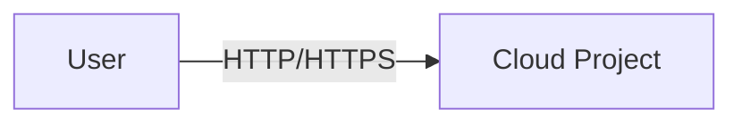
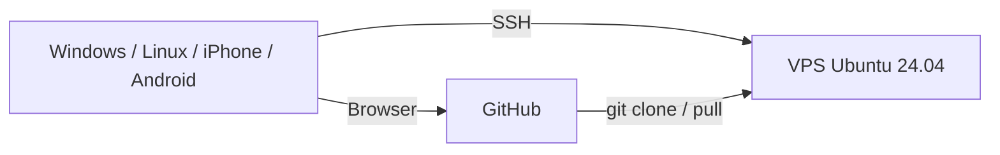
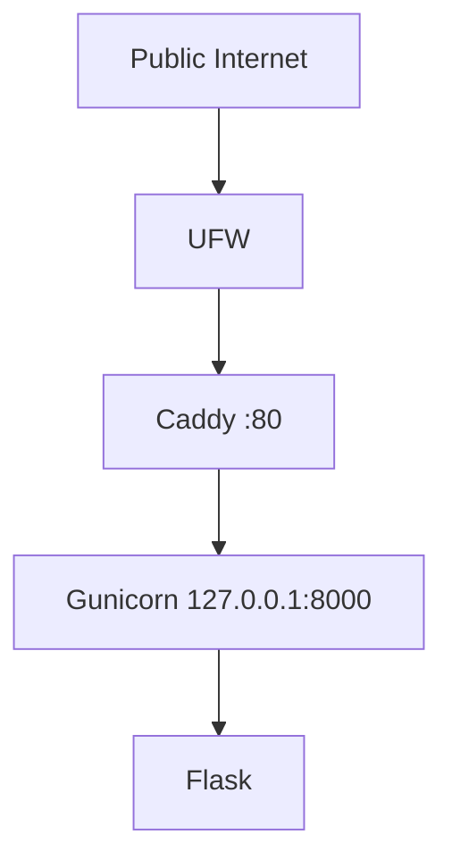
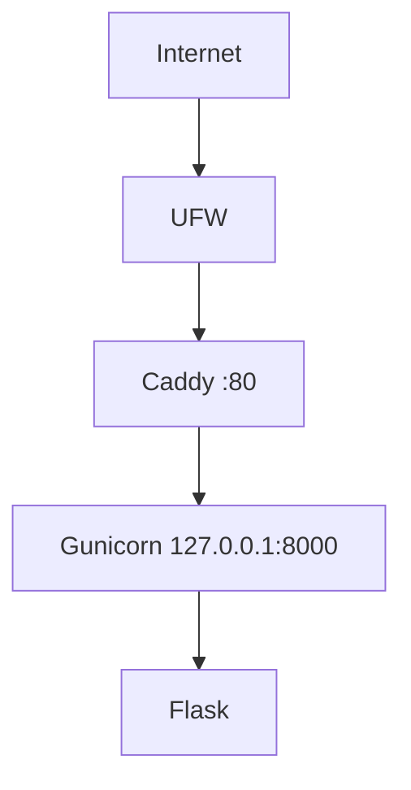

# MODUL CLOUD COMPUTING — PERTEMUAN 3

## Project Inception: Architecture, Repository, dan First Deployment pada VPS Ubuntu Server 24.04

**Mata Kuliah:** Cloud Computing  
**Kode:** PTI 2802  
**Program Studi:** S1 Pendidikan Teknologi Informasi  
**Fakultas:** Fakultas Ilmu Terapan dan Sains  
**Perguruan Tinggi:** Institut Pendidikan Indonesia  
**Periode:** Semester Ganjil 2026/2027  
**Pertemuan:** 3 dari 16  
**Penyusun:** **Muhaemin Sidiq, S.Pd., M.Pd.**  
**Versi:** 2.0 — Skenario VPS  
**Tanggal:** 24 September 2026  

> **Tema utama:** mengubah ide menjadi proyek cloud yang terdokumentasi, memiliki repository, berjalan sebagai service pada VPS, dapat diakses dari internet, dan mempunyai evidence engineering yang dapat diaudit.

---

# 1. Posisi Pertemuan 3 dalam Mata Kuliah

Pertemuan 3 adalah awal **proyek semester individual** yang akan berkembang hingga UAS.

```text
P1  Cloud Computing Foundations
 │
P2  Cloud Account + CLI + IAM + Compute + Network
 │
P3  PROJECT INCEPTION
 │   ├─ problem statement
 │   ├─ target users
 │   ├─ requirements
 │   ├─ architecture v0.1
 │   ├─ GitHub repository
 │   ├─ ADR-0001
 │   ├─ backlog
 │   ├─ VPS hardening dasar
 │   ├─ baseline application
 │   ├─ first deployment
 │   └─ evidence + release m03
 │
P4–P15  Iterative Cloud Engineering
 │
P16 Final Release v1.0.0 + Demo + Defense
```

Repository yang dibuat pada Pertemuan 3 menjadi **single source of truth** proyek sampai akhir semester.

---

# 2. Lingkungan VPS yang Digunakan

Panduan ini secara khusus menggunakan VPS dengan spesifikasi:

| Komponen | Spesifikasi |
|---|---|
| vCPU | **1 core** |
| RAM | **1 GB** |
| Disk | **20 GB** |
| Network | **Public IPv4** |
| OS | **Ubuntu Server 24.04 LTS** |
| Remote access | OpenSSH |
| Runtime | Python 3.12 |
| Web framework | Flask |
| Application server | Gunicorn |
| Service manager | systemd |
| Reverse proxy | Caddy |
| Host firewall | UFW |
| Version control | Git |
| Remote repository | GitHub |

Ubuntu 24.04 LTS menggunakan Python 3.12 sebagai default dan mendapat standard security maintenance sampai 31 Mei 2029 [1].

---

# 3. Mengapa Stack Ini Dipilih?

VPS hanya memiliki 1 vCPU dan RAM 1 GB. Stack perlu efisien, mudah dipahami, dan tetap merepresentasikan arsitektur deployment nyata.

```text
Internet
   │
   ▼
UFW
   │
   ▼
Caddy :80
   │
   ▼
Gunicorn 127.0.0.1:8000
   │
   ▼
Flask Application
```

Alasan utama:

1. Python 3.12 sudah menjadi runtime default Ubuntu 24.04 [1].
2. `venv` mengisolasi dependency proyek [2].
3. Gunicorn merupakan WSGI server dan dapat di-bind hanya pada loopback [3].
4. Caddy menyediakan reverse proxy yang sederhana dan siap dikembangkan menjadi HTTPS otomatis ketika domain tersedia [4], [5].
5. systemd tersedia secara native pada Ubuntu 24.04.
6. footprint sesuai VPS 1 GB bila jumlah worker dikendalikan.
7. container belum dipakai karena containerization merupakan capaian pertemuan berikutnya.

> Stack ini adalah **reference implementation**, bukan kewajiban proyek final. Stack lain boleh digunakan jika keputusan teknis dicatat dalam ADR dan tetap memenuhi CPMK.

---

# 4. Capaian Pembelajaran Pertemuan

Mahasiswa mampu:

1. merumuskan problem statement;
2. menentukan target user dan stakeholder;
3. menyusun functional dan non-functional requirements;
4. menetapkan scope awal;
5. membuat architecture v0.1;
6. membuat ADR;
7. membuat GitHub repository;
8. menggunakan Git dengan commit bermakna;
9. membuat backlog GitHub Issues;
10. mengakses VPS dari Windows, Linux, iPhone, dan Android;
11. membuat akun VPS non-root;
12. menerapkan SSH key authentication;
13. mengaktifkan UFW;
14. menjalankan aplikasi Flask dalam virtual environment;
15. menjalankan aplikasi melalui Gunicorn;
16. mengelola aplikasi sebagai systemd service;
17. menggunakan Caddy sebagai reverse proxy;
18. membuat public first deployment;
19. melakukan health check internal dan eksternal;
20. membaca log dan melakukan troubleshooting;
21. menghubungkan VPS dengan GitHub menggunakan deploy key;
22. menghasilkan evidence dan release `m03`.

---

# 5. Evidence Minimum M03

Pada akhir praktikum harus tersedia:

```text
GitHub Repository
├── README.md
├── .gitignore
├── .env.example
├── requirements.txt
├── app.py
├── templates/
│   └── index.html
├── static/
│   └── style.css
└── docs/
    ├── requirements.md
    ├── architecture.md
    ├── deployment.md
    ├── adr/
    │   └── 0001-initial-architecture.md
    └── evidence/m03/
```

Checklist:

- [ ] problem statement;
- [ ] target user;
- [ ] FR dan NFR;
- [ ] scope;
- [ ] architecture v0.1;
- [ ] ADR-0001;
- [ ] GitHub repository;
- [ ] backlog ≥ 5 issue;
- [ ] non-root SSH;
- [ ] SSH key-only authentication;
- [ ] UFW aktif;
- [ ] Gunicorn berjalan sebagai service;
- [ ] backend hanya listen pada loopback;
- [ ] Caddy reverse proxy;
- [ ] `http://PUBLIC_IP/` dapat dibuka;
- [ ] `/health` mengembalikan HTTP 200;
- [ ] evidence aman;
- [ ] tag/release `m03`.

---

# 6. Project Inception

Project inception menjawab:

```text
Apa masalahnya?
Siapa penggunanya?
Apa nilai yang dihasilkan?
Apa yang termasuk scope?
Apa keputusan arsitektur awal?
Bagaimana proyek dikembangkan dan dideploy?
Bagaimana perubahan dibuktikan?
```

Model kerja:

```text
PROBLEM
  ↓
USERS
  ↓
REQUIREMENTS
  ↓
ARCHITECTURE
  ↓
DECISIONS
  ↓
IMPLEMENTATION
  ↓
REPOSITORY
  ↓
DEPLOYMENT
  ↓
EVIDENCE
  ↓
ITERATION
```

---

# 7. Problem Statement

Gunakan format:

```text
[Pengguna] mengalami [masalah] pada [konteks].
Sistem akan menyediakan [kapabilitas utama]
sehingga [hasil/manfaat].
```

Contoh:

```text
Administrator laboratorium membutuhkan cara untuk memantau
peminjaman perangkat secara terpusat.

Sistem menyediakan pencatatan perangkat, peminjaman, dan status
pengembalian sehingga penggunaan perangkat dapat ditelusuri.
```

Kurang tepat:

```text
Saya ingin membuat Flask di Ubuntu.
```

Itu adalah pilihan teknologi, bukan masalah.

---

# 8. User Need

Gunakan pola:

```text
Sebagai <role>,
saya ingin <kapabilitas>,
sehingga <manfaat>.
```

Contoh:

```text
Sebagai administrator,
saya ingin melihat perangkat yang belum dikembalikan,
sehingga saya dapat menindaklanjuti keterlambatan.
```

---

# 9. Functional Requirements

Functional requirement menjelaskan **apa yang dilakukan sistem**.

```text
FR-01 Sistem menampilkan halaman utama.
FR-02 Sistem menyediakan health endpoint.
FR-03 Sistem menampilkan metadata aplikasi.
FR-04 Sistem menampilkan daftar objek utama proyek.
```

Requirement sebaiknya:

- spesifik;
- dapat diuji;
- tidak ambigu;
- tidak langsung memaksakan teknologi jika tidak diperlukan.

---

# 10. Non-Functional Requirements

NFR menjelaskan **bagaimana sistem harus beroperasi**.

Contoh M03:

```text
NFR-01 Backend hanya listen pada loopback.
NFR-02 Aplikasi dikelola systemd.
NFR-03 Request publik masuk melalui reverse proxy.
NFR-04 Secret tidak disimpan pada Git repository.
NFR-05 Health endpoint mengembalikan HTTP 200 saat sehat.
NFR-06 Deployment dapat direproduksi dari repository.
NFR-07 Arsitektur sesuai VPS 1 vCPU/1 GB RAM.
```

---

# 11. Scope

## In Scope M03

```text
repository
requirements
architecture
ADR
baseline Flask app
SSH hardening dasar
Gunicorn
systemd
Caddy
HTTP public deployment
```

## Out of Scope M03

```text
database production
Docker
Infrastructure as Code
CI/CD
TLS/domain production
horizontal scaling
monitoring stack penuh
```

DNS dan HTTPS menjadi fokus Pertemuan 4.

---

# 12. Architecture v0.1

## 12.1 Context View



## 12.2 Client–Repository–VPS



## 12.3 Internal VPS



---

# 13. Mengapa Backend Bind ke 127.0.0.1?

Gunicorn akan menggunakan:

```text
127.0.0.1:8000
```

bukan:

```text
0.0.0.0:8000
```

Tujuan:

- backend tidak diekspos langsung;
- hanya reverse proxy yang menjadi entry point publik;
- kebijakan TLS/header/routing kelak terpusat;
- attack surface lebih kecil.

Gunicorn mendukung bind loopback dan secara default menggunakan `127.0.0.1:8000` [3].

---

# 14. Reverse Proxy

```text
Client → Caddy → Gunicorn → Flask
```

Fungsi Caddy pada M03:

- menerima koneksi publik;
- melakukan reverse proxy ke backend;
- compression;
- menjadi tempat future HTTPS configuration.

Caddy mendokumentasikan `reverse_proxy` sebagai mekanisme standar untuk meneruskan request ke backend [4].

---

# 15. Repository dan GitHub

README sebaiknya menjelaskan:

- apa fungsi proyek;
- mengapa proyek berguna;
- cara menjalankan;
- arsitektur;
- deployment;
- batasan saat ini;
- maintainer.

GitHub merekomendasikan README agar repository mudah dipahami dan digunakan [6].

GitHub Issues digunakan untuk backlog, feature, bug, task, dan improvement [8].

---

# 16. ADR

File:

```text
docs/adr/0001-initial-architecture.md
```

Template:

```markdown
# ADR-0001: Initial VPS Deployment Architecture

## Status
Accepted

## Context
VPS 1 vCPU, RAM 1 GB, disk 20 GB, Ubuntu Server 24.04.

## Decision
- Flask
- Gunicorn 1 worker
- systemd
- Caddy
- UFW
- GitHub

## Alternatives
1. Node.js + PM2
2. NGINX + Gunicorn
3. Docker
4. PHP-FPM

## Rationale
...

## Consequences
### Positive
...
### Negative
...

## Review Trigger
Review pada M06/M07.
```

---

# 17. Strategi Lintas Perangkat

## Workflow A — Windows/Linux (direkomendasikan)

```text
PC edit source
 → git push
 → GitHub
 → SSH VPS
 → git pull
 → restart service
```

## Workflow B — iPhone/Android (universal lab path)

```text
Mobile
 → SSH VPS
 → nano edit
 → git commit/push
 → restart service
```

Workflow B memungkinkan mobile menyelesaikan seluruh praktikum, tetapi editing langsung di production-like server **bukan pola deployment final yang direkomendasikan**.

---

# 18. Client yang Digunakan

| Client | SSH | Browser | Catatan |
|---|---|---|---|
| Windows 10/11 | OpenSSH / Windows Terminal | Edge/Chrome/Firefox | native |
| Linux | OpenSSH | Firefox/Chrome | native |
| iPhone/iPad | Termius | Safari | SSH + key management [11] |
| Android | Termius | Chrome/Firefox | alternatif Termux [12], [13] |

Termius tersedia lintas platform termasuk iOS dan Android [11], [13].

---

# 19. Placeholder yang Dipakai

```text
<PUBLIC_IP>      public IPv4 VPS
<INITIAL_USER>   root/ubuntu/user provider
<NIM>            NIM mahasiswa
<GITHUB_USER>    username GitHub
<REPO>           cc-<NIM>-<project>
```

Jangan menaruh password, private key, API token, atau recovery code pada dokumen publik.

---

# 20. Membuat Repository GitHub

Dapat dilakukan dari browser Windows/Linux/iPhone/Android.

1. Login GitHub.
2. Pilih **New repository**.
3. Nama:
   ```text
   cc-<NIM>-<project>
   ```
4. Pilih Public/Private sesuai kebijakan.
5. Centang **Add a README file**.
6. Create repository.

GitHub mendukung pembuatan repository melalui web UI [7].

---

# 21. Buat Backlog Awal

Buat Issues:

```text
M03 — Complete first VPS deployment
M04 — Configure DNS and HTTPS
M05 — Add persistent data service
M06 — Containerize application
M07 — Define infrastructure as code
M09 — Implement CI/CD
```

---

# 22. Akses VPS dari Windows

PowerShell:

```powershell
ssh -V
```

Login awal:

```powershell
ssh <INITIAL_USER>@<PUBLIC_IP>
```

Jika membuat key client:

```powershell
ssh-keygen -t ed25519 `
  -f "$HOME\.ssh\pti2802_m03" `
  -C "pti2802-m03-windows"
```

Public key:

```powershell
Get-Content "$HOME\.ssh\pti2802_m03.pub"
```

Jangan membagikan file private key tanpa `.pub`.

---

# 23. Akses VPS dari Linux

```bash
ssh -V
ssh <INITIAL_USER>@<PUBLIC_IP>
```

Key:

```bash
ssh-keygen -t ed25519 \
  -f ~/.ssh/pti2802_m03 \
  -C "pti2802-m03-linux"
```

Public key:

```bash
cat ~/.ssh/pti2802_m03.pub
```

Ubuntu merekomendasikan Ed25519 untuk SSH key modern [9].

---

# 24. Akses VPS dari iPhone/iPad

Gunakan Termius:

1. instal Termius;
2. buat Host;
3. Address = `<PUBLIC_IP>`;
4. Port = `22`;
5. Username = `<INITIAL_USER>`;
6. lakukan login awal;
7. buka Keychain/Keys;
8. generate key Ed25519;
9. beri nama `pti2802-m03-iphone`;
10. copy public key;
11. private key tetap pada device/keychain.

Termius mendukung key generation dan SSH pada iPhone/iPad [11].

---

# 25. Akses VPS dari Android

## Opsi 1 — Termius

Langkah sama dengan iPhone:

- Host Address `<PUBLIC_IP>`;
- port `22`;
- user `<INITIAL_USER>`;
- generate Ed25519 key;
- copy public key.

Termius menyediakan SSH client dan key management pada Android [13].

## Opsi 2 — Termux

Termux dapat diperoleh melalui F-Droid/GitHub resmi [12].

```bash
pkg update
pkg upgrade
pkg install openssh git curl
```

Key:

```bash
ssh-keygen -t ed25519 \
  -f ~/.ssh/pti2802_m03 \
  -C "pti2802-m03-android"
```

---

# 26. Audit VPS Pertama

Setelah login:

```bash
whoami
hostnamectl
cat /etc/os-release
uname -a
free -h
df -h /
nproc
```

Target:

```text
Ubuntu Server 24.04
1 CPU
RAM sekitar 1 GB
disk sekitar 20 GB
```

---

# 27. Update Sistem

```bash
sudo apt update
sudo apt full-upgrade -y
```

Jika login sebagai root, `sudo` dapat dihilangkan hanya pada tahap bootstrap.

---

# 28. Hostname dan Timezone

```bash
sudo hostnamectl set-hostname cc-m03-<NIM>
```

```bash
sudo timedatectl set-timezone Asia/Jakarta
```

Verifikasi:

```bash
hostnamectl
timedatectl
```

---

# 29. Buat User Non-Root

Ubuntu security guidance menekankan prinsip least privilege dan penggunaan akun non-root untuk aktivitas normal [10].

```bash
sudo adduser cloudstudent
sudo usermod -aG sudo cloudstudent
id cloudstudent
```

---

# 30. Siapkan authorized_keys

```bash
sudo install -d \
  -m 700 \
  -o cloudstudent \
  -g cloudstudent \
  /home/cloudstudent/.ssh
```

```bash
sudo touch /home/cloudstudent/.ssh/authorized_keys
sudo chmod 600 /home/cloudstudent/.ssh/authorized_keys
sudo chown cloudstudent:cloudstudent \
  /home/cloudstudent/.ssh/authorized_keys
```

---

# 31. Tambahkan Public Key Client

```bash
sudo nano /home/cloudstudent/.ssh/authorized_keys
```

Contoh:

```text
ssh-ed25519 AAAA... pti2802-m03-windows
ssh-ed25519 AAAA... pti2802-m03-iphone
```

Gunakan key berbeda per perangkat bila memungkinkan.

---

# 32. Test Login Non-Root Sebelum Hardening

**Jangan tutup session bootstrap.**

Windows:

```powershell
ssh -i "$HOME\.ssh\pti2802_m03" \
  cloudstudent@<PUBLIC_IP>
```

Linux:

```bash
ssh -i ~/.ssh/pti2802_m03 \
  cloudstudent@<PUBLIC_IP>
```

Mobile: pilih key pada host Termius.

Test sudo:

```bash
sudo whoami
```

Expected:

```text
root
```

---

# 33. Hardening SSH

Ubuntu OpenSSH mendukung config snippets di `/etc/ssh/sshd_config.d/` [9].

```bash
sudo nano /etc/ssh/sshd_config.d/99-pti2802.conf
```

Isi:

```text
PermitRootLogin no
PubkeyAuthentication yes
PasswordAuthentication no
KbdInteractiveAuthentication no
AllowUsers cloudstudent
```

Validasi:

```bash
sudo sshd -t
```

Jika tidak ada error:

```bash
sudo systemctl reload ssh
```

Buka session baru dan test sebelum menutup session lama.

---

# 34. Recovery dari SSH Lockout

Sebelum hardening:

- pastikan provider mempunyai web console/rescue console;
- jangan tutup session aktif;
- jalankan `sshd -t`;
- test session baru;
- baru tutup session lama.

---

# 35. UFW Firewall

Ubuntu menggunakan UFW sebagai firewall frontend standar [14].

```bash
sudo apt install -y ufw
sudo ufw allow OpenSSH
sudo ufw allow 80/tcp
sudo ufw enable
sudo ufw status verbose
```

Port 443 akan ditambahkan pada Pertemuan 4.

Jika provider mempunyai cloud firewall, konfigurasi provider dan UFW keduanya harus konsisten.

---

# 36. Opsional: Swap 1 GB

Cek:

```bash
swapon --show
```

Jika kosong dan provider mengizinkan:

```bash
sudo fallocate -l 1G /swapfile
sudo chmod 600 /swapfile
sudo mkswap /swapfile
sudo swapon /swapfile
```

Persist:

```bash
echo '/swapfile none swap sw 0 0' \
  | sudo tee -a /etc/fstab
```

Verifikasi:

```bash
free -h
```

Swap hanya safety buffer, bukan pengganti RAM.

---

# 37. Instal Paket Dasar

```bash
sudo apt install -y \
  git \
  python3 \
  python3-venv \
  python3-pip \
  curl \
  ca-certificates \
  nano
```

```bash
git --version
python3 --version
curl --version
```

---

# 38. Instal Caddy

Gunakan package resmi Caddy untuk Debian/Ubuntu [15].

```bash
sudo apt install -y \
  debian-keyring \
  debian-archive-keyring \
  apt-transport-https \
  curl
```

```bash
curl -1sLf \
  'https://dl.cloudsmith.io/public/caddy/stable/gpg.key' \
  | sudo gpg --dearmor \
  -o /usr/share/keyrings/caddy-stable-archive-keyring.gpg
```

```bash
curl -1sLf \
  'https://dl.cloudsmith.io/public/caddy/stable/debian.deb.txt' \
  | sudo tee /etc/apt/sources.list.d/caddy-stable.list
```

```bash
sudo chmod o+r \
  /usr/share/keyrings/caddy-stable-archive-keyring.gpg \
  /etc/apt/sources.list.d/caddy-stable.list
```

```bash
sudo apt update
sudo apt install -y caddy
```

Verifikasi:

```bash
caddy version
systemctl status caddy --no-pager
```

Package resmi menjalankan Caddy sebagai systemd service [15].

---

# 39. Buat GitHub Deploy Key dari VPS

Masuk sebagai `cloudstudent`.

```bash
whoami
```

Buat key:

```bash
ssh-keygen -t ed25519 \
  -f ~/.ssh/github_m03 \
  -C "deploy-key-cc-m03"
```

Permission:

```bash
chmod 600 ~/.ssh/github_m03
chmod 644 ~/.ssh/github_m03.pub
```

Public key:

```bash
cat ~/.ssh/github_m03.pub
```

GitHub deploy key memberi akses ke satu repository dan private key tetap berada pada server [16].

---

# 40. Tambahkan Deploy Key ke GitHub

Browser semua perangkat:

```text
Repository
→ Settings
→ Deploy keys
→ Add deploy key
```

Title:

```text
M03 VPS Ubuntu
```

Paste public key.

Jika workflow mobile membutuhkan push langsung dari VPS, aktifkan **Allow write access**.

> Write deploy key meningkatkan risiko jika VPS kompromi. Gunakan hanya pada repository proyek dan revoke saat VPS tidak lagi dipakai [16].

---

# 41. Konfigurasi SSH Alias untuk GitHub

```bash
nano ~/.ssh/config
```

Isi:

```text
Host github-m03
    HostName github.com
    User git
    IdentityFile ~/.ssh/github_m03
    IdentitiesOnly yes
```

```bash
chmod 600 ~/.ssh/config
```

Test:

```bash
ssh -T github-m03
```

Verifikasi fingerprint Ed25519 GitHub:

```text
SHA256:+DiY3wvvV6TuJJhbpZisF/zLDA0zPMSvHdkr4UvCOqU
```

Fingerprint resmi dipublikasikan GitHub [17].

---

# 42. Siapkan Direktori Deployment

```bash
sudo mkdir -p /srv/cc-m03
sudo chown cloudstudent:cloudstudent /srv/cc-m03
```

Clone:

```bash
git clone \
  git@github-m03:<GITHUB_USER>/<REPO>.git \
  /srv/cc-m03
```

```bash
cd /srv/cc-m03
git status
git remote -v
```

GitHub mendukung cloning melalui SSH URL [18].

---

# 43. Konfigurasi Git Identity

```bash
git config user.name "Nama Mahasiswa"
git config user.email "email@example.com"
git config --local --list
```

---

# 44. Buat Struktur Proyek

```bash
mkdir -p \
  templates \
  static \
  docs/adr \
  docs/evidence/m03
```

---

# 45. `.gitignore`

```bash
nano .gitignore
```

Isi:

```gitignore
.venv/
__pycache__/
*.py[cod]
.env
.env.*
!.env.example
*.log
.DS_Store
Thumbs.db
```

Virtual environment tidak perlu masuk version control [2].

---

# 46. `.env.example`

```bash
nano .env.example
```

```dotenv
APP_ENV=development
```

Tidak ada secret nyata.

---

# 47. Python Virtual Environment

```bash
python3 -m venv .venv
source .venv/bin/activate
python -m pip install --upgrade pip
```

Python mendokumentasikan `venv` sebagai cara standar mengisolasi dependency [2].

---

# 48. Install Flask dan Gunicorn

```bash
python -m pip install Flask gunicorn
```

Record versi:

```bash
python -m pip freeze > requirements.txt
cat requirements.txt
```

---

# 49. `app.py`

```bash
nano app.py
```

```python
from datetime import datetime, timezone
import os
import socket

from flask import Flask, jsonify, render_template

app = Flask(__name__)


@app.get("/")
def index():
    return render_template(
        "index.html",
        app_env=os.getenv("APP_ENV", "development"),
        hostname=socket.gethostname(),
    )


@app.get("/health")
def health():
    return jsonify(
        status="ok",
        environment=os.getenv("APP_ENV", "development"),
        timestamp=datetime.now(timezone.utc).isoformat(),
    )


@app.get("/api/info")
def info():
    return jsonify(
        course="Cloud Computing",
        code="PTI 2802",
        meeting=3,
        milestone="M03",
        deployment="VPS Ubuntu Server 24.04",
    )
```

---

# 50. `templates/index.html`

```bash
nano templates/index.html
```

```html
<!doctype html>
<html lang="id">
<head>
  <meta charset="utf-8">
  <meta name="viewport" content="width=device-width, initial-scale=1">
  <meta name="description" content="Cloud Computing PTI 2802 First Deployment">
  <title>Cloud Project — M03</title>
  <link rel="stylesheet" href="{{ url_for('static', filename='style.css') }}">
</head>
<body>
  <main class="shell">
    <span class="badge">PTI 2802 · M03</span>
    <h1>First VPS Deployment</h1>
    <p class="lead">Project Inception: Architecture, Repository, dan First Deployment.</p>

    <dl>
      <div><dt>Environment</dt><dd>{{ app_env }}</dd></div>
      <div><dt>Host</dt><dd>{{ hostname }}</dd></div>
    </dl>

    <nav>
      <a href="/health">Health Endpoint</a>
      <a href="/api/info">API Info</a>
    </nav>
  </main>
</body>
</html>
```

---

# 51. `static/style.css`

```bash
nano static/style.css
```

```css
:root {
  font-family: Inter, ui-sans-serif, system-ui, -apple-system,
               BlinkMacSystemFont, "Segoe UI", sans-serif;
  color-scheme: dark;
  background: #07121f;
  color: #eaf3fb;
}

* { box-sizing: border-box; }

body {
  margin: 0;
  min-height: 100vh;
  display: grid;
  place-items: center;
  background:
    radial-gradient(circle at top right, #134d7a, transparent 35rem),
    linear-gradient(135deg, #06101b, #0b2540);
}

.shell {
  width: min(780px, calc(100% - 2rem));
  padding: clamp(1.5rem, 5vw, 3rem);
  border: 1px solid rgb(255 255 255 / 12%);
  border-radius: 1.5rem;
  background: rgb(255 255 255 / 6%);
  box-shadow: 0 2rem 6rem rgb(0 0 0 / 25%);
}

.badge {
  display: inline-flex;
  padding: .4rem .7rem;
  border-radius: 999px;
  background: rgb(255 255 255 / 10%);
  font-size: .8rem;
  font-weight: 700;
}

h1 {
  margin: 1rem 0 .5rem;
  font-size: clamp(2.2rem, 8vw, 4.5rem);
  line-height: 1;
}

.lead { color: #b6c9da; }

dl { display: grid; gap: .75rem; margin: 2rem 0; }

dl div {
  display: grid;
  grid-template-columns: 8rem 1fr;
  gap: 1rem;
  padding: .8rem 0;
  border-bottom: 1px solid rgb(255 255 255 / 10%);
}

dt { color: #8cc9ef; }
dd { margin: 0; }
nav { display: flex; flex-wrap: wrap; gap: .75rem; }

a {
  padding: .65rem .9rem;
  border-radius: .75rem;
  background: #1185c4;
  color: white;
  text-decoration: none;
}
```

---

# 52. Test Flask Development Server

```bash
flask --app app run \
  --host 127.0.0.1 \
  --port 5000
```

Session kedua:

```bash
curl http://127.0.0.1:5000/
curl http://127.0.0.1:5000/health
```

Hentikan:

```text
Ctrl+C
```

Flask development server tidak digunakan sebagai deployment service akhir.

---

# 53. Test Gunicorn Manual

```bash
.venv/bin/gunicorn \
  --workers 1 \
  --threads 2 \
  --bind 127.0.0.1:8000 \
  --timeout 30 \
  app:app
```

Session lain:

```bash
curl http://127.0.0.1:8000/health
```

Gunicorn mendokumentasikan pola `gunicorn app:app` dan opsi bind/worker [3].

---

# 54. Mengapa 1 Worker?

Walaupun Gunicorn memiliki formula umum untuk menambah worker, konfigurasi praktikum sengaja menggunakan:

```text
workers = 1
threads = 2
```

karena constraint:

```text
1 vCPU
1 GB RAM
```

Tujuannya mempertahankan headroom untuk:

- SSH;
- systemd;
- Caddy;
- package operations;
- troubleshooting.

Ini keputusan kontekstual, bukan aturan universal.

---

# 55. systemd Service

```bash
sudo nano /etc/systemd/system/cc-m03.service
```

```ini
[Unit]
Description=PTI 2802 M03 Flask Application
After=network-online.target
Wants=network-online.target

[Service]
Type=simple
User=cloudstudent
Group=cloudstudent
WorkingDirectory=/srv/cc-m03
Environment="APP_ENV=development"
Environment="PYTHONUNBUFFERED=1"

ExecStart=/srv/cc-m03/.venv/bin/gunicorn \
    --workers 1 \
    --threads 2 \
    --bind 127.0.0.1:8000 \
    --timeout 30 \
    --access-logfile - \
    --error-logfile - \
    app:app

Restart=on-failure
RestartSec=3
NoNewPrivileges=true
PrivateTmp=true
ProtectSystem=full
ProtectHome=true
ReadWritePaths=/srv/cc-m03

[Install]
WantedBy=multi-user.target
```

---

# 56. Enable dan Start Service

```bash
sudo systemctl daemon-reload
sudo systemctl enable cc-m03
sudo systemctl start cc-m03
sudo systemctl status cc-m03 --no-pager
```

Backend test:

```bash
curl http://127.0.0.1:8000/health
```

---

# 57. Audit Port

```bash
sudo ss -ltnp
```

Target:

```text
127.0.0.1:8000
```

Bukan:

```text
0.0.0.0:8000
```

---

# 58. Konfigurasi Caddy

Backup:

```bash
sudo cp /etc/caddy/Caddyfile /etc/caddy/Caddyfile.bak
```

Edit:

```bash
sudo nano /etc/caddy/Caddyfile
```

M03:

```caddyfile
:80 {
    encode zstd gzip
    reverse_proxy 127.0.0.1:8000
}
```

Caddy mendukung reverse proxy ke backend lokal [4].

---

# 59. Validasi dan Reload Caddy

```bash
sudo caddy validate --config /etc/caddy/Caddyfile
sudo systemctl reload caddy
sudo systemctl status caddy --no-pager
```

Test:

```bash
curl http://127.0.0.1/
curl http://127.0.0.1/health
```

---

# 60. External First Deployment Test

Browser:

```text
http://<PUBLIC_IP>/
```

Health:

```text
http://<PUBLIC_IP>/health
```

---

# 61. Pengujian dari Windows

```powershell
curl.exe http://<PUBLIC_IP>/health
curl.exe -I http://<PUBLIC_IP>/
```

Lalu buka browser.

---

# 62. Pengujian dari Linux

```bash
curl http://<PUBLIC_IP>/health
curl -I http://<PUBLIC_IP>/
```

---

# 63. Pengujian dari iPhone

Safari:

```text
http://<PUBLIC_IP>/
http://<PUBLIC_IP>/health
```

Untuk test dari jalur berbeda, gunakan mobile data.

Termius dapat digunakan untuk server-side check:

```bash
curl http://127.0.0.1:8000/health
```

---

# 64. Pengujian dari Android

Browser:

```text
http://<PUBLIC_IP>/
```

Termux opsional:

```bash
curl http://<PUBLIC_IP>/health
```

External client test penting karena membuktikan seluruh path:

```text
internet
→ provider firewall
→ UFW
→ Caddy
→ Gunicorn
→ Flask
```

---

# 65. `docs/requirements.md`

```markdown
# Requirements

## Problem Statement
...

## Target Users
...

## Functional Requirements
- FR-01 ...

## Non-Functional Requirements
- NFR-01 backend loopback-only
- NFR-02 application managed by systemd
- NFR-03 public request through reverse proxy
- NFR-04 no secret in repository

## Constraints
- 1 vCPU
- 1 GB RAM
- 20 GB disk
- Ubuntu Server 24.04
- public IPv4

## Acceptance Criteria M03
- [ ] first deployment accessible
- [ ] health endpoint works
```

---

# 66. `docs/architecture.md`

````markdown
# Architecture v0.1

## Deployment View



## Resource Constraints
- 1 vCPU
- 1 GB RAM
- 20 GB disk

## Security Decisions
- non-root administration
- SSH key authentication
- password SSH disabled
- UFW enabled
- backend loopback-only

## Current Limitations
- HTTP only
- single VPS
- no database
- no container
- no CI/CD

## Planned Evolution
- M04 DNS + HTTPS
- M05 persistent data
- M06 container
- M07 IaC
- M09 CI/CD
````

---

# 67. `docs/deployment.md`

```markdown
# Manual Deployment M03

## Application Path
`/srv/cc-m03`

## Service
`cc-m03.service`

## Backend
`127.0.0.1:8000`

## Public Endpoint
`http://<PUBLIC_IP>/`

## Update Procedure

```bash
cd /srv/cc-m03
git pull
source .venv/bin/activate
python -m pip install -r requirements.txt
sudo systemctl restart cc-m03
sudo systemctl status cc-m03 --no-pager
curl -fsS http://127.0.0.1:8000/health
curl -fsS http://127.0.0.1/health
```
```

---

# 68. README Minimum

````markdown
# <Project Name>

Cloud Computing — PTI 2802  
Pertemuan 3 — Project Inception

## Author
Nama / NIM / Kelas

## Problem
...

## Target Users
...

## Features M03
- baseline application
- health endpoint
- VPS deployment

## Architecture


## Infrastructure
- Ubuntu Server 24.04
- 1 vCPU
- 1 GB RAM
- 20 GB disk
- Caddy
- Gunicorn

## Public Endpoint
`http://<PUBLIC_IP>/`

## Health Check
`GET /health`

## Deployment
See `docs/deployment.md`.

## Security
- key-only SSH
- root SSH disabled
- UFW enabled
- backend loopback-only

## Current Limitations
- HTTP only
- no persistent database
- no container
- manual deployment

## Roadmap
M04 DNS/HTTPS, M05 Data, M06 Container, M07 IaC, M09 CI/CD
````

---

# 69. Audit Secret Sebelum Commit

```bash
git status
```

```bash
grep -RniE \
  "password|api[_-]?key|secret|token|private[_-]?key" \
  --exclude-dir=.git \
  --exclude-dir=.venv \
  .
```

Review manual setiap hasil.

---

# 70. Commit dan Push

```bash
git add .
git status
git commit -m "feat: establish M03 VPS application baseline"
git push
```

Commit selanjutnya dipisahkan menurut perubahan:

```text
docs: add architecture v0.1
ops: document VPS deployment
fix: correct reverse proxy configuration
```

---

# 71. Workflow Update Windows/Linux

Local development:

```bash
git add .
git commit -m "feat: ..."
git push
```

VPS:

```bash
cd /srv/cc-m03
git pull
source .venv/bin/activate
python -m pip install -r requirements.txt
sudo systemctl restart cc-m03
curl -fsS http://127.0.0.1/health
```

---

# 72. Workflow Update iPhone/Android

SSH:

```bash
cd /srv/cc-m03
nano app.py
```

Review:

```bash
git diff
```

Commit:

```bash
git add .
git commit -m "feat: update project from mobile SSH workflow"
git push
```

Restart:

```bash
sudo systemctl restart cc-m03
curl -fsS http://127.0.0.1/health
```

Test public URL dari browser mobile.

---

# 73. Application Logs

```bash
sudo systemctl status cc-m03 --no-pager
```

```bash
sudo journalctl -u cc-m03 -n 50 --no-pager
```

Follow:

```bash
sudo journalctl -u cc-m03 -f
```

---

# 74. Caddy Logs

```bash
sudo journalctl -u caddy -n 50 --no-pager
```

```bash
sudo journalctl -u caddy -f
```

---

# 75. Troubleshooting Layer Model

```text
APPLICATION
↑
GUNICORN
↑
SYSTEMD
↑
CADDY
↑
UFW
↑
PROVIDER FIREWALL
↑
PUBLIC NETWORK
```

Troubleshoot dari lapisan terdekat ke terjauh, berdasarkan evidence.

---

# 76. Kasus: Browser Timeout

```bash
sudo ufw status verbose
sudo ss -ltnp
systemctl status caddy --no-pager
curl http://127.0.0.1/
```

Jika internal berhasil tetapi external gagal, fokus pada firewall/routing/provider.

---

# 77. Kasus: 502 Bad Gateway

Caddy reachable tetapi backend bermasalah.

```bash
sudo systemctl status cc-m03 --no-pager
sudo journalctl -u cc-m03 -n 100 --no-pager
curl http://127.0.0.1:8000/health
```

---

# 78. Kasus: Caddy Tidak Listen Port 80

```bash
sudo systemctl status caddy --no-pager
sudo ss -ltnp | grep ':80'
sudo caddy validate --config /etc/caddy/Caddyfile
```

---

# 79. Kasus: Gunicorn Gagal

```bash
sudo journalctl -u cc-m03 -n 100 --no-pager
```

Test manual:

```bash
cd /srv/cc-m03
source .venv/bin/activate
gunicorn --workers 1 --threads 2 \
  --bind 127.0.0.1:8000 app:app
```

---

# 80. Kasus: ModuleNotFoundError

```bash
cd /srv/cc-m03
source .venv/bin/activate
python -m pip install -r requirements.txt
python -m pip list
```

---

# 81. Disk dan RAM Troubleshooting

Disk:

```bash
df -h
sudo du -xh /var /srv 2>/dev/null | sort -h | tail -n 30
journalctl --disk-usage
```

RAM:

```bash
free -h
ps aux --sort=-%mem | head
```

VPS 1 GB harus menghindari service yang tidak diperlukan.

---

# 82. SSH Troubleshooting

```bash
sudo sshd -t
sudo journalctl -u ssh -n 100 --no-pager
sudo cat /etc/ssh/sshd_config.d/99-pti2802.conf
```

Jika seluruh session terputus, gunakan provider console/rescue mode.

---

# 83. Security Baseline M03

- [ ] non-root user;
- [ ] root SSH disabled;
- [ ] password SSH disabled;
- [ ] Ed25519 key;
- [ ] UFW aktif;
- [ ] hanya port diperlukan dibuka;
- [ ] backend loopback-only;
- [ ] Caddy public entry point;
- [ ] no secret in repository;
- [ ] system packages updated;
- [ ] GitHub deploy key permission `600`.

Ubuntu security guidance merekomendasikan least privilege, firewall, dan SSH untuk remote access [10].

---

# 84. Audit Exposure

```bash
sudo ss -ltnp
```

Target konseptual:

```text
0.0.0.0:22       SSH
0.0.0.0:80       Caddy
127.0.0.1:8000   Gunicorn
```

Jika Gunicorn berada di `0.0.0.0:8000`, perbaiki service.

---

# 85. Mengapa M03 Masih HTTP?

Karena requirement Pertemuan 3 hanya public IP. Pertemuan 4 akan menambahkan:

```text
Domain
+ DNS
+ TLS
+ HTTPS
+ secure endpoint
```

Caddy dapat mengelola HTTPS otomatis jika hostname publik mengarah ke server dan port yang diperlukan dapat dijangkau [5].

---

# 86. Evidence Directory

```text
docs/evidence/m03/
├── os.txt
├── resources.txt
├── ufw.txt
├── ports.txt
├── service.txt
├── health-internal.txt
├── health-public.txt
└── notes.md
```

---

# 87. Capture Evidence

OS:

```bash
cat /etc/os-release > docs/evidence/m03/os.txt
```

Resource:

```bash
{
  echo "=== CPU ==="
  nproc
  echo "=== MEMORY ==="
  free -h
  echo "=== DISK ==="
  df -h /
} > docs/evidence/m03/resources.txt
```

Firewall:

```bash
sudo ufw status verbose > /tmp/ufw.txt
cp /tmp/ufw.txt docs/evidence/m03/ufw.txt
```

Ports:

```bash
sudo ss -ltnp > /tmp/ports.txt
cp /tmp/ports.txt docs/evidence/m03/ports.txt
```

Service:

```bash
systemctl status cc-m03 --no-pager \
  > docs/evidence/m03/service.txt
```

Health:

```bash
curl -s http://127.0.0.1:8000/health \
  > docs/evidence/m03/health-internal.txt
```

```bash
curl -s http://127.0.0.1/health \
  > docs/evidence/m03/health-public.txt
```

---

# 88. Sanitasi Evidence

```bash
grep -RniE \
  "password|token|BEGIN.*PRIVATE|authorization:" \
  docs/evidence/m03
```

Review manual sebelum commit.

---

# 89. Tag M03

Setelah semua final:

```bash
git status
```

Expected:

```text
working tree clean
```

```bash
git tag -a m03 \
  -m "M03: Project inception and first VPS deployment"
```

```bash
git push origin m03
```

---

# 90. GitHub Release M03

Browser:

```text
Repository
→ Releases
→ Draft a new release
→ tag m03
```

Title:

```text
M03 — Project Inception & First VPS Deployment
```

GitHub Releases dibangun di atas Git tags yang menandai titik tertentu pada history repository [19].

---

# 91. Hapus Deploy Key Ketika VPS Tidak Digunakan

```text
Repository
→ Settings
→ Deploy keys
→ Delete
```

Deploy key tidak mempunyai expiration otomatis, sehingga harus direvoke ketika server selesai digunakan [16].

---

# 92. Manual Deployment Checklist

```bash
cd /srv/cc-m03
git status
git pull
source .venv/bin/activate
python -m pip install -r requirements.txt
sudo systemctl restart cc-m03
sudo systemctl status cc-m03 --no-pager
curl -fsS http://127.0.0.1:8000/health
curl -fsS http://127.0.0.1/health
```

Terakhir test dari client eksternal.

---

# 93. Rollback Dasar

```bash
git log --oneline --decorate -10
```

Untuk diagnosis:

```bash
git checkout m03
sudo systemctl restart cc-m03
```

Kembali:

```bash
git switch main
```

---

# 94. Technical Defense M03

Dosen dapat meminta mahasiswa menunjukkan:

1. problem statement;
2. architecture diagram;
3. ADR;
4. `git log`;
5. GitHub Issues;
6. public endpoint;
7. `/health`;
8. `systemctl status cc-m03`;
9. `ss -ltnp`;
10. `ufw status`;
11. Caddyfile;
12. deployment procedure;
13. evidence;
14. resource footprint.

---

# 95. Pertanyaan Defense

1. Mengapa Gunicorn tidak bind ke public interface?
2. Apa perbedaan Caddy dan Gunicorn?
3. Mengapa Flask development server tidak dipakai untuk deployment?
4. Mengapa root SSH dinonaktifkan?
5. Mengapa password SSH dinonaktifkan?
6. Apa fungsi UFW jika provider sudah punya firewall?
7. Mengapa GitHub deploy key lebih sempit dibanding key personal?
8. Apa risiko write-enabled deploy key?
9. Mengapa worker hanya satu?
10. Apa yang akan berubah saat M04 menambah domain/HTTPS?
11. Apa arti HTTP 502 pada arsitektur ini?
12. Bagaimana membuktikan app healthy tanpa browser?
13. Mengapa external health check berbeda dengan localhost check?
14. Mengapa repository disebut single source of truth?
15. Mengapa editing langsung di VPS hanya workflow laboratorium?

---

# 96. Rubrik Pertemuan 3

| Dimensi | Bobot |
|---|---:|
| Problem, user, scope | 10% |
| FR & NFR | 10% |
| Architecture v0.1 | 15% |
| ADR & reasoning | 10% |
| Repository hygiene & Git history | 10% |
| VPS security baseline | 15% |
| Gunicorn + systemd | 10% |
| Caddy + public endpoint | 10% |
| Evidence & troubleshooting | 5% |
| Technical defense | 5% |
| **Total** | **100%** |

---

# 97. Kriteria Sangat Baik

Mahasiswa:

- menjelaskan masalah secara spesifik;
- requirements dapat diuji;
- architecture sesuai implementasi;
- repository rapi;
- tidak ada secret;
- SSH key-only;
- backend loopback-only;
- UFW aktif;
- service survive logout/reboot;
- reverse proxy bekerja;
- log dapat dibaca;
- update deployment dapat dilakukan;
- trade-off VPS kecil dapat dijelaskan.

---

# 98. Kriteria Perlu Remediasi

- root dipakai terus untuk operasi harian;
- password SSH tetap terbuka tanpa alasan;
- backend diekspos `0.0.0.0:8000`;
- firewall tidak aktif;
- private key masuk Git;
- aplikasi mati ketika SSH session ditutup;
- mahasiswa tidak memahami Caddy vs Gunicorn;
- repository hanya satu commit besar;
- endpoint tidak dapat diverifikasi.

---

# 99. Analisis Kapasitas VPS

```text
1 vCPU
1 GB RAM
20 GB disk
```

mengajarkan **resource-conscious engineering**.

Prinsip:

- worker minimal;
- dependency minimal;
- monitor disk;
- kendalikan log;
- hindari service tak diperlukan;
- jangan menjalankan stack berat tanpa analisis;
- swap hanya safety buffer;
- lakukan observasi sebelum optimasi.

Audit:

```bash
nproc
free -h
df -h
uptime
ps aux --sort=-%mem | head
```

---

# 100. Diagnosis Cepat

| Gejala | Kandidat utama |
|---|---|
| SSH bisa, HTTP timeout | provider firewall/UFW/Caddy |
| HTTP 502 | Gunicorn/application |
| `curl :8000` gagal | Gunicorn/Flask |
| `curl :8000` berhasil tetapi `:80` gagal | Caddy |
| localhost berhasil, public gagal | network/firewall |
| app hilang setelah reboot | systemd enable/config |

---

# 101. Persiapan Pertemuan 4

M04 akan menambahkan:

```text
Domain
+ DNS
+ TLS
+ HTTPS
+ secure endpoint
```

Evolusi:

```text
M03
PUBLIC_IP:80
  ↓
Caddy
  ↓
Gunicorn

M04
DOMAIN:443
  ↓
TLS / HTTPS
  ↓
Caddy
  ↓
Gunicorn
```

---

# 102. Pre-M04 Checklist

- [ ] repository final M03;
- [ ] tag/release `m03`;
- [ ] requirements;
- [ ] architecture;
- [ ] ADR;
- [ ] public HTTP endpoint;
- [ ] key-only SSH;
- [ ] systemd service;
- [ ] Caddy;
- [ ] UFW;
- [ ] health endpoint;
- [ ] evidence;
- [ ] penggunaan resource diketahui.

---

# 103. Ringkasan Konsep

```text
REQUIREMENT
   ↓
ARCHITECTURE
   ↓
DECISION
   ↓
REPOSITORY
   ↓
SOURCE CODE
   ↓
APPLICATION SERVER
   ↓
SYSTEM SERVICE
   ↓
REVERSE PROXY
   ↓
FIREWALL
   ↓
PUBLIC ENDPOINT
   ↓
EVIDENCE
   ↓
NEXT ITERATION
```

Keberhasilan M03 tidak hanya berarti **halaman tampil**, tetapi mahasiswa mampu menjelaskan dan membuktikan seluruh rantai tersebut.

---

# 104. Referensi

[1] Canonical Ltd., “Ubuntu 24.04 LTS Release Notes,” *Ubuntu Documentation*, 2026. [Online]. Available: https://documentation.ubuntu.com/release-notes/24.04/. [Accessed: Sep. 24, 2026].

[2] Python Software Foundation, “Virtual Environments and Packages,” *Python 3.12 Documentation*, 2026. [Online]. Available: https://docs.python.org/3.12/tutorial/venv.html. [Accessed: Sep. 24, 2026].

[3] Gunicorn Project, “Gunicorn Quickstart,” 2026. [Online]. Available: https://gunicorn.org/quickstart/. [Accessed: Sep. 24, 2026].

[4] Caddy Project, “Reverse Proxy Quick-start,” *Caddy Documentation*, 2026. [Online]. Available: https://caddyserver.com/docs/quick-starts/reverse-proxy. [Accessed: Sep. 24, 2026].

[5] Caddy Project, “HTTPS Quick-start,” *Caddy Documentation*, 2026. [Online]. Available: https://caddyserver.com/docs/quick-starts/https. [Accessed: Sep. 24, 2026].

[6] GitHub, “About the Repository README File,” *GitHub Docs*, 2026. [Online]. Available: https://docs.github.com/en/repositories/managing-your-repositorys-settings-and-features/customizing-your-repository/about-readmes. [Accessed: Sep. 24, 2026].

[7] GitHub, “Creating a New Repository,” *GitHub Docs*, 2026. [Online]. Available: https://docs.github.com/en/repositories/creating-and-managing-repositories/creating-a-new-repository. [Accessed: Sep. 24, 2026].

[8] GitHub, “About Issues,” *GitHub Docs*, 2026. [Online]. Available: https://docs.github.com/en/issues/tracking-your-work-with-issues/learning-about-issues/about-issues. [Accessed: Sep. 24, 2026].

[9] Canonical Ltd., “OpenSSH Server,” *Ubuntu Server Documentation*, 2026. [Online]. Available: https://ubuntu.com/server/docs/how-to/security/openssh-server/. [Accessed: Sep. 24, 2026].

[10] Canonical Ltd., “Security Suggestions,” *Ubuntu Server Documentation*, 2026. [Online]. Available: https://ubuntu.com/server/docs/explanation/security/security_suggestions/. [Accessed: Sep. 24, 2026].

[11] Termius Corp., “Free SSH Client for iPhone,” 2026. [Online]. Available: https://www.termius.com/free-ssh-client-for-iphone. [Accessed: Sep. 24, 2026].

[12] Termux Project, “Termux Application,” *GitHub*, 2026. [Online]. Available: https://github.com/termux/termux-app. [Accessed: Sep. 24, 2026].

[13] Termius Corp., “Free SSH Client for Android,” 2026. [Online]. Available: https://www.termius.com/free-ssh-client-for-android. [Accessed: Sep. 24, 2026].

[14] Canonical Ltd., “Firewall,” *Ubuntu Server Documentation*, 2026. [Online]. Available: https://ubuntu.com/server/docs/how-to/security/firewalls/. [Accessed: Sep. 24, 2026].

[15] Caddy Project, “Install Caddy,” *Caddy Documentation*, 2026. [Online]. Available: https://caddyserver.com/docs/install. [Accessed: Sep. 24, 2026].

[16] GitHub, “Managing Deploy Keys,” *GitHub Docs*, 2026. [Online]. Available: https://docs.github.com/en/enterprise-cloud@latest/authentication/connecting-to-github-with-ssh/managing-deploy-keys. [Accessed: Sep. 24, 2026].

[17] GitHub, “GitHub’s SSH Key Fingerprints,” *GitHub Docs*, 2026. [Online]. Available: https://docs.github.com/en/authentication/keeping-your-account-and-data-secure/githubs-ssh-key-fingerprints. [Accessed: Sep. 24, 2026].

[18] GitHub, “Cloning a Repository,” *GitHub Docs*, 2026. [Online]. Available: https://docs.github.com/en/repositories/creating-and-managing-repositories/cloning-a-repository. [Accessed: Sep. 24, 2026].

[19] GitHub, “About Releases,” *GitHub Docs*, 2026. [Online]. Available: https://docs.github.com/en/repositories/releasing-projects-on-github/about-releases. [Accessed: Sep. 24, 2026].

---

# 105. Riwayat Revisi

| Versi | Tanggal | Perubahan | Penyusun |
|---|---|---|---|
| 2.0-vps | 24 September 2026 | Revisi menyeluruh M03 untuk VPS 1 vCPU/1 GB/20 GB Ubuntu Server 24.04; lintas Windows/Linux/iPhone/Android; Flask, Gunicorn, systemd, Caddy, UFW, SSH key, GitHub deploy key, troubleshooting, evidence, dan release M03 | Muhaemin Sidiq, S.Pd., M.Pd. |

---

# Penutup

Target Pertemuan 3 bukan hanya:

```text
“website bisa dibuka”
```

melainkan mahasiswa dapat menunjukkan hubungan lengkap:

```text
problem
→ requirements
→ architecture
→ repository
→ source
→ secure server access
→ process management
→ reverse proxy
→ firewall
→ public deployment
→ evidence
→ versioned milestone
```

Spesifikasi VPS **1 vCPU, RAM 1 GB, disk 20 GB** justru menjadi konteks pembelajaran yang baik untuk membangun disiplin efisiensi, security, observability, dan keputusan arsitektural yang proporsional.

**— Akhir Modul —**
