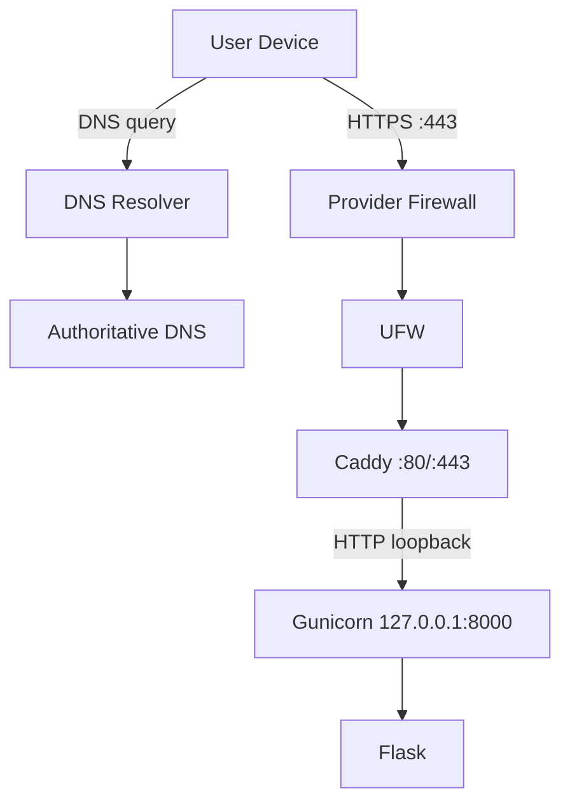

# MODUL CLOUD COMPUTING — PERTEMUAN 4

## Compute, Networking, DNS, dan Secure Endpoint

**Mata Kuliah:** Cloud Computing  
**Kode Mata Kuliah:** PTI 2802  
**Program Studi:** S1 Pendidikan Teknologi Informasi  
**Fakultas:** Fakultas Ilmu Terapan dan Sains  
**Perguruan Tinggi:** Institut Pendidikan Indonesia  
**Periode:** Semester Ganjil 2026/2027  
**Pertemuan:** 4 dari 16  
**Penyusun:** **Muhaemin Sidiq, S.Pd., M.Pd.**  
**Versi Modul:** 1.0 — Skenario VPS Ubuntu Server 24.04  
**Tanggal:** 1 Oktober 2026  

> **Tema utama:** mengubah deployment M03 yang masih berbasis public IPv4 dan HTTP menjadi endpoint berbasis nama domain yang terstruktur, dapat di-resolve melalui DNS, hanya mengekspos service yang diperlukan, menggunakan HTTPS/TLS yang valid, dan dapat didiagnosis secara sistematis dari Windows, Linux, iPhone, maupun Android.

---

# 1. Posisi Pertemuan 4 dalam Proyek Semester

Pertemuan 4 merupakan kelanjutan langsung dari **M03 — Project Inception: Architecture, Repository, dan First Deployment**.

Pada akhir Pertemuan 3, arsitektur baseline adalah:

```text
Internet
   │
   ▼
PUBLIC_IP:80
   │
   ▼
Provider Firewall
   │
   ▼
UFW
   │
   ▼
Caddy :80
   │
   ▼
Gunicorn 127.0.0.1:8000
   │
   ▼
Flask Application
```

Pertemuan 4 mengembangkan arsitektur tersebut menjadi:

```text
User Device
Windows / Linux / iPhone / Android
              │
              │ https://app.example.com
              ▼
       Recursive DNS Resolver
              │
              ▼
   Authoritative DNS for example.com
              │
              │ A → PUBLIC_IPV4
              ▼
          Public Internet
              │
              ▼
      VPS Public IPv4 :443
              │
              ▼
       Provider Firewall
              │
              ▼
             UFW
              │
              ▼
      Caddy TLS Termination
          :80 / :443
              │
              │ HTTP loopback
              ▼
   Gunicorn 127.0.0.1:8000
              │
              ▼
       Flask Application
```

Transformasi utama:

```text
M03                                 M04
────────────────────────────        ────────────────────────────
Public IP                    →      DNS hostname
HTTP                         →      HTTPS
Port 80                      →      80 + 443
IP URL                       →      FQDN URL
Manual network assumption    →      verified network path
No public certificate        →      publicly trusted TLS cert
Basic reverse proxy          →      secure endpoint gateway
Basic evidence               →      DNS + TLS + endpoint evidence
```

---

# 2. Lingkungan Praktikum

Praktikum tetap menggunakan VPS yang sama dengan Pertemuan 3.

| Komponen | Spesifikasi |
|---|---|
| CPU | **1 vCPU** |
| RAM | **1 GB** |
| Disk | **20 GB** |
| Public network | **1 public IPv4** |
| OS | **Ubuntu Server 24.04 LTS** |
| Application | Flask |
| Application server | Gunicorn |
| Process manager | systemd |
| Reverse proxy | Caddy |
| Host firewall | UFW |
| Repository | GitHub |
| Client | Windows / Linux / iPhone / Android |

Tambahan untuk Pertemuan 4:

- sebuah domain atau subdomain yang dapat dikelola DNS-nya;
- akses ke DNS control panel;
- TCP/80 dan TCP/443 dapat mencapai VPS;
- aplikasi M03 masih berfungsi;
- Caddy masih terpasang dan berjalan.

> Jika mahasiswa belum memiliki domain, dosen dapat menyediakan subdomain per mahasiswa, misalnya `nim123.lab.example.ac.id`. Yang penting mahasiswa memiliki hostname publik yang dapat diarahkan ke public IPv4 VPS.

---

# 3. Capaian Pembelajaran Pertemuan

Setelah menyelesaikan Pertemuan 4, mahasiswa mampu:

1. menjelaskan compute environment VPS dan jalur jaringan end-to-end;
2. mengidentifikasi interface, IP address, route, gateway, resolver, dan listening socket pada Ubuntu Server;
3. membedakan public IP, private IP, loopback, hostname, domain, dan FQDN;
4. menjelaskan fungsi DNS resolver dan authoritative DNS;
5. membedakan record A, AAAA, CNAME, TXT, NS, dan TTL secara konseptual;
6. membuat record A untuk domain/subdomain menuju public IPv4 VPS;
7. memverifikasi DNS dari resolver lokal, resolver publik, dan authoritative path;
8. menjelaskan dampak caching dan TTL;
9. menghindari konfigurasi AAAA yang salah ketika VPS tidak memiliki IPv6 publik;
10. membuka TCP/443 secara terkontrol pada host/provider firewall;
11. mengubah Caddy dari HTTP-IP endpoint menjadi hostname-based HTTPS endpoint;
12. menjelaskan fungsi TLS dan certificate validation;
13. menjelaskan hubungan DNS dengan ACME certificate issuance;
14. memperoleh HTTPS certificate secara otomatis melalui Caddy;
15. memverifikasi certificate, protocol, redirect, dan HTTPS dari empat jenis client;
16. mempertahankan backend agar hanya listen pada loopback;
17. menerapkan response security headers dasar secara proporsional;
18. mengaktifkan dan membaca access log tanpa mengabaikan aspek privasi;
19. mendiagnosis kegagalan berdasarkan layer;
20. memperbarui architecture v0.2, ADR, README, dan evidence repository;
21. menghasilkan milestone **M04 — Secure Public Endpoint**.

---

# 4. Deliverable Wajib M04

Repository proyek harus berkembang menjadi minimal:

```text
cloud-project/
├── app.py
├── requirements.txt
├── templates/
├── static/
├── README.md
├── docs/
│   ├── requirements.md
│   ├── architecture.md
│   ├── deployment.md
│   ├── networking.md
│   ├── security.md
│   ├── adr/
│   │   ├── 0001-initial-architecture.md
│   │   └── 0002-domain-tls-secure-endpoint.md
│   └── evidence/
│       ├── m03/
│       └── m04/
└── ...
```

Evidence minimum M04:

- [ ] public IPv4 VPS terverifikasi;
- [ ] network interface dan default route terverifikasi;
- [ ] listening socket terinventarisasi;
- [ ] DNS A record menunjuk ke IP VPS;
- [ ] DNS resolution terverifikasi dari client;
- [ ] port 443 terbuka;
- [ ] Caddyfile valid;
- [ ] Caddy memperoleh certificate publik;
- [ ] HTTP mengarahkan ke HTTPS;
- [ ] `https://<DOMAIN>/` bekerja;
- [ ] `https://<DOMAIN>/health` bekerja;
- [ ] certificate hostname cocok;
- [ ] backend tetap hanya di `127.0.0.1:8000`;
- [ ] firewall rule terdokumentasi;
- [ ] architecture v0.2 tersedia;
- [ ] ADR-0002 tersedia;
- [ ] tag/release `m04` tersedia.

---

# 5. Model Mental Compute Environment

VPS adalah compute environment yang menyediakan abstraksi komputasi virtual:

```text
PHYSICAL HOST
    │
    ▼
VIRTUALIZATION LAYER
    │
    ▼
VPS
├── vCPU
├── RAM
├── virtual disk
├── virtual NIC
├── operating system
└── public/private networking
```

Pada sisi guest OS, mahasiswa melihat interface dan IP yang disediakan platform.

Perintah dasar:

```bash
hostnamectl
nproc
free -h
df -h /
ip -brief address
ip route
```

Ubuntu menggunakan **Netplan** sebagai lapisan konfigurasi jaringan tingkat tinggi dan dapat meneruskan konfigurasi ke `systemd-networkd` atau NetworkManager [1].

> **Peringatan:** pada VPS cloud, jangan mengubah Netplan hanya untuk memenuhi latihan jika network sudah disediakan dengan benar oleh provider. Kesalahan Netplan dapat memutus SSH dan menyebabkan lockout. Pertemuan 4 berfokus pada *observasi dan reasoning* sebelum konfigurasi jaringan tingkat rendah.

---

# 6. Interface, Address, dan Route

## 6.1 Interface

Lihat:

```bash
ip -brief link
```

Lihat alamat:

```bash
ip -brief address
```

Contoh konseptual:

```text
lo        UNKNOWN  127.0.0.1/8 ::1/128
eth0      UP       10.0.0.5/24
```

Pada sebagian provider, guest VM dapat mempunyai private IP sementara public IP diterjemahkan melalui jaringan provider/NAT.

Pada provider lain, public IP dapat langsung muncul pada interface.

Karena itu:

> **Jangan berasumsi bahwa nilai public IP pasti muncul pada `ip addr`. Verifikasi model network provider.**

---

# 7. Loopback

Loopback IPv4:

```text
127.0.0.1
```

Loopback digunakan untuk komunikasi internal host.

Arsitektur proyek:

```text
Caddy → 127.0.0.1:8000 → Gunicorn
```

Keuntungan:

- backend tidak langsung tersedia dari internet;
- policy publik berada pada reverse proxy;
- port 8000 tidak perlu dibuka pada UFW/provider firewall.

---

# 8. Private dan Public IPv4

RFC 1918 mendefinisikan blok private IPv4 yang umum digunakan dalam jaringan internal [2]:

```text
10.0.0.0/8
172.16.0.0/12
192.168.0.0/16
```

Public IPv4 adalah alamat yang dapat dirutekan secara global, dengan pengecualian ruang alamat khusus/reserved lainnya.

Untuk modul:

```text
PUBLIC_IPV4=<alamat publik VPS>
```

Jangan menulis IP nyata mahasiswa dalam modul publik jika dianggap informasi infrastruktur sensitif.

---

# 9. Route dan Default Gateway

Lihat:

```bash
ip route
```

Contoh:

```text
default via 10.0.0.1 dev eth0
10.0.0.0/24 dev eth0 proto kernel scope link src 10.0.0.5
```

Makna:

- route lokal menangani subnet langsung;
- default route menangani destination yang tidak memiliki route lebih spesifik;
- gateway adalah next hop untuk traffic keluar.

Gunakan:

```bash
ip route get 1.1.1.1
```

untuk melihat route yang akan dipilih kernel menuju alamat tujuan tertentu.

---

# 10. Layered Network Reasoning

Gunakan model diagnosis berikut:

```text
APPLICATION LAYER
HTTP / HTTPS / DNS application behavior
        │
TRANSPORT LAYER
TCP ports 22 / 80 / 443 / 8000
        │
NETWORK LAYER
IP + routing
        │
LINK / VIRTUAL NETWORK
virtual NIC + provider network
```

Di atas semuanya terdapat policy:

```text
provider firewall
host firewall (UFW)
application binding
reverse proxy rules
```

---

# 11. Socket dan Listening Service

Inventaris service:

```bash
sudo ss -lntup
```

Target setelah M03:

```text
0.0.0.0:22       SSH
0.0.0.0:80       Caddy
127.0.0.1:8000   Gunicorn
```

Setelah M04:

```text
0.0.0.0:22       SSH
0.0.0.0:80       Caddy HTTP/redirect/ACME
0.0.0.0:443      Caddy HTTPS
127.0.0.1:8000   Gunicorn
```

Jika IPv6 aktif, `ss` dapat menampilkan bentuk `[::]:443` tergantung binding dan sistem.

---

# 12. Port Tidak Sama dengan Service

Port adalah identifikasi endpoint transport.

```text
22  → biasanya SSH
53  → DNS
80  → HTTP
443 → HTTPS
8000 → backend internal proyek
```

Namun port tidak otomatis menjamin service tertentu.

Contoh:

```text
TCP/443 open
```

belum membuktikan certificate valid atau hostname benar.

---

# 13. Network Path Secure Endpoint

Untuk request:

```text
https://app.example.com/health
```

jalur konseptual:

```text
1. user memasukkan hostname
2. client mencari DNS
3. resolver memperoleh A record
4. client memilih IP
5. client membuka TCP ke IP:443
6. TLS handshake terjadi
7. certificate diverifikasi
8. HTTP request dikirim melalui TLS
9. Caddy menerima request
10. Caddy reverse proxy ke 127.0.0.1:8000
11. Gunicorn meneruskan ke Flask
12. response kembali ke client
```

Setiap tahap dapat gagal secara independen.

---

# 14. Domain Name System — Fungsi Utama

DNS menyediakan sistem nama hierarkis dan resource records. RFC 1034 menjelaskan konsep dan fasilitas DNS, sementara RFC 1035 mendefinisikan format/protokol implementasinya [3], [4].

Model sederhana:

```text
app.example.com
      │
      ▼
DNS resolution
      │
      ▼
203.0.113.10
```

DNS **bukan**:

- web server;
- TLS encryption;
- firewall;
- application authentication;
- database.

---

# 15. FQDN

**Fully Qualified Domain Name (FQDN)** adalah nama lengkap dalam hierarki DNS.

Contoh:

```text
app.example.com
```

Struktur konseptual:

```text
.                  root
└── com             TLD
    └── example     registered domain
        └── app     host/subdomain label
```

---

# 16. Resolver dan Authoritative DNS

## Recursive resolver

Menerima pertanyaan client dan mencari jawaban melalui DNS hierarchy/cache.

Contoh resolver dapat berasal dari:

- ISP;
- jaringan kampus;
- sistem operasi;
- public resolver.

## Authoritative DNS

Server yang memiliki data otoritatif untuk zone tertentu.

```text
Client
  │
  ▼
Recursive Resolver
  │
  ├─ cache hit → answer
  │
  └─ cache miss
       │
       ▼
   DNS hierarchy
       │
       ▼
Authoritative server
```

---

# 17. DNS Resource Record yang Relevan

## A

Memetakan hostname ke IPv4.

```text
app.example.com.  A  203.0.113.10
```

Ini record utama praktikum.

## AAAA

Memetakan hostname ke IPv6.

> **Jangan buat AAAA jika VPS tidak mempunyai IPv6 publik yang benar-benar bekerja.**

## CNAME

Membuat satu nama menjadi alias ke canonical hostname.

Contoh konseptual:

```text
www.example.com CNAME app.example.com
```

## TXT

Membawa data teks; digunakan antara lain pada beberapa mekanisme verifikasi dan DNS-based ACME challenge.

## NS

Menunjukkan authoritative name server suatu zone/delegation.

---

# 18. TTL dan DNS Cache

RFC 1035 mendefinisikan TTL sebagai interval waktu record dapat disimpan pada cache sebelum sumber informasi perlu dikonsultasikan kembali [4].

Jika:

```text
TTL = 300
```

secara konseptual cache dapat menggunakan record selama sekitar 300 detik sesuai kebijakan/protokol resolver.

Konsekuensi:

- perubahan DNS tidak selalu terlihat serentak pada semua client;
- nilai lama dapat tetap berada pada cache;
- “sudah diubah di dashboard” tidak berarti semua resolver langsung memberi jawaban baru.

Istilah yang lebih tepat daripada “DNS belum tersebar” adalah:

> record authoritative sudah berubah, tetapi cache resolver tertentu masih dapat memiliki nilai lama hingga TTL/cache policy memungkinkan refresh.

---

# 19. DNS dan IPv6 — Kesalahan yang Harus Dihindari

Jika hanya mempunyai IPv4:

```text
A    → PUBLIC_IPV4
AAAA → jangan dibuat
```

Kesalahan:

```text
A     → server benar
AAAA  → IPv6 salah/tidak reachable
```

Sebagian client dapat mencoba IPv6. Hasilnya dapat terlihat seperti:

```text
sebagian perangkat berhasil
sebagian lambat/gagal
```

Padahal IPv4 sehat.

---

# 20. TLS — Tujuan

TLS 1.3 didefinisikan dalam RFC 8446. TLS dirancang agar aplikasi client/server berkomunikasi dengan perlindungan terhadap penyadapan, modifikasi, dan pemalsuan pesan pada jalur komunikasi [5].

Secara praktis, HTTPS menyediakan:

- encryption in transit;
- integrity protection;
- server authentication melalui certificate validation.

HTTPS tidak otomatis memperbaiki:

- SQL injection;
- authorization yang salah;
- password lemah;
- credential di repository;
- aplikasi yang vulnerable.

---

# 21. Certificate

Certificate publik mengikat identitas hostname dengan public key melalui trust chain.

Saat client membuka:

```text
https://app.example.com
```

client memeriksa antara lain:

- certificate masih valid secara waktu;
- hostname tercakup oleh certificate;
- chain mengarah ke trust anchor yang dipercaya;
- handshake berhasil.

---

# 22. ACME

Caddy menggunakan mekanisme otomatis untuk memperoleh certificate publik melalui ACME CA. Caddy mendokumentasikan bahwa public DNS name dapat dilayani dengan certificate dari CA publik seperti Let's Encrypt atau ZeroSSL [6].

Prasyarat umum Caddy automatic HTTPS:

- domain publik;
- A/AAAA benar;
- TCP/80 dan TCP/443 dapat dijangkau;
- Caddy dapat bind pada port tersebut;
- storage Caddy persistent dan writable;
- domain tercantum pada konfigurasi [6].

---

# 23. HTTP-01 dan TLS-ALPN-01

Caddy mendukung challenge otomatis. Untuk challenge HTTP, CA melakukan DNS lookup lalu mengambil resource challenge melalui TCP/80; TLS-ALPN challenge memerlukan TCP/443 [6], [7].

Implikasi praktikum:

```text
DNS benar + 80/443 reachable
```

adalah kondisi penting sebelum berharap certificate berhasil diterbitkan.

Let's Encrypt juga mendokumentasikan HTTP-01 sebagai challenge yang menggunakan resource di bawah:

```text
http://<domain>/.well-known/acme-challenge/...
```

untuk membuktikan kontrol domain [8].

---

# 24. Caddy Automatic HTTPS

Caddy mengaktifkan HTTPS otomatis ketika hostname publik digunakan sebagai site address dan kondisi jaringan/DNS terpenuhi [6].

Contoh M03:

```caddyfile
:80 {
    reverse_proxy 127.0.0.1:8000
}
```

Contoh M04:

```caddyfile
app.example.com {
    reverse_proxy 127.0.0.1:8000
}
```

Perubahan kecil pada konfigurasi menghasilkan perubahan arsitektur besar:

```text
hostname matching
+ certificate automation
+ HTTPS listener
+ HTTP → HTTPS redirect
```

Caddy menggunakan redirect HTTPS otomatis dan dokumentasinya menyebut redirect HTTP→HTTPS menggunakan status 308 [9].

---

# 25. Security Boundary

M04 mempertahankan boundary:

```text
PUBLIC
├── TCP/80  → Caddy
├── TCP/443 → Caddy
└── TCP/22  → SSH administration

PRIVATE TO HOST
└── TCP/8000 → Gunicorn on 127.0.0.1 only
```

Yang **tidak** boleh dilakukan:

```text
UFW allow 8000/tcp
Gunicorn --bind 0.0.0.0:8000
```

kecuali ada kebutuhan teknis khusus yang dijelaskan dan diaudit.

---

# 26. Defense in Depth

Secure endpoint bukan satu kontrol.

```text
DNS correctness
    +
provider firewall
    +
UFW
    +
Caddy TLS
    +
loopback-only backend
    +
SSH hardening
    +
application security
```

Satu kontrol tidak menggantikan semua kontrol lain.

---

# 27. Praktikum — Prasyarat

Sebelum mulai, verifikasi M03:

```bash
sudo systemctl status cc-m03 --no-pager
sudo systemctl status caddy --no-pager
sudo ufw status verbose
curl -fsS http://127.0.0.1:8000/health
curl -fsS http://127.0.0.1/health
```

Expected:

- backend sehat;
- Caddy sehat;
- port 80 tersedia;
- SSH masih dapat digunakan.

---

# 28. Variabel Praktikum

Ganti placeholder:

```text
PUBLIC_IPV4=<public IPv4 VPS>
DOMAIN=<FQDN proyek>
```

Contoh:

```text
PUBLIC_IPV4=203.0.113.10
DOMAIN=app.example.com
```

Jangan gunakan IP dokumentasi sebagai IP VPS nyata.

---

# 29. Tahap A — Audit Compute Environment

SSH ke VPS.

Jalankan:

```bash
hostnamectl
```

```bash
nproc
```

```bash
free -h
```

```bash
df -h /
```

```bash
uptime
```

Catat:

```text
hostname       = ...
vCPU           = ...
RAM            = ...
disk usage     = ...
load average   = ...
```

---

# 30. Audit Interface

```bash
ip -brief link
```

```bash
ip -brief address
```

Lebih detail:

```bash
ip addr show
```

Pertanyaan:

1. apa nama interface utama?
2. apakah address guest private atau public?
3. apakah IPv6 tersedia?
4. apa interface loopback?

---

# 31. Audit Route

```bash
ip route
```

Route keluar:

```bash
ip route get 1.1.1.1
```

Catat:

- interface keluar;
- source address;
- gateway bila terlihat.

---

# 32. Audit DNS Resolver VPS

Ubuntu menggunakan `systemd-resolved` pada konfigurasi umum untuk menyediakan name resolution lokal [10].

Periksa:

```bash
resolvectl status
```

Uji:

```bash
resolvectl query ubuntu.com
```

Fallback bila `resolvectl` tidak tersedia:

```bash
getent ahosts ubuntu.com
```

Periksa:

```bash
ls -l /etc/resolv.conf
```

> Jangan mengganti `/etc/resolv.conf` secara manual tanpa memahami siapa yang mengelolanya.

---

# 33. Audit Public IPv4

Bandingkan IP provider dashboard dengan endpoint eksternal yang dipercaya.

Contoh:

```bash
curl -4 https://ifconfig.me
```

atau gunakan dashboard provider sebagai source of truth administratif.

Catat:

```text
PUBLIC_IPV4=...
```

---

# 34. Audit Socket

```bash
sudo ss -lntup
```

Verifikasi backend:

```bash
sudo ss -lntp | grep ':8000'
```

Target:

```text
127.0.0.1:8000
```

Verifikasi Caddy:

```bash
sudo ss -lntp | grep -E ':(80|443)\b'
```

Sebelum HTTPS kemungkinan hanya 80.

---

# 35. Audit UFW

Ubuntu mendokumentasikan UFW sebagai frontend firewall default yang user-friendly [11].

```bash
sudo ufw status verbose
```

Saat awal M04 minimal:

```text
OpenSSH ALLOW
80/tcp  ALLOW
```

---

# 36. Audit Provider Firewall

Buka panel VPS provider.

Verifikasi inbound:

```text
TCP 22  → sumber admin atau sesuai kebijakan
TCP 80  → Internet
TCP 443 → belum/akan dibuka
```

Jangan membuka:

```text
TCP 8000 → Internet
```

---

# 37. Evidence Baseline

Buat:

```bash
mkdir -p /srv/cc-m03/docs/evidence/m04
cd /srv/cc-m03
```

Simpan:

```bash
{
  echo '=== ADDRESS ==='
  ip -brief address
  echo
  echo '=== ROUTE ==='
  ip route
  echo
  echo '=== SOCKETS ==='
  sudo ss -lntup
} > docs/evidence/m04/network-baseline.txt
```

Review file sebelum commit.

---

# 38. Tahap B — Tentukan Hostname Publik

Gunakan subdomain proyek.

Contoh pola:

```text
<NIM>.lab.example.com
app-<NIM>.example.com
<project>.example.com
```

Rekomendasi:

- pendek;
- tidak mengandung data sensitif;
- stabil sepanjang semester;
- tidak sering diganti.

---

# 39. Pilih A Record

Karena skenario hanya menjamin public IPv4:

```text
Type: A
Name/Host: app
Value: <PUBLIC_IPV4>
TTL: 300 atau nilai wajar provider
```

Jika hostname:

```text
app.example.com
```

control panel DNS dapat meminta `app` sebagai host, bukan FQDN lengkap. UI berbeda antar-provider.

---

# 40. Jangan Buat AAAA Tanpa IPv6

Periksa IPv6:

```bash
ip -6 address
```

Test outbound IPv6 jika ada:

```bash
curl -6 -I https://www.cloudflare.com/
```

Jika VPS **tidak mempunyai IPv6 publik end-to-end yang valid**, jangan membuat AAAA.

---

# 41. Tahap C — Tambahkan DNS Record

Di DNS provider:

```text
TYPE : A
NAME : <host-label>
VALUE: <PUBLIC_IPV4>
TTL  : 300 (contoh; ikuti provider)
```

Simpan.

Catat waktu perubahan:

```text
YYYY-MM-DD HH:MM timezone
```

---

# 42. Verifikasi DNS dari Authoritative/Recursive Path

Jangan langsung mengubah Caddy.

Pertama, pastikan DNS benar.

Target:

```text
DOMAIN → PUBLIC_IPV4
```

---

# 43. Windows — Verifikasi DNS

PowerShell:

```powershell
Resolve-DnsName -Name <DOMAIN> -Type A -DnsOnly
```

Microsoft mendokumentasikan `Resolve-DnsName` untuk melakukan DNS query dan mendukung pemilihan record type/server [12].

Alternatif:

```powershell
nslookup <DOMAIN>
```

`nslookup` tersedia pada Windows 10/11 untuk diagnosis DNS [13].

---

# 44. Windows — Query Resolver Tertentu

```powershell
Resolve-DnsName `
  -Name <DOMAIN> `
  -Type A `
  -Server 1.1.1.1 `
  -DnsOnly
```

Bandingkan dengan resolver lain bila diperlukan.

Tujuan bukan menentukan resolver “terbaik”, melainkan melihat apakah hasil konsisten.

---

# 45. Linux — Verifikasi DNS

Instal `dig` bila perlu:

```bash
sudo apt update
sudo apt install -y dnsutils
```

Query:

```bash
dig <DOMAIN> A
```

Ringkas:

```bash
dig +short <DOMAIN> A
```

Resolver tertentu:

```bash
dig @1.1.1.1 <DOMAIN> A
```

---

# 46. VPS — Verifikasi DNS

Dari VPS:

```bash
resolvectl query <DOMAIN>
```

atau:

```bash
dig +short <DOMAIN> A
```

Expected:

```text
<PUBLIC_IPV4>
```

---

# 47. iPhone — Verifikasi DNS

Metode universal tanpa tool tambahan:

1. buka Safari;
2. akses:
   ```text
   http://<DOMAIN>/
   ```
3. bila DNS sudah resolve dan port 80 sehat, halaman M03 harus terbuka.

Untuk diagnosis terminal menggunakan Termius, SSH ke VPS lalu:

```bash
dig +short <DOMAIN> A
```

Jika menggunakan aplikasi DNS lookup pihak ketiga, pastikan aplikasi hanya dipakai sebagai alat bantu; evidence utama tetap berasal dari DNS query yang dapat direproduksi.

---

# 48. Android — Verifikasi DNS

Browser:

```text
http://<DOMAIN>/
```

Jika menggunakan Termux:

```bash
pkg install dnsutils
```

```bash
dig +short <DOMAIN> A
```

atau SSH ke VPS melalui Termius kemudian gunakan `dig` pada server.

---

# 49. Interpretasi DNS

## Benar

```text
DOMAIN → PUBLIC_IPV4
```

Lanjutkan ke TLS.

## NXDOMAIN

Nama tidak ada menurut resolver.

Periksa:

- typo;
- record belum dibuat;
- zone salah;
- nameserver/delegation salah.

## IP lama

Kemungkinan cache TTL.

Periksa:

- authoritative value;
- TTL;
- resolver berbeda.

## Multiple A records

Pastikan semua IP memang seharusnya menerima traffic.

---

# 49A. Verifikasi ke Authoritative Name Server

Untuk membedakan **data authoritative** dari **cache recursive resolver**, identifikasi name server zone.

Linux/VPS:

```bash
dig <ZONE> NS
```

Contoh konseptual:

```text
example.com. NS ns1.dns-provider.example.
example.com. NS ns2.dns-provider.example.
```

Kemudian query langsung ke salah satu authoritative server:

```bash
dig @<AUTHORITATIVE_NS> <DOMAIN> A
```

Jika authoritative server sudah menjawab IP baru tetapi recursive resolver tertentu masih menjawab IP lama, masalah utamanya bukan lagi konfigurasi record pada authoritative zone, melainkan kemungkinan cache/TTL di jalur resolver.

Windows dapat menggunakan server tertentu:

```powershell
Resolve-DnsName -Name <DOMAIN> -Type A -Server <AUTHORITATIVE_NS> -DnsOnly
```

Untuk observasi hierarki DNS dari Linux/VPS, gunakan:

```bash
dig +trace <DOMAIN> A
```

`+trace` berguna untuk pembelajaran delegasi DNS, tetapi outputnya lebih panjang dan tidak perlu digunakan untuk setiap pemeriksaan rutin.

---

# 50. Jangan Menggunakan Hosts File sebagai Bukti DNS Publik

Mengubah `/etc/hosts` atau Windows hosts file dapat membuat hostname bekerja hanya pada satu device.

Itu **tidak membuktikan DNS publik benar**.

Hosts file hanya boleh digunakan sebagai eksperimen diagnostik terkontrol, bukan solusi utama M04.

---

# 51. Tahap D — Buka HTTPS Port pada UFW

Pastikan SSH session aktif.

```bash
sudo ufw allow 443/tcp
```

Verifikasi:

```bash
sudo ufw status numbered
```

Target:

```text
22/tcp   ALLOW
80/tcp   ALLOW
443/tcp  ALLOW
```

Jika `OpenSSH` profile digunakan, output dapat menampilkan nama profile.

---

# 52. Provider Firewall — Buka 443

Di control panel provider:

```text
Protocol : TCP
Port     : 443
Source   : 0.0.0.0/0
Purpose  : public HTTPS
```

Jika IPv6 benar-benar digunakan, buat policy IPv6 yang sesuai.

Jangan membuka port backend 8000.

---

# 53. Verifikasi Firewall Host

```bash
sudo ufw status verbose
```

Simpan evidence:

```bash
sudo ufw status verbose \
  > /tmp/m04-ufw.txt
cp /tmp/m04-ufw.txt \
  /srv/cc-m03/docs/evidence/m04/ufw.txt
```

---

# 54. Tahap E — Backup Caddyfile

```bash
sudo cp \
  /etc/caddy/Caddyfile \
  /etc/caddy/Caddyfile.m03.bak
```

Tampilkan config M03:

```bash
sudo cat /etc/caddy/Caddyfile
```

---

# 55. Konfigurasi Caddy M04 Minimum

Edit:

```bash
sudo nano /etc/caddy/Caddyfile
```

Isi:

```caddyfile
<DOMAIN> {
    encode zstd gzip
    reverse_proxy 127.0.0.1:8000
}
```

Contoh konseptual:

```caddyfile
app.example.com {
    encode zstd gzip
    reverse_proxy 127.0.0.1:8000
}
```

Jangan menulis:

```caddyfile
http://app.example.com
```

karena prefix eksplisit `http://` mencegah automatic HTTPS [6].

---

# 56. Validasi Sebelum Reload

```bash
sudo caddy validate \
  --config /etc/caddy/Caddyfile
```

Jika valid, format opsional:

```bash
sudo caddy fmt \
  --overwrite \
  /etc/caddy/Caddyfile
```

Validasi kembali:

```bash
sudo caddy validate \
  --config /etc/caddy/Caddyfile
```

---

# 57. Reload Caddy

```bash
sudo systemctl reload caddy
```

Status:

```bash
sudo systemctl status caddy --no-pager
```

Jika gagal:

```bash
sudo journalctl \
  -u caddy \
  -n 100 \
  --no-pager
```

---

# 58. Apa yang Terjadi Saat Reload?

Dengan hostname publik yang valid, Caddy akan mencoba:

```text
1. membaca hostname
2. memastikan HTTPS automation aktif
3. melakukan ACME validation
4. memperoleh certificate
5. menyimpan certificate state
6. listen pada :443
7. menyediakan HTTPS
8. mengarahkan HTTP ke HTTPS
```

Caddy mendokumentasikan certificate management dan redirect otomatis tersebut [6].

---

# 59. Verifikasi Port Setelah Reload

```bash
sudo ss -lntp | grep -E ':(80|443|8000)\b'
```

Target:

```text
:80              Caddy
:443             Caddy
127.0.0.1:8000   Gunicorn
```

---

# 60. Verifikasi HTTPS dari VPS

```bash
curl -I https://<DOMAIN>/
```

Health:

```bash
curl -fsS https://<DOMAIN>/health
```

HTTP redirect:

```bash
curl -I http://<DOMAIN>/
```

Expected:

- HTTP menghasilkan redirect ke HTTPS;
- HTTPS menghasilkan response aplikasi;
- health menghasilkan status 200.

---

# 61. Ikuti Redirect

```bash
curl -IL http://<DOMAIN>/
```

Amati rangkaian:

```text
HTTP response
Location: https://...
↓
HTTPS response
```

Caddy menggunakan automatic redirect untuk mengarahkan HTTP ke HTTPS [6], [9].

---

# 62. Periksa Certificate dengan OpenSSL

Ubuntu:

```bash
openssl s_client \
  -connect <DOMAIN>:443 \
  -servername <DOMAIN> \
  </dev/null
```

Ringkas certificate:

```bash
openssl s_client \
  -connect <DOMAIN>:443 \
  -servername <DOMAIN> \
  </dev/null 2>/dev/null \
  | openssl x509 \
      -noout \
      -subject \
      -issuer \
      -dates \
      -ext subjectAltName
```

Periksa:

- `subjectAltName` mencakup domain;
- `notBefore`;
- `notAfter`;
- issuer.

---

# 63. Windows — Verifikasi Secure Endpoint

PowerShell:

```powershell
curl.exe -I https://<DOMAIN>/
```

```powershell
curl.exe https://<DOMAIN>/health
```

DNS:

```powershell
Resolve-DnsName -Name <DOMAIN> -Type A -DnsOnly
```

Port:

```powershell
Test-NetConnection -ComputerName <DOMAIN> -Port 443
```

Expected:

```text
TcpTestSucceeded : True
```

---

# 64. Linux — Verifikasi Secure Endpoint

```bash
dig +short <DOMAIN> A
```

```bash
curl -I https://<DOMAIN>/
```

```bash
curl https://<DOMAIN>/health
```

TCP test bila `nc` tersedia:

```bash
nc -vz <DOMAIN> 443
```

---

# 65. iPhone — Verifikasi Secure Endpoint

Safari:

```text
https://<DOMAIN>/
```

Kemudian:

```text
https://<DOMAIN>/health
```

Periksa:

- tidak ada warning certificate;
- hostname sesuai;
- HTTPS aktif;
- halaman dapat dimuat melalui Wi-Fi;
- bila memungkinkan, uji melalui mobile data.

Uji jaringan berbeda membantu memastikan endpoint benar-benar publik dan bukan hanya accessible dari satu jaringan lokal.

---

# 66. Android — Verifikasi Secure Endpoint

Chrome/Firefox:

```text
https://<DOMAIN>/
```

Termux:

```bash
curl -I https://<DOMAIN>/
```

```bash
curl https://<DOMAIN>/health
```

Jika browser memberi warning certificate, **jangan tekan “proceed anyway” sebagai solusi**. Diagnosis penyebabnya.

---

# 67. Validasi dengan Browser Certificate UI

Pada browser desktop/mobile, lihat informasi koneksi.

Periksa:

- koneksi secure;
- certificate hostname;
- issuer;
- validity.

UI browser dapat berubah, sehingga evidence utama tetap dapat menggunakan OpenSSL/curl dari terminal.

---

# 68. Tahap F — Security Headers Dasar

Tambahkan secara proporsional di Caddy:

```caddyfile
<DOMAIN> {
    encode zstd gzip

    header {
        X-Content-Type-Options "nosniff"
        Referrer-Policy "strict-origin-when-cross-origin"
        X-Frame-Options "DENY"
    }

    reverse_proxy 127.0.0.1:8000
}
```

Caddy menyediakan directive `header` untuk mengatur response headers dan mendokumentasikan contoh security headers [14].

---

# 69. Mengapa Belum Langsung HSTS?

Caddy docs memberikan contoh `Strict-Transport-Security`, tetapi juga memperingatkan agar header keamanan hanya digunakan ketika implikasinya dipahami [14].

Pada laboratorium awal:

- pastikan HTTPS stabil terlebih dahulu;
- pahami bahwa HSTS memberi instruksi browser untuk memaksa HTTPS selama periode tertentu;
- konfigurasi domain/subdomain yang salah dapat menjadi lebih sulit dipulihkan setelah HSTS dicache.

Karena itu HSTS dibahas sebagai **opsional terkontrol**, bukan langkah wajib pertama.

---

# 70. Jika HSTS Akan Diaktifkan

Setelah HTTPS stabil dan dosen menyetujui:

```caddyfile
header {
    Strict-Transport-Security "max-age=86400"
    X-Content-Type-Options "nosniff"
    Referrer-Policy "strict-origin-when-cross-origin"
    X-Frame-Options "DENY"
}
```

Mulai dengan masa yang konservatif untuk lab.

Jangan menggunakan `includeSubDomains` atau `preload` tanpa memahami dampaknya terhadap seluruh subdomain.

---

# 71. Content-Security-Policy

CSP sangat berguna tetapi harus dibuat sesuai konten aplikasi.

Jangan copy-paste policy terlalu ketat tanpa testing.

Untuk aplikasi baseline sederhana yang seluruh asset berasal dari origin sendiri, eksperimen dapat menggunakan:

```text
Content-Security-Policy: default-src 'self'
```

Tetapi lakukan pengujian jika template memakai inline styles/scripts atau resource eksternal.

---

# 72. Tahap G — Access Logging

Caddy mempunyai fasilitas access/request logging melalui directive `log` [15].

Konfigurasi sederhana:

```caddyfile
<DOMAIN> {
    encode zstd gzip

    log

    header {
        X-Content-Type-Options "nosniff"
        Referrer-Policy "strict-origin-when-cross-origin"
        X-Frame-Options "DENY"
    }

    reverse_proxy 127.0.0.1:8000
}
```

Dengan systemd package, log operasional Caddy dapat dibaca melalui journal.

---

# 73. Privacy dan Logging

Access logs dapat mengandung:

- client IP;
- URL/path;
- method;
- user agent;
- timestamp;
- response code.

Karena itu:

- jangan log secret pada URL;
- jangan menaruh token pada query string;
- batasi retention sesuai kebutuhan;
- jangan mengunggah raw log yang mengandung personal data ke repository publik.

Caddy mendukung filter termasuk masking IP pada logging bila dibutuhkan pada konfigurasi lebih lanjut [15].

---

# 74. Reload Setelah Hardening

```bash
sudo caddy validate \
  --config /etc/caddy/Caddyfile
```

```bash
sudo systemctl reload caddy
```

Test:

```bash
curl -I https://<DOMAIN>/
```

Periksa header.

---

# 75. Capture Header Evidence

```bash
curl -sS -D - \
  -o /dev/null \
  https://<DOMAIN>/ \
  > /srv/cc-m03/docs/evidence/m04/https-headers.txt
```

Review file.

---

# 76. Capture DNS Evidence

```bash
dig <DOMAIN> A \
  > /srv/cc-m03/docs/evidence/m04/dns-a.txt
```

Ringkas:

```bash
dig +short <DOMAIN> A \
  > /srv/cc-m03/docs/evidence/m04/dns-a-short.txt
```

---

# 77. Capture TLS Evidence

```bash
openssl s_client \
  -connect <DOMAIN>:443 \
  -servername <DOMAIN> \
  </dev/null 2>/dev/null \
  | openssl x509 \
      -noout \
      -subject \
      -issuer \
      -dates \
      -ext subjectAltName \
  > /srv/cc-m03/docs/evidence/m04/tls-certificate.txt
```

---

# 78. Capture Socket Evidence

```bash
sudo ss -lntp \
  > /tmp/m04-sockets.txt
```

Review:

```bash
cat /tmp/m04-sockets.txt
```

Jika aman:

```bash
cp /tmp/m04-sockets.txt \
  /srv/cc-m03/docs/evidence/m04/sockets.txt
```

---

# 79. Capture Caddy Status

```bash
systemctl status caddy --no-pager \
  > /srv/cc-m03/docs/evidence/m04/caddy-status.txt
```

Application:

```bash
systemctl status cc-m03 --no-pager \
  > /srv/cc-m03/docs/evidence/m04/app-status.txt
```

---

# 80. Capture Health Evidence

Internal backend:

```bash
curl -fsS http://127.0.0.1:8000/health \
  > docs/evidence/m04/health-backend.json
```

Public HTTPS:

```bash
curl -fsS https://<DOMAIN>/health \
  > docs/evidence/m04/health-https.json
```

Keduanya harus sukses.

---

# 81. Sanitasi Evidence

Sebelum commit:

```bash
grep -RniE \
  'password|token|secret|authorization:|BEGIN.*PRIVATE' \
  docs/evidence/m04
```

Review manual.

Jangan commit:

- private key;
- provider token;
- DNS API key;
- GitHub token;
- ACME account private material;
- raw log yang mengandung data sensitif tanpa sanitasi.

---

# 82. Tahap H — Update Architecture v0.2

Edit:

```bash
nano docs/architecture.md
```

Perbarui deployment view:

````markdown
## Deployment View v0.2



## Public DNS

`<DOMAIN> A <PUBLIC_IPV4>`

## Public Ports

- 22/tcp — SSH administration
- 80/tcp — HTTP redirect / ACME challenge
- 443/tcp — HTTPS

## Private Host Port

- 127.0.0.1:8000 — Gunicorn

## TLS

Managed automatically by Caddy through a public ACME CA.
````

---

# 83. Tambahkan Data Flow

Dokumentasikan:

```text
Browser
  │
  │ DNS
  ▼
DOMAIN → PUBLIC_IPV4
  │
  │ TCP/443 + TLS
  ▼
Caddy
  │
  │ local HTTP
  ▼
Gunicorn
  │
  ▼
Flask
```

Ini harus dapat dijelaskan saat technical defense.

---

# 84. Tahap I — ADR-0002

Buat:

```bash
nano docs/adr/0002-domain-tls-secure-endpoint.md
```

Template:

```markdown
# ADR-0002: Public DNS and TLS Termination with Caddy

## Status
Accepted

## Context

M03 menggunakan public IPv4 dan HTTP.
M04 membutuhkan hostname stabil dan secure endpoint.
VPS memiliki 1 vCPU, 1 GB RAM, Ubuntu Server 24.04.

## Decision

- gunakan subdomain publik;
- gunakan A record ke public IPv4 VPS;
- jangan membuat AAAA tanpa IPv6 yang valid;
- gunakan Caddy sebagai TLS terminator dan reverse proxy;
- pertahankan Gunicorn pada 127.0.0.1:8000;
- buka TCP/80 dan TCP/443;
- gunakan automatic HTTPS Caddy.

## Alternatives Considered

1. NGINX + Certbot
2. Apache + Certbot
3. aplikasi melayani TLS langsung
4. self-signed certificate
5. akses berbasis IP tanpa domain

## Rationale

Jelaskan alasan berdasarkan:
- footprint VPS;
- automation;
- maintainability;
- separation of concerns;
- learning outcomes.

## Consequences

### Positive
- valid public HTTPS;
- certificate lifecycle otomatis;
- aplikasi tetap sederhana;
- backend tidak diekspos.

### Negative
- dependency pada DNS yang benar;
- dependency pada CA/ACME availability;
- port 80/443 harus reachable untuk challenge default.

## Risks

- DNS salah;
- AAAA stale;
- provider firewall menutup 80/443;
- certificate issuance rate limit jika eksperimen berulang tidak terkontrol.

## Review Trigger

Tinjau jika:
- pindah provider;
- menambah load balancer/CDN;
- mengadopsi container/orchestrator;
- membutuhkan wildcard certificate.
```

---

# 85. Tahap J — Update `docs/networking.md`

Buat:

```bash
nano docs/networking.md
```

Isi minimal:

```markdown
# Networking — M04

## VPS

Public IPv4: `<REDACT_OR_VALUE_AS_POLICY>`

## Interface

Main interface: ...

## Default Route

...

## DNS

Domain: `<DOMAIN>`
Record: A → `<PUBLIC_IPV4>`
AAAA: not configured unless verified IPv6 exists

## Public Ports

| Port | Protocol | Purpose |
|---:|---|---|
| 22 | TCP | SSH administration |
| 80 | TCP | HTTP redirect / ACME HTTP-01 |
| 443 | TCP | HTTPS |

## Internal Ports

| Address | Port | Service |
|---|---:|---|
| 127.0.0.1 | 8000 | Gunicorn |

## Firewalls

- provider firewall
- UFW

## Validation Commands

...
```

---

# 86. Tahap K — Update `docs/security.md`

Buat atau perbarui:

```bash
nano docs/security.md
```

Isi:

```markdown
# Security Baseline — M04

## Identity and Administration

- non-root SSH user
- public key authentication
- password SSH disabled

## Network Exposure

Public:
- 22/tcp
- 80/tcp
- 443/tcp

Private to host:
- 127.0.0.1:8000

## Transport Security

- public HTTPS
- certificate managed by Caddy
- HTTP redirects to HTTPS

## HTTP Response Headers

- X-Content-Type-Options
- Referrer-Policy
- X-Frame-Options

## Known Limitations

- single VPS
- no WAF
- no application authentication yet
- no centralized log system
- no external uptime monitoring yet
```

---

# 87. Tahap L — Update README

Perbarui bagian deployment:

```markdown
## Production-like Development Endpoint

URL: `https://<DOMAIN>/`

Health: `https://<DOMAIN>/health`

## Network Architecture

Public entry points:
- TCP/80 → Caddy redirect/ACME
- TCP/443 → Caddy HTTPS

Internal application:
- `127.0.0.1:8000` → Gunicorn

## DNS

`<DOMAIN>` resolves through an A record to the VPS public IPv4.

## Security

- SSH public key authentication
- UFW
- loopback-only backend
- Caddy automatic HTTPS
```

---

# 88. Tahap M — Commit M04

Periksa:

```bash
git status
```

Review diff:

```bash
git diff
```

Tambahkan:

```bash
git add README.md docs/
```

Commit:

```bash
git commit -m "docs: establish M04 DNS and secure endpoint architecture"
```

Push:

```bash
git push
```

---

# 89. Simpan Caddyfile dalam Repository?

Konfigurasi sistem berada di:

```text
/etc/caddy/Caddyfile
```

Untuk traceability, buat salinan **tanpa secret**:

```bash
mkdir -p ops/caddy
```

```bash
sudo cp /etc/caddy/Caddyfile \
  /srv/cc-m03/ops/caddy/Caddyfile
```

```bash
sudo chown cloudstudent:cloudstudent \
  /srv/cc-m03/ops/caddy/Caddyfile
```

Commit sebagai engineering artifact.

> Caddyfile normal tidak membutuhkan private key/certificate path ketika automatic HTTPS digunakan; Caddy mengelola certificate material di storage internalnya. Jangan menyalin storage certificate/private key ke Git.

---

# 90. Konfigurasi yang Direkomendasikan Setelah M04

Contoh baseline:

```caddyfile
<DOMAIN> {
    encode zstd gzip

    log

    header {
        X-Content-Type-Options "nosniff"
        Referrer-Policy "strict-origin-when-cross-origin"
        X-Frame-Options "DENY"
    }

    reverse_proxy 127.0.0.1:8000
}
```

Pertahankan sederhana.

Jangan menambahkan konfigurasi kompleks yang belum dipahami.

---

# 91. Troubleshooting Philosophy

Gunakan urutan:

```text
OBSERVE
  ↓
COLLECT EVIDENCE
  ↓
LOCALIZE LAYER
  ↓
FORM HYPOTHESIS
  ↓
TEST
  ↓
VERIFY
  ↓
DOCUMENT
```

Bukan:

```text
website gagal
  ↓
ubah DNS
ubah firewall
reinstall Caddy
reboot VPS
ubah app
  ↓
masalah hilang tetapi penyebab tidak diketahui
```

---

# 92. Matriks Diagnosis Utama

| Gejala | Layer kandidat utama | Pemeriksaan pertama |
|---|---|---|
| `NXDOMAIN` | DNS | record/zone/delegation |
| domain resolve ke IP salah | DNS/cache | `dig`, authoritative value |
| TCP/443 timeout | network/firewall | provider firewall, UFW, listener |
| TCP/443 refused | listener/service | `ss`, Caddy status |
| TLS certificate error | TLS/DNS | Caddy log, hostname, cert |
| HTTP 502 | reverse proxy/backend | Gunicorn/systemd |
| HTTPS 404 | application/routing | app route/Caddy route |
| internal backend sehat, HTTPS gagal | Caddy/TLS/network | Caddy + firewall |
| HTTPS sehat dari VPS, gagal dari mobile | external path/DNS cache | mobile resolver/network |

---

# 93. Kasus 1 — NXDOMAIN

Windows:

```powershell
Resolve-DnsName -Name <DOMAIN> -Type A -DnsOnly
```

Linux:

```bash
dig <DOMAIN> A
```

Jika:

```text
NXDOMAIN
```

periksa:

1. domain ditulis benar;
2. zone DNS benar;
3. record A ada;
4. authoritative nameserver domain benar;
5. subdomain tidak salah zone.

Jangan troubleshooting Caddy terlebih dahulu jika nama belum resolve.

---

# 94. Kasus 2 — DNS ke IP Salah

```bash
dig +short <DOMAIN> A
```

Jika hasil bukan IP VPS:

- perbaiki record authoritative;
- periksa record lama;
- periksa multiple A;
- tunggu cache sesuai TTL bila resolver masih menyimpan value lama.

---

# 95. Kasus 3 — Ada AAAA yang Tidak Valid

Query:

```bash
dig +short <DOMAIN> AAAA
```

Jika muncul IPv6 tetapi server tidak mendukung IPv6 publik:

- hapus AAAA yang salah;
- tunggu cache;
- uji kembali.

Bandingkan:

```bash
curl -4 -I https://<DOMAIN>/
```

```bash
curl -6 -I https://<DOMAIN>/
```

Jika IPv4 berhasil dan IPv6 gagal, konfigurasi AAAA/network IPv6 harus diaudit.

---

# 96. Kasus 4 — HTTP Bekerja, HTTPS Timeout

Periksa listener:

```bash
sudo ss -lntp | grep ':443'
```

UFW:

```bash
sudo ufw status verbose
```

Provider firewall:

```text
TCP/443 ALLOW?
```

Caddy:

```bash
sudo systemctl status caddy --no-pager
```

Log:

```bash
sudo journalctl -u caddy -n 100 --no-pager
```

---

# 97. Kasus 5 — Certificate Issuance Gagal

Caddy log:

```bash
sudo journalctl \
  -u caddy \
  -n 200 \
  --no-pager
```

Periksa:

1. A record benar;
2. AAAA tidak salah;
3. port 80 accessible;
4. port 443 accessible;
5. hostname pada Caddyfile benar;
6. Caddy dapat menulis storage;
7. waktu sistem benar;
8. CA/rate limit tidak bermasalah.

---

# 98. Periksa Waktu Sistem

TLS sangat bergantung pada validitas waktu certificate.

```bash
timedatectl
```

Pastikan sinkronisasi waktu sehat.

---

# 99. Kasus 6 — HTTP-01 Gagal

Caddy automatic HTTPS menjelaskan bahwa HTTP challenge membutuhkan port 80 externally accessible [6].

Periksa dari external client:

```powershell
Test-NetConnection <DOMAIN> -Port 80
```

Linux:

```bash
nc -vz <DOMAIN> 80
```

Jangan membuat manual file ACME jika Caddy sedang mengelola challenge; perbaiki network reachability terlebih dahulu.

---

# 100. Kasus 7 — 502 Bad Gateway

DNS dan TLS sudah selesai. 502 menunjukkan reverse proxy tidak memperoleh response sehat dari upstream.

Backend:

```bash
curl -v http://127.0.0.1:8000/health
```

Service:

```bash
sudo systemctl status cc-m03 --no-pager
```

Log:

```bash
sudo journalctl -u cc-m03 -n 100 --no-pager
```

Socket:

```bash
sudo ss -lntp | grep ':8000'
```

---

# 101. Kasus 8 — Backend Bind Salah

Jika:

```bash
sudo ss -lntp | grep ':8000'
```

menunjukkan:

```text
0.0.0.0:8000
```

periksa systemd unit:

```bash
sudo systemctl cat cc-m03
```

Pastikan:

```text
--bind 127.0.0.1:8000
```

Reload bila unit berubah:

```bash
sudo systemctl daemon-reload
sudo systemctl restart cc-m03
```

---

# 102. Kasus 9 — Caddyfile Syntax Error

Validasi:

```bash
sudo caddy validate \
  --config /etc/caddy/Caddyfile
```

Format:

```bash
sudo caddy fmt \
  --diff \
  /etc/caddy/Caddyfile
```

Jangan reload config yang belum valid.

---

# 103. Kasus 10 — Redirect Loop

Gejala:

```text
too many redirects
```

Kemungkinan:

- aplikasi memaksa HTTPS dengan asumsi proxy header yang salah;
- reverse proxy bertingkat;
- CDN/proxy eksternal salah mode;
- konfigurasi redirect manual berkonflik.

Pada arsitektur M04 sederhana, biarkan Caddy mengelola redirect HTTP→HTTPS dan jangan menambah redirect Flask tanpa kebutuhan.

---

# 104. Kasus 11 — Certificate Hostname Mismatch

Penyebab umum:

- mengakses IP dengan HTTPS padahal cert untuk domain;
- domain berbeda dari Caddyfile;
- DNS mengarah ke server lain;
- certificate lama pada proxy lain.

Gunakan:

```bash
openssl s_client \
  -connect <DOMAIN>:443 \
  -servername <DOMAIN> \
  </dev/null 2>/dev/null \
  | openssl x509 -noout -ext subjectAltName
```

---

# 105. Kasus 12 — Windows Berhasil, iPhone Gagal

Bandingkan:

- Wi-Fi vs mobile data;
- DNS resolver;
- IPv6 availability;
- cached DNS;
- certificate warning;
- captive portal/VPN/private relay behavior.

Query A dan AAAA dari server/public resolver.

Jangan menyimpulkan server salah hanya dari satu client.

---

# 106. Kasus 13 — Mobile Berhasil, Jaringan Kampus Gagal

Kemungkinan:

- DNS cache kampus;
- outbound filtering;
- transparent proxy;
- captive portal;
- local network policy.

Uji:

```text
mobile data
vs
campus Wi-Fi
```

Evidence lintas jaringan sangat berguna.

---

# 107. Kasus 14 — Domain Bekerja dengan HTTP tetapi Caddy Tidak Memperoleh Cert

Periksa:

```bash
sudo journalctl -u caddy -f
```

Lalu reload:

```bash
sudo systemctl reload caddy
```

Amati ACME message.

Periksa port 443 dan DNS A/AAAA.

---

# 108. Kasus 15 — Port 443 Dibuka Tetapi Tidak Ada Listener

Firewall `ALLOW` tidak membuat aplikasi listen.

```text
Firewall allows ≠ service listens
```

Periksa:

```bash
sudo ss -lntp | grep ':443'
```

Jika tidak ada:

```bash
systemctl status caddy
journalctl -u caddy
```

---

# 109. Kasus 16 — Listener Ada tetapi Port Timeout dari Internet

```text
Caddy :443 LISTEN
+
external timeout
```

fokus ke:

- UFW;
- provider firewall;
- route/provider network;
- wrong public IP;
- IPv6/AAAA mismatch.

---

# 110. Windows Troubleshooting Toolkit

```powershell
Resolve-DnsName <DOMAIN> -Type A -DnsOnly
```

```powershell
Resolve-DnsName <DOMAIN> -Type AAAA -DnsOnly
```

```powershell
Test-NetConnection <DOMAIN> -Port 80
```

```powershell
Test-NetConnection <DOMAIN> -Port 443
```

```powershell
curl.exe -v http://<DOMAIN>/
```

```powershell
curl.exe -v https://<DOMAIN>/
```

---

# 111. Linux Troubleshooting Toolkit

```bash
dig <DOMAIN> A
```

```bash
dig <DOMAIN> AAAA
```

```bash
curl -v http://<DOMAIN>/
```

```bash
curl -v https://<DOMAIN>/
```

```bash
openssl s_client \
  -connect <DOMAIN>:443 \
  -servername <DOMAIN>
```

```bash
nc -vz <DOMAIN> 443
```

---

# 112. iPhone Troubleshooting Toolkit

Praktis:

1. Safari `https://<DOMAIN>`;
2. bandingkan Wi-Fi dan mobile data;
3. gunakan Termius untuk SSH ke VPS;
4. dari VPS:
   ```bash
   dig <DOMAIN> A
   curl -I https://<DOMAIN>/
   journalctl -u caddy
   ```
5. jangan mengabaikan certificate warning.

---

# 113. Android Troubleshooting Toolkit

Browser:

```text
https://<DOMAIN>/
```

Termius → SSH VPS.

Termux bila tersedia:

```bash
dig <DOMAIN> A
curl -v https://<DOMAIN>/
```

Bandingkan Wi-Fi/mobile data.

---

# 114. DNS Cache dan Client

Jika record sudah benar authoritative tetapi client masih melihat nilai lama:

- tunggu TTL/cache expiry;
- query resolver lain untuk membandingkan;
- restart browser bukan solusi universal;
- flushing local cache hanya memengaruhi cache lokal, bukan cache recursive resolver upstream.

Windows local cache dapat dilihat/dikelola dengan tool DNS client, tetapi lakukan hanya bila perlu.

---

# 115. Jangan Mengubah TTL Secara Acak

TTL rendah mempermudah perubahan cepat tetapi meningkatkan query ke authoritative infrastructure.

TTL tinggi mengurangi query tetapi memperpanjang waktu cache lama tetap digunakan saat perubahan.

Untuk lab, nilai seperti 300 detik sering nyaman jika provider mengizinkan, tetapi bukan standar universal.

---

# 116. DNS CNAME — Kapan Digunakan?

CNAME cocok bila sebuah hostname menjadi alias ke hostname lain.

Contoh:

```text
www.example.com CNAME app.example.com
```

Tetapi endpoint utama ke VPS IPv4 cukup menggunakan:

```text
app.example.com A PUBLIC_IPV4
```

Jangan membuat CNAME hanya karena terlihat lebih modern.

---

# 117. Root/Apex Domain

Jika ingin menggunakan:

```text
example.com
```

bukan subdomain, gunakan metode record yang didukung DNS provider dan tetap pastikan A record menuju VPS.

Untuk pembelajaran, subdomain biasanya lebih aman karena:

- tidak mengganggu website utama;
- scope lebih jelas;
- mudah dihapus setelah semester.

---

# 118. Wildcard DNS

Contoh:

```text
*.lab.example.com
```

Wildcards berguna pada skala tertentu tetapi **tidak diperlukan** pada M04.

Gunakan explicit hostname agar:

- ownership jelas;
- debugging sederhana;
- accidental exposure berkurang.

---

# 119. Wildcard Certificate

Wildcard certificate umumnya memerlukan DNS challenge, bukan HTTP-01 biasa. Caddy mendokumentasikan DNS challenge melalui TXT record dan DNS provider API [6].

M04 tidak memerlukannya.

Jangan menambah DNS API credential ke VPS hanya untuk memenuhi praktikum dasar.

---

# 120. Rate Limit Awareness

ACME CA memiliki rate limits. Hindari pola:

```text
edit config
reload
hapus cert
retry berkali-kali
```

Untuk eksperimen certificate berulang, staging CA dapat digunakan pada skenario lanjut. Caddy mendokumentasikan endpoint staging Let's Encrypt [6].

Pada M04 normal, DNS dan firewall diverifikasi **sebelum** reload agar retry minimal.

---

# 121. Jangan Menghapus Storage Caddy untuk “Memperbaiki” TLS

Certificate state dikelola Caddy.

Jangan melakukan:

```text
rm -rf /var/lib/caddy/...
```

sebagai tindakan troubleshooting pertama.

Gunakan log dan perbaiki root cause.

---

# 122. Caddy Service Identity

Periksa:

```bash
systemctl cat caddy
```

Package resmi Caddy menginstal service systemd secara otomatis pada Ubuntu/Debian [16].

Jangan menjalankan instance Caddy manual lain pada port 80/443 bersamaan dengan service systemd karena dapat menyebabkan conflict listener.

---

# 123. Periksa Conflict Port

```bash
sudo ss -lntp | grep -E ':(80|443)\b'
```

Hanya service yang diharapkan yang seharusnya listen.

Jika NGINX/Apache terinstal tanpa perlu dan menggunakan port sama, tentukan service mana yang menjadi edge proxy.

---

# 124. Jangan Menjalankan Dua Reverse Proxy Tanpa Alasan

Arsitektur M04:

```text
Caddy → Gunicorn
```

Tidak perlu:

```text
Caddy → NGINX → Gunicorn
```

kecuali ada learning objective atau kebutuhan nyata.

Lebih banyak layer = lebih banyak failure point.

---

# 125. Compute Resource Check Setelah HTTPS

```bash
free -h
```

```bash
ps aux --sort=-%mem | head -n 15
```

```bash
uptime
```

```bash
df -h /
```

Catat apakah Caddy + Gunicorn + OS masih proporsional terhadap RAM 1 GB.

---

# 126. Lihat Resource Gunicorn

```bash
ps -C gunicorn \
  -o pid,ppid,%cpu,%mem,rss,cmd
```

Caddy:

```bash
ps -C caddy \
  -o pid,ppid,%cpu,%mem,rss,cmd
```

Tujuan bukan micro-optimization, melainkan mengenali penggunaan resource.

---

# 127. Disk Awareness

```bash
df -h /
```

```bash
sudo du -sh \
  /var/lib/caddy \
  /var/log \
  /srv/cc-m03 \
  2>/dev/null
```

Certificate dan log mempunyai footprint, meskipun relatif kecil.

VPS hanya memiliki 20 GB; kebiasaan observasi disk dimulai sejak awal.

---

# 128. Certificate Renewal

Caddy mengelola renewal certificate yang dikelolanya secara otomatis [6].

Mahasiswa **tidak** perlu membuat cron job `certbot renew` jika certificate memang dikelola Caddy.

Menggunakan dua certificate manager sekaligus justru menambah kompleksitas.

---

# 129. Apa yang Harus Tetap Terbuka Setelah M04?

```text
22/tcp  SSH administration
80/tcp  HTTP redirect + ACME HTTP challenge
443/tcp HTTPS
```

Port 80 tidak harus ditutup hanya karena aplikasi menggunakan HTTPS; Caddy dapat memakainya untuk redirect dan ACME HTTP validation [6], [7].

---

# 130. SSH Port dan Secure Endpoint

HTTPS hardening tidak menggantikan SSH hardening.

Tetap pertahankan M03:

```text
PermitRootLogin no
PasswordAuthentication no
PubkeyAuthentication yes
AllowUsers cloudstudent
```

Jika provider firewall memungkinkan, batasi SSH berdasarkan source IP administrasi.

---

# 131. Endpoint Security ≠ Application Security

M04 mengamankan **transport dan exposure path**.

Belum menyelesaikan:

- user authentication;
- RBAC aplikasi;
- CSRF;
- database security;
- input validation lengkap;
- session management;
- dependency scanning.

Ini penting untuk menghindari miskonsepsi:

> “Sudah HTTPS” ≠ “Aplikasi sudah aman.”

---

# 132. Health Endpoint Security

Health endpoint M03 sederhana:

```text
GET /health
```

Jangan memasukkan informasi sensitif:

```json
{
  "database_password": "...",
  "internal_ip": "...",
  "token": "..."
}
```

Cukup:

```json
{
  "status": "ok",
  "environment": "development",
  "timestamp": "..."
}
```

---

# 133. Host Header dan Domain

Caddy site address berbasis hostname hanya melayani request yang sesuai dengan host matcher tersebut [17].

Ini berbeda dari konfigurasi M03 `:80` yang menerima traffic berdasarkan port tanpa hostname spesifik.

Konsep:

```text
:80
→ catch-all HTTP port

app.example.com
→ hostname-specific site + automatic HTTPS
```

---

# 134. SNI

Pada HTTPS, client menyampaikan server name saat TLS handshake melalui mekanisme yang memungkinkan server memilih certificate yang sesuai untuk hostname.

Untuk diagnosis OpenSSL selalu gunakan:

```bash
-servername <DOMAIN>
```

agar pengujian merepresentasikan koneksi hostname modern.

---

# 135. HTTP vs HTTPS Packet View

HTTP biasa:

```text
TCP
└── HTTP request/response plaintext pada transport path
```

HTTPS:

```text
TCP
└── TLS
    └── HTTP
```

TLS 1.3 menyediakan mekanisme secure channel sesuai RFC 8446 [5].

---

# 136. TLS Termination

Pada arsitektur M04:

```text
Client ──HTTPS──> Caddy ──HTTP loopback──> Gunicorn
```

TLS **berakhir pada Caddy**.

Mengapa internal leg HTTP masih dapat diterima pada lab ini?

- Caddy dan Gunicorn berada pada host yang sama;
- komunikasi menggunakan loopback;
- tidak melewati jaringan eksternal.

Jika backend kelak berada pada host/container/node berbeda, transport internal perlu dievaluasi ulang.

---

# 137. Reverse Proxy Headers

Reverse proxy biasanya meneruskan informasi seperti host dan client/protocol context ke upstream sesuai mekanisme proxy.

Jangan menambahkan `X-Forwarded-*` secara manual tanpa kebutuhan. Caddy reverse proxy sudah mempunyai perilaku proxy-aware dan dokumentasi khusus untuk upstream headers [18].

Pada aplikasi yang kemudian menggunakan proxy headers untuk security decisions, konfigurasi trusted proxy harus dipahami secara hati-hati.

---

# 138. Optional Flask Proxy Awareness

M04 tidak memerlukan Flask percaya secara penuh terhadap semua forwarded headers.

Jika kelak aplikasi membutuhkan original scheme/client IP:

- identifikasi reverse proxy yang dipercaya;
- gunakan middleware/configuration yang tepat;
- jangan mempercayai header yang dapat dikirim langsung oleh client tanpa trust boundary.

---

# 139. Network Failure Injection 1 — Stop Backend

**Dilakukan hanya pada waktu praktikum terkontrol.**

```bash
sudo systemctl stop cc-m03
```

Test:

```bash
curl -I https://<DOMAIN>/
```

Expected:

- Caddy masih reachable;
- upstream failure/5xx muncul.

Lihat:

```bash
sudo journalctl -u caddy -n 30 --no-pager
```

Start kembali:

```bash
sudo systemctl start cc-m03
```

---

# 140. Network Failure Injection 2 — Test Backend Independently

Setelah service hidup:

```bash
curl -fsS http://127.0.0.1:8000/health
```

Jika backend sehat tetapi public gagal, masalah berada di lapisan setelah/di depan backend.

---

# 141. Network Failure Injection 3 — Jangan Menutup SSH

Jangan bereksperimen memblokir port 22 tanpa console provider/recovery path.

Latihan firewall difokuskan pada observasi port 80/443, bukan mengunci mahasiswa dari server.

---

# 142. Perbedaan `ping` dan Service Health

`ping` menggunakan ICMP dan tidak membuktikan HTTP/TLS sehat.

Server dapat:

- tidak menjawab ping tetapi HTTPS bekerja;
- menjawab ping tetapi aplikasi mati.

Untuk secure endpoint, gunakan:

```text
DNS query
TCP port test
TLS test
HTTP request
```

bukan hanya ping.

---

# 143. Perbedaan TCP Connectivity dan HTTPS Health

Jika:

```text
TCP/443 succeeds
```

belum berarti:

```text
TLS valid
HTTP healthy
application healthy
```

Diagnosis harus melanjutkan satu layer di atasnya.

---

# 144. Empat Tingkat Verification

## Level 1 — DNS

```text
DOMAIN resolves to intended IP
```

## Level 2 — Transport

```text
TCP 443 reachable
```

## Level 3 — TLS

```text
certificate valid for DOMAIN
```

## Level 4 — HTTP/Application

```text
GET /health → 200 + expected body
```

M04 harus membuktikan semuanya.

---

# 145. Cross-Device Verification Matrix

| Test | Windows | Linux | iPhone | Android |
|---|---|---|---|---|
| DNS A | Resolve-DnsName | dig | browser/SSH-to-VPS | dig/Termux/browser |
| TCP 443 | Test-NetConnection | nc/curl | browser | browser/Termux |
| HTTPS | curl/browser | curl/browser | Safari | Chrome/Firefox |
| Server diagnosis | SSH | SSH | Termius | Termius/Termux |
| Certificate CLI | via server/OpenSSL | OpenSSL | via server | via Termux/server |

---

# 146. Mobile Workflow — iPhone Step-by-Step

1. Buka Termius.
2. Connect ke `cloudstudent@PUBLIC_IP` menggunakan SSH key M03.
3. Jalankan:
   ```bash
   cd /srv/cc-m03
   ```
4. Periksa app:
   ```bash
   systemctl status cc-m03 --no-pager
   ```
5. Periksa Caddy:
   ```bash
   systemctl status caddy --no-pager
   ```
6. Periksa DNS:
   ```bash
   dig +short <DOMAIN> A
   ```
7. Periksa HTTPS:
   ```bash
   curl -I https://<DOMAIN>/
   ```
8. Buka Safari.
9. Akses `https://<DOMAIN>`.
10. Akses `/health`.
11. Jika gagal, bandingkan Wi-Fi dengan mobile data.
12. Catat gejala dan evidence.

---

# 147. Mobile Workflow — Android Step-by-Step

## Termius

Sama dengan iPhone untuk SSH/server-side diagnosis.

## Termux

```bash
pkg update
pkg install curl openssh dnsutils openssl-tool
```

DNS:

```bash
dig +short <DOMAIN> A
```

HTTPS:

```bash
curl -I https://<DOMAIN>/
```

TLS:

```bash
openssl s_client \
  -connect <DOMAIN>:443 \
  -servername <DOMAIN>
```

---

# 148. Windows Workflow — Step-by-Step Summary

1. PowerShell.
2. Query DNS:
   ```powershell
   Resolve-DnsName <DOMAIN> -Type A -DnsOnly
   ```
3. Query AAAA:
   ```powershell
   Resolve-DnsName <DOMAIN> -Type AAAA -DnsOnly
   ```
4. Port 443:
   ```powershell
   Test-NetConnection <DOMAIN> -Port 443
   ```
5. HTTP:
   ```powershell
   curl.exe -I http://<DOMAIN>/
   ```
6. HTTPS:
   ```powershell
   curl.exe -I https://<DOMAIN>/
   ```
7. Health:
   ```powershell
   curl.exe https://<DOMAIN>/health
   ```
8. Browser verification.
9. SSH ke VPS jika diagnosis diperlukan.

---

# 149. Linux Workflow — Step-by-Step Summary

```bash
dig +short <DOMAIN> A
```

```bash
dig +short <DOMAIN> AAAA
```

```bash
nc -vz <DOMAIN> 443
```

```bash
curl -IL http://<DOMAIN>/
```

```bash
curl -I https://<DOMAIN>/
```

```bash
curl https://<DOMAIN>/health
```

```bash
openssl s_client \
  -connect <DOMAIN>:443 \
  -servername <DOMAIN> \
  </dev/null
```

---

# 150. M04 Acceptance Test Script — Server Side

Buat opsional:

```bash
nano scripts/m04-check.sh
```

Isi:

```bash
#!/usr/bin/env bash
set -u

DOMAIN="${1:?usage: $0 domain}"

printf '\n== Backend ==\n'
curl -fsS http://127.0.0.1:8000/health && echo

printf '\n== DNS A ==\n'
dig +short "$DOMAIN" A

printf '\n== HTTPS headers ==\n'
curl -fsSI "https://$DOMAIN/"

printf '\n== HTTPS health ==\n'
curl -fsS "https://$DOMAIN/health" && echo

printf '\n== Listening ports ==\n'
sudo ss -lntp | grep -E ':(22|80|443|8000)([[:space:]]|$)' || true
```

Executable:

```bash
chmod +x scripts/m04-check.sh
```

Run:

```bash
./scripts/m04-check.sh <DOMAIN>
```

> Script bukan pengganti pemahaman command individual. Gunakan setelah mahasiswa memahami setiap pemeriksaan.

---

# 151. Error Handling pada Script

Jangan menjadikan satu script sebagai “lampu hijau/hijau” tanpa membaca output.

Jika satu command gagal, tentukan layer yang gagal.

Contoh:

```text
DNS A benar
backend benar
HTTPS gagal
```

fokus pada:

```text
Caddy / TLS / firewall :443
```

---

# 152. Update `docs/deployment.md`

Tambahkan:

```markdown
## M04 Secure Endpoint

### DNS

`<DOMAIN> A <PUBLIC_IPV4>`

### Firewall

Public TCP:
- 22
- 80
- 443

### Reverse Proxy

Caddy terminates TLS and proxies to:

`127.0.0.1:8000`

### Validation

```bash
dig +short <DOMAIN> A
curl -IL http://<DOMAIN>/
curl -I https://<DOMAIN>/
curl https://<DOMAIN>/health
```
```

---

# 153. Git Commit untuk Ops Configuration

```bash
git add \
  README.md \
  docs/ \
  ops/ \
  scripts/
```

Review:

```bash
git diff --cached
```

Commit:

```bash
git commit -m "ops: configure DNS-aware HTTPS endpoint for M04"
```

Push:

```bash
git push
```

---

# 154. Tag M04

Pastikan working tree clean:

```bash
git status
```

Buat annotated tag:

```bash
git tag -a m04 \
  -m "M04: compute networking DNS and secure endpoint"
```

Push:

```bash
git push origin m04
```

---

# 155. GitHub Release M04

Release title:

```text
M04 — Compute, Networking, DNS & Secure Endpoint
```

Release notes minimum:

```text
- verified VPS compute/network environment
- public A record configured
- hostname-based endpoint established
- Caddy automatic HTTPS enabled
- HTTP redirects to HTTPS
- loopback-only application backend retained
- UFW/provider firewall updated for 443
- DNS/TLS/network evidence added
```

---

# 156. Milestone Review

Dosen dapat meminta:

```bash
git log --oneline --decorate --graph -10
```

```bash
git tag -n
```

```bash
sudo ufw status verbose
```

```bash
sudo ss -lntp
```

```bash
curl -IL http://<DOMAIN>/
```

```bash
curl https://<DOMAIN>/health
```

---

# 157. Technical Defense Questions

1. Mengapa domain diperlukan jika public IP sudah dapat digunakan?
2. Apa perbedaan recursive resolver dan authoritative DNS?
3. Apa fungsi A record?
4. Kapan AAAA boleh dibuat?
5. Apa akibat AAAA salah?
6. Apa fungsi TTL?
7. Mengapa perubahan DNS tidak selalu langsung terlihat pada semua client?
8. Apa perbedaan port 80 dan 443 pada arsitektur M04?
9. Mengapa backend tetap di 127.0.0.1:8000?
10. Mengapa UFW tidak cukup jika provider firewall menutup 443?
11. Mengapa firewall `allow 443` tidak berarti HTTPS otomatis bekerja?
12. Apa fungsi Caddy?
13. Apa fungsi Gunicorn?
14. Apa yang dimaksud TLS termination?
15. Bagaimana ACME membuktikan kontrol domain?
16. Mengapa DNS harus benar sebelum certificate issuance?
17. Mengapa certificate dapat valid tetapi aplikasi tetap 502?
18. Apa perbedaan TCP connectivity dan application health?
19. Mengapa HTTPS bukan jaminan seluruh aplikasi aman?
20. Bagaimana membedakan DNS failure dari backend failure?

---

# 158. Soal Analisis 1

Domain menghasilkan `NXDOMAIN`, tetapi public IP masih membuka halaman HTTP M03.

Pertanyaan:

- layer mana yang gagal?
- apakah Flask bermasalah?
- apakah Gunicorn perlu direstart?
- tindakan diagnosis apa yang tepat?

---

# 159. Soal Analisis 2

Hasil:

```text
dig A      → public IPv4 benar
dig AAAA   → IPv6 muncul
curl -4    → berhasil
curl -6    → gagal
```

Analisis kemungkinan penyebab dan tindakan koreksi.

---

# 160. Soal Analisis 3

`Test-NetConnection DOMAIN -Port 443` berhasil tetapi browser menampilkan certificate mismatch.

Jelaskan mengapa layer transport dapat berhasil sementara TLS gagal.

---

# 161. Soal Analisis 4

```text
curl http://127.0.0.1:8000/health → 200
curl https://domain/health        → 502
```

Layer mana yang perlu diperiksa?

---

# 162. Soal Analisis 5

Mengapa port 8000 tidak perlu dibuka ke internet meskipun Gunicorn menggunakan port tersebut?

---

# 163. Soal Analisis 6

Apa manfaat menggunakan hostname stabil dibanding mendokumentasikan public IP langsung pada aplikasi dan user?

---

# 164. Soal Analisis 7

Mengapa certificate self-signed tidak sama dengan certificate publik yang dipercaya browser?

---

# 165. Soal Analisis 8

Mengapa `ping DOMAIN` tidak cukup untuk membuktikan secure endpoint sehat?

---

# 166. Soal Analisis 9

Apa risiko langsung mengaktifkan HSTS `max-age=31536000; includeSubDomains; preload` pada domain lab tanpa memahami dampaknya?

---

# 167. Soal Analisis 10

Jelaskan end-to-end request path untuk:

```text
https://app.example.com/health
```

mulai dari DNS hingga Flask response.

---

# 168. Rubrik Praktikum M04

| Dimensi | Bobot |
|---|---:|
| Pemahaman compute/interface/route | 10% |
| Analisis network path dan socket | 10% |
| Konfigurasi DNS | 15% |
| Verifikasi DNS lintas client | 10% |
| Firewall/provider network | 10% |
| HTTPS/TLS dengan Caddy | 15% |
| Secure exposure design | 10% |
| Troubleshooting berbasis layer | 10% |
| Dokumentasi/evidence/ADR | 5% |
| Technical defense | 5% |
| **Total** | **100%** |

---

# 169. Deskriptor Sangat Baik

Mahasiswa:

- dapat menjelaskan interface dan route;
- memahami public/private/loopback;
- DNS A benar;
- tidak membuat AAAA palsu;
- port exposure minimum;
- TLS certificate valid;
- backend loopback-only;
- dapat membedakan firewall/listener/service;
- dapat mendiagnosis minimal satu failure scenario;
- evidence lengkap dan disanitasi;
- architecture dan implementasi konsisten.

---

# 170. Deskriptor Baik

- endpoint HTTPS bekerja;
- DNS benar;
- konfigurasi cukup aman;
- terdapat minor gap pada reasoning atau dokumentasi;
- troubleshooting masih membutuhkan bantuan ringan.

---

# 171. Deskriptor Cukup

- HTTPS bekerja tetapi mahasiswa belum mampu menjelaskan layer;
- DNS dibuat tanpa memahami record/TTL;
- evidence kurang;
- network exposure belum dianalisis dengan baik.

---

# 172. Perlu Remediasi

Contoh:

- AAAA diarahkan ke alamat tidak valid;
- backend dibuka ke internet tanpa alasan;
- port 443 tidak diuji;
- certificate warning diabaikan;
- Caddy/Flask/Gunicorn dianggap komponen yang sama;
- DNS failure “diperbaiki” dengan reinstall aplikasi;
- private material masuk repository.

---

# 173. M04 Definition of Done

M04 selesai jika:

```text
DOMAIN
  ↓ resolves correctly
PUBLIC IPv4
  ↓ reachable on 80/443
Caddy
  ↓ valid TLS
HTTPS
  ↓ reverse proxy
Gunicorn loopback
  ↓
Flask
  ↓
200 /health
```

serta seluruh keputusan dapat dijelaskan.

---

# 174. Checklist DNS

- [ ] domain/subdomain dimiliki/diberikan;
- [ ] authoritative DNS dapat diedit;
- [ ] A record benar;
- [ ] TTL diketahui;
- [ ] AAAA hanya jika IPv6 valid;
- [ ] Windows DNS query benar;
- [ ] Linux/server DNS query benar;
- [ ] mobile browser resolve.

---

# 175. Checklist Network

- [ ] public IPv4 benar;
- [ ] interface teridentifikasi;
- [ ] default route teridentifikasi;
- [ ] port 22 policy diketahui;
- [ ] port 80 terbuka;
- [ ] port 443 terbuka;
- [ ] port 8000 tidak public;
- [ ] provider firewall terdokumentasi;
- [ ] UFW terdokumentasi.

---

# 176. Checklist TLS

- [ ] Caddyfile menggunakan domain;
- [ ] config valid;
- [ ] Caddy reload berhasil;
- [ ] :443 listen;
- [ ] HTTPS sukses;
- [ ] HTTP redirect;
- [ ] certificate hostname cocok;
- [ ] validity date masuk akal;
- [ ] tidak ada browser warning.

---

# 177. Checklist Application

- [ ] `cc-m03.service` active;
- [ ] backend `127.0.0.1:8000`;
- [ ] `/health` internal 200;
- [ ] `/health` HTTPS 200;
- [ ] restart service tidak merusak endpoint.

---

# 178. Checklist Repository

- [ ] architecture v0.2;
- [ ] networking.md;
- [ ] security.md;
- [ ] ADR-0002;
- [ ] ops/Caddyfile;
- [ ] evidence M04;
- [ ] commit history;
- [ ] tag `m04`;
- [ ] GitHub release M04.

---

# 179. Persiapan Pertemuan 5

Pertemuan 5 akan berfokus pada:

> **Storage dan Managed Data Services**

Setelah M04, mahasiswa sudah memiliki:

```text
stable hostname
+ HTTPS
+ secure public entry point
+ healthy application
```

M05 akan menambahkan persistence:

```text
User
 ↓ HTTPS
Caddy
 ↓
Application
 ↓
Persistent Data Service
```

---

# 180. Pre-M05 Checklist

- [ ] M04 release final;
- [ ] endpoint HTTPS sehat;
- [ ] DNS stabil;
- [ ] certificate valid;
- [ ] backend tidak public;
- [ ] disk usage diketahui;
- [ ] architecture v0.2 tersedia;
- [ ] siap membahas data lifecycle.

---

# 181. Ringkasan Konseptual

Pertemuan 4 mengajarkan bahwa secure endpoint bukan sekadar:

```text
pasang SSL
```

melainkan hasil interaksi:

```text
COMPUTE
+
INTERFACE
+
IP
+
ROUTE
+
DNS
+
FIREWALL
+
LISTENER
+
TLS
+
REVERSE PROXY
+
APPLICATION
```

---

# 182. Model Diagnosis Akhir

Jika user berkata:

> “website tidak bisa dibuka”

jangan langsung menebak.

Gunakan:

```text
Does DNS resolve?
    │ no → DNS
    ▼ yes
Is TCP/443 reachable?
    │ no → firewall/network/listener
    ▼ yes
Does TLS validate?
    │ no → hostname/certificate/ACME
    ▼ yes
Does HTTP respond?
    │ no → Caddy/routing/backend
    ▼ yes
Does /health return expected content?
    │ no → application
    ▼ yes
Endpoint healthy
```

---

# 183. Catatan Dosen — Alokasi Waktu 180 Menit

| Menit | Aktivitas |
|---:|---|
| 0–15 | Review M03 + pre-check |
| 15–35 | Compute/interface/route/socket |
| 35–60 | DNS concepts + A/AAAA/TTL |
| 60–80 | DNS configuration + verification |
| 80–100 | Firewall 443 + network path |
| 100–125 | Caddy hostname + automatic HTTPS |
| 125–145 | TLS verification lintas client |
| 145–160 | Failure scenarios + troubleshooting |
| 160–172 | Architecture/ADR/evidence |
| 172–180 | Tag/release + reflection |

Jika DNS belum tersedia sebelum kelas, konfigurasi record sebaiknya menjadi **pre-lab** agar waktu kelas tidak habis menunggu cache/delegation.

---

# 184. Pre-Lab Mahasiswa

Sebelum sesi:

1. pastikan M03 sehat;
2. pastikan domain/subdomain diberikan;
3. pastikan dapat mengedit DNS;
4. catat public IPv4 VPS;
5. pastikan provider firewall dapat diedit;
6. jangan membuat AAAA tanpa verifikasi IPv6;
7. pastikan SSH tetap bekerja.

---

# 185. Post-Lab Mahasiswa

1. uji dari dua jaringan berbeda bila memungkinkan;
2. finalisasi evidence;
3. audit log untuk secret/data sensitif;
4. commit docs;
5. tag `m04`;
6. release M04;
7. monitor endpoint setelah beberapa jam;
8. siapkan desain persistence M05.

---

# 186. Refleksi Individu

Tuliskan 300–500 kata menjawab:

1. Layer apa yang paling sulit dipahami?
2. Apa perbedaan terbesar antara akses IP dan domain?
3. Apa bukti bahwa DNS benar?
4. Apa bukti bahwa TLS benar?
5. Apa bukti bahwa backend tidak public?
6. Jika endpoint gagal besok, urutan diagnosis apa yang digunakan?

Simpan:

```text
docs/evidence/m04/reflection.md
```

---

# 187. Istilah Kunci

| Istilah | Makna ringkas |
|---|---|
| NIC | Network interface |
| Route | Jalur pemilihan next hop |
| Default route | Route fallback |
| Loopback | Interface/traffic lokal host |
| Public IP | Alamat yang dirutekan publik |
| Private IP | Alamat non-global tertentu untuk jaringan privat |
| DNS | Sistem nama dan resource record |
| Resolver | Komponen pencari jawaban DNS |
| Authoritative DNS | Sumber otoritatif zone |
| A | Hostname → IPv4 |
| AAAA | Hostname → IPv6 |
| CNAME | Alias hostname |
| TTL | Waktu cache DNS record |
| FQDN | Nama domain lengkap |
| TCP | Transport connection-oriented |
| TLS | Secure transport protocol |
| HTTPS | HTTP over TLS |
| Certificate | Credential untuk identity/public key binding |
| ACME | Protokol otomatisasi certificate |
| Reverse proxy | Frontend yang meneruskan request ke backend |
| TLS termination | Titik TLS didekripsi/diakhiri |
| UFW | Host firewall frontend Ubuntu |
| Health endpoint | Endpoint untuk memverifikasi health aplikasi |

---

# 188. Peta Konsep M04

```text
                       SECURE ENDPOINT
                              │
          ┌───────────────────┼───────────────────┐
          │                   │                   │
        DNS                NETWORK               TLS
          │                   │                   │
     A / AAAA            IP / Route          Certificate
     CNAME / TTL         Firewall            ACME
          │                   │                   │
          └────────────┬──────┴────────────┬──────┘
                       │                   │
                    CADDY               HTTPS
                       │
                       ▼
                127.0.0.1:8000
                       │
                    GUNICORN
                       │
                     FLASK
```

---

# 189. Referensi

[1] Canonical Ltd., “About Netplan,” *Ubuntu Server Documentation*, Jun. 26, 2026. [Online]. Available: https://ubuntu.com/server/docs/explanation/networking/about-netplan/. [Accessed: Oct. 1, 2026].

[2] Y. Rekhter, B. Moskowitz, D. Karrenberg, G. J. de Groot, and E. Lear, “Address Allocation for Private Internets,” RFC 1918, BCP 5, Feb. 1996. [Online]. Available: https://www.rfc-editor.org/rfc/rfc1918.html

[3] P. Mockapetris, “Domain Names—Concepts and Facilities,” RFC 1034, Nov. 1987. [Online]. Available: https://www.rfc-editor.org/rfc/rfc1034.html

[4] P. Mockapetris, “Domain Names—Implementation and Specification,” RFC 1035, Nov. 1987. [Online]. Available: https://www.rfc-editor.org/rfc/rfc1035.html

[5] E. Rescorla, “The Transport Layer Security (TLS) Protocol Version 1.3,” RFC 8446, Aug. 2018. [Online]. Available: https://www.rfc-editor.org/rfc/rfc8446.html

[6] Caddy Project, “Automatic HTTPS,” *Caddy Documentation*, 2026. [Online]. Available: https://caddyserver.com/docs/automatic-https. [Accessed: Oct. 1, 2026].

[7] Caddy Project, “HTTPS Quick-start,” *Caddy Documentation*, 2026. [Online]. Available: https://caddyserver.com/docs/quick-starts/https. [Accessed: Oct. 1, 2026].

[8] Internet Security Research Group, “Challenge Types,” *Let’s Encrypt Documentation*, Feb. 12, 2026. [Online]. Available: https://letsencrypt.org/docs/challenge-types/. [Accessed: Oct. 1, 2026].

[9] Caddy Project, “redir (Caddyfile directive),” *Caddy Documentation*, 2026. [Online]. Available: https://caddyserver.com/docs/caddyfile/directives/redir. [Accessed: Oct. 1, 2026].

[10] freedesktop.org/systemd, “systemd-resolved,” Ubuntu Noble manpages, 2026. [Online]. Available: https://manpages.ubuntu.com/manpages/noble/man8/systemd-resolved.service.8.html. [Accessed: Oct. 1, 2026].

[11] Canonical Ltd., “Firewall,” *Ubuntu Server Documentation*, 2026. [Online]. Available: https://ubuntu.com/server/docs/firewalls/. [Accessed: Oct. 1, 2026].

[12] Microsoft, “Resolve-DnsName,” *Microsoft Learn*, 2026. [Online]. Available: https://learn.microsoft.com/powershell/module/dnsclient/resolve-dnsname. [Accessed: Oct. 1, 2026].

[13] Microsoft, “nslookup,” *Microsoft Learn*, 2026. [Online]. Available: https://learn.microsoft.com/windows-server/administration/windows-commands/nslookup. [Accessed: Oct. 1, 2026].

[14] Caddy Project, “header (Caddyfile directive),” *Caddy Documentation*, 2026. [Online]. Available: https://caddyserver.com/docs/caddyfile/directives/header. [Accessed: Oct. 1, 2026].

[15] Caddy Project, “log (Caddyfile directive),” *Caddy Documentation*, 2026. [Online]. Available: https://caddyserver.com/docs/caddyfile/directives/log. [Accessed: Oct. 1, 2026].

[16] Caddy Project, “Install Caddy,” *Caddy Documentation*, 2026. [Online]. Available: https://caddyserver.com/docs/install. [Accessed: Oct. 1, 2026].

[17] Caddy Project, “Caddyfile Concepts,” *Caddy Documentation*, 2026. [Online]. Available: https://caddyserver.com/docs/caddyfile/concepts. [Accessed: Oct. 1, 2026].

[18] Caddy Project, “reverse_proxy (Caddyfile directive),” *Caddy Documentation*, 2026. [Online]. Available: https://caddyserver.com/docs/caddyfile/directives/reverse_proxy. [Accessed: Oct. 1, 2026].

---

# 190. Riwayat Revisi

| Versi | Tanggal | Perubahan | Penyusun |
|---|---|---|---|
| 1.0-vps | 1 Oktober 2026 | Penyusunan awal Pertemuan 4 untuk VPS 1 vCPU, RAM 1 GB, disk 20 GB, Ubuntu Server 24.04; compute/network audit, DNS, A/AAAA/TTL, provider firewall, UFW, Caddy automatic HTTPS, TLS verification, security headers, logging, troubleshooting Windows/Linux/iPhone/Android, evidence, ADR, dan milestone M04 | Muhaemin Sidiq, S.Pd., M.Pd. |

---

# Penutup

Pertemuan 4 membentuk kemampuan yang sangat penting dalam cloud engineering: **menjelaskan dan membuktikan bagaimana sebuah request mencapai workload secara aman**.

Mahasiswa harus meninggalkan sesi dengan kemampuan untuk tidak sekadar mengatakan:

```text
“domain sudah aktif”
```

atau:

```text
“SSL sudah terpasang”
```

melainkan mampu membuktikan:

```text
DNS record benar
        ↓
resolver menghasilkan IP yang benar
        ↓
network route dan firewall mengizinkan 443
        ↓
Caddy menerima koneksi
        ↓
TLS certificate valid untuk hostname
        ↓
HTTP berjalan di dalam secure channel
        ↓
reverse proxy mencapai loopback backend
        ↓
Gunicorn mencapai Flask
        ↓
/health memberikan response yang diharapkan
```

Kompetensi tersebut menjadi fondasi sebelum proyek menambahkan **persistent storage dan managed data services pada Pertemuan 5**.

**— Akhir Modul —**
